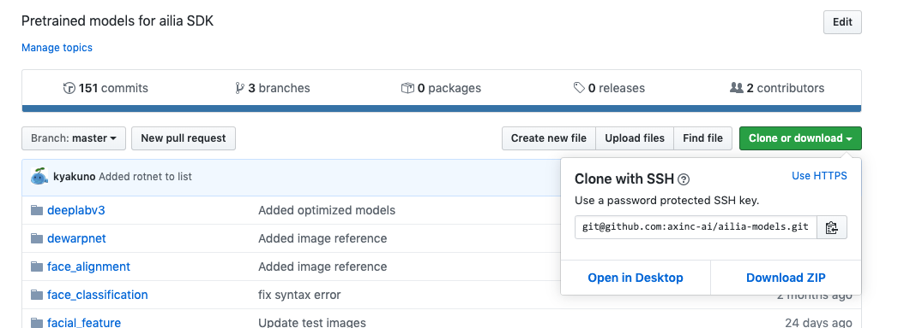
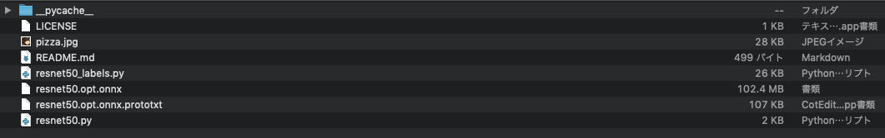

# ailia SDK チュートリアル(Python)

# ailia SDK チュートリアル(Python)

[](https://kyakuno.medium.com/?source=post_page---byline--28379dbc9649---------------------------------------)

[Kazuki Kyakuno](https://kyakuno.medium.com/?source=post_page---byline--28379dbc9649---------------------------------------)

10 min read

·

Jan 12, 2020

--

Share

ailia SDKをPythonで使用するチュートリアルです。ailia SDKとailia MODELSを使用することで、簡単に様々なAIを実行することができます。ailia SDKについて詳しくは[こちら](https://ailia.jp/)をご覧ください。

## PythonとGPUドライバのインストール

### macOS

macOS 12.6 Monterey以降の場合はPython3が標準でインストールされています。

macOS 12.5以前の場合はPython2がインストールされていますので、brewを使用してPython3をインストールします。

下記のサイトからBrewをインストールします。

[## Homebrew

### The Missing Package Manager for macOS (or Linux).

brew.sh](https://brew.sh/index_ja?source=post_page-----28379dbc9649---------------------------------------)

Brewをインストール後、下記のコマンドでPython3をインストールします。

```
brew install python3
```

### Windows

Windowsの場合は下記のサイトからPython 3.7をインストールします。

[## Python Releases for Windows

### The official home of the Python Programming Language

www.python.org](https://www.python.org/downloads/windows/?source=post_page-----28379dbc9649---------------------------------------)

コマンドプロンプトを開いて、python3とタイプして実行できることを確認します。コマンドプロンプトが見つからない場合、Windows10のサーチバーからcommandと入力してください。

この状態でVulkanを使用したGPU推論が可能です。

nVidia GPUにおいては、cuDNNを使用することもできます。cuDNNを使用する場合、CUDA Toolkit 9.1以上とcuDNN 7.5.0以上をインストールしてください。cuDNNのインストールにはnVidia Developerへの登録が必要です。

[## Windows PCにCUDA ToolkitとcuDNNを導入する

### Windows PCにCUDA ToolkitとcuDNNを導入する方法を解説します。

medium.com](https://medium.com/axinc/windows-pc%E3%81%ABcuda-toolkit%E3%81%A8cudnn%E3%82%92%E5%B0%8E%E5%85%A5%E3%81%99%E3%82%8B-2018c8edb2db?source=post_page-----28379dbc9649---------------------------------------)

### Linux

Ubuntu 18.04 LTSではPython3はすでにインストールされていますが、パッケージ管理ツールのpipはインストールされていませんので、インストールします。

```
apt install python3-pip
```

Vulkanを使用する場合は、Vulkanのライブラリをインストールします。

```
apt install libvulkan1
```

この状態でCPUとVulkanは動作しますが、cuDNNを使用する場合はCUDA ToolkitとcuDNNをインストールします。

[## CUDA Toolkit 10.2 Download

### Select Target Platform Click on the green buttons that describe your target platform. Only supported platforms will be…

developer.nvidia.com](https://developer.nvidia.com/cuda-downloads?source=post_page-----28379dbc9649---------------------------------------)

[## NVIDIA cuDNN

### NVIDIA cuDNN The NVIDIA CUDA Deep Neural Network library (cuDNN) is a GPU-accelerated library of primitives for deep…

developer.nvidia.com](https://developer.nvidia.com/cudnn?source=post_page-----28379dbc9649---------------------------------------)

cuDNNはダウンロード後、下記のコマンドでインストール可能です。

```
sudo dpkg -i libcudnn7_7.6.5.32–1+cuda10.1_amd64.deb
```

### Jetson

Jetsonでは、Jetpackの中にcuDNNとOpenCVを含む各種のライブラリが標準でインストールされています。ailia SDK 1.2.3ではJetpack4.2とcuDNN7を使用します。ailia SDK 1.2.4以降ではJetpack4.4とcuDNN8も使用することができます。Ubuntuのバージョンは18.04LTS以降に対応しています。

Python3はすでにインストールされていますが、パッケージ管理ツールのpipはインストールされていませんので、インストールします。

```
apt install python3-pip
```

Jetpackには標準でopencvが含まれますが、Jetpackがインストールされておらず、opencvでエラーが発生する場合は、下記のコマンドでJetpackをインストールします。

```
apt install nvidia-jetpack
```

### Raspberry Pi

Raspberry Pi OS (32-bit) with desktop and recommended software（  
August 2020）をダウンロードしてbalenaEtcherを使用して書き込みます。

[## Download Raspberry Pi OS for Raspberry Pi

### Raspberry Pi OS (previously called Raspbian) is the Foundation’s official supported operating system. You can install…

www.raspberrypi.org](https://www.raspberrypi.org/downloads/raspberry-pi-os/?source=post_page-----28379dbc9649---------------------------------------)

Raspberry Pi OS August 2020にはPythonは3.7.3がインストールされています。

## ailia SDKのインストール

### ailia SDKの評価版のインストール

下記のコマンドでailia SDKをインストールします。

```
pip3 install ailia
```

必要なライセンスファイルは実行時に自動的にダウンロードされます。

## Get Kazuki Kyakuno’s stories in your inbox

Join Medium for free to get updates from this writer.

Subscribe

Subscribe

Remember me for faster sign in

上記のコマンドだけでailia SDKをPythonから使用することが可能ですが、より詳細なドキュメントが必要な場合は、ailia SDKの評価版をax株式会社のWEBサイトから申し込みします。申し込みフォームに入力すると、自動的に、ダウンロードURLと評価用のライセンスファイルがメールで送付されます。

[## ax Inc.

### ax株式会社のコーポレートサイトです。あらゆるデバイスにAI が載る未来。そのような未来が来ることを我々は信じています。その未来に向けて我々は高速なSDK を開発し、最新のAI モデルを常に研究し続けます。ax 株式会社は最新のAI…

axinc.jp](https://axinc.jp/trial/?source=post_page-----28379dbc9649---------------------------------------)

### ailia SDKのプロダクション版のインストール

ailia SDKをダウンロードして展開すると、下記のような配置となっています。

Press enter or click to view image in full size


pipを使用してailia SDKをインストールするには、ailia SDKのpythonフォルダに移動し、下記のコマンドを実行してください。

```
cd ailia_sdk_version/python  
python3 bootstrap.py  
pip3 install ./
```

## サンプルの実行

### ailia MODELSのダウンロード

サンプルにはailia MODELSを使用します。ailia MODELSはPython 3.6以降に対応しています。

ailia MODELSを使用するには、下記のサイトをCloneします。

```
git clone https://github.com/axinc-ai/ailia-models
```

[## axinc-ai/ailia-models

### Pretrained models for ailia SDK. Contribute to axinc-ai/ailia-models development by creating an account on GitHub.

github.com](https://github.com/axinc-ai/ailia-models?source=post_page-----28379dbc9649---------------------------------------)

gitがインストールされていない場合は、「Clone or Download」からzipでダウンロードすることも可能です。

Press enter or click to view image in full size



### 必要なライブラリのインストール

サンプルプログラムではOpenCV、numpy、request、urllib、matplotlib、scipyを使用しています。

JetsonとRaspberry Pi以外（Windows、Mac、Linux）の場合は、下記のコマンドでインストールします。

```
pip3 install -r requirements.txt
```

JetsonとRaspberryPiの場合は、requirements.txtに含まれている複数のライブラリが使用できませんので、下記のコマンドでインストールします。

Jetson

```
pip3 install cython  
pip3 install numpy  
sudo apt-get install python3-matplotlib  
sudo apt-get install python3-scipy
```

Raspberry Pi

```
pip3 install numpy  
pip3 install opencv-python  
pip3 install matplotlib  
pip3 install scikit-image  
sudo apt-get install libatlas-base-dev
```

これで、Pythonからailia SDKが使用できるようになります。

### サンプルの実行

ailia-models/image\_classification/resnet50フォルダに移動します。

Press enter or click to view image in full size



このフォルダでコマンドプロンプトもしくはターミナルを開き、下記のコマンドを実行します。

```
python3 resnet50.py
```

すると、ailia SDKを使用して推論結果を得ることができます。


ailia MODELSではフォルダごとに異なる種類のモデルが格納されています。300種類以上のモデルが用意されていますので、ぜひ、色々なモデルを動かしてみてください。

## 関連情報

ailia SDKをブラウザから使用する場合は下記のチュートリアルを参照してください。

[## Google Colaboratoryとailia MODELSを使用してブラウザだけでAI処理を行う

### Google Colaboratoryとailia MODELSを使用してブラウザだけで簡単にAI処理を実行する方法を解説します。

medium.com](https://medium.com/axinc/google-colaboratory%E3%81%A8ailia-models%E3%82%92%E4%BD%BF%E7%94%A8%E3%81%97%E3%81%A6%E3%83%96%E3%83%A9%E3%82%A6%E3%82%B6%E3%81%A0%E3%81%91%E3%81%A7ai%E5%87%A6%E7%90%86%E3%82%92%E8%A1%8C%E3%81%86-230222eace55?source=post_page-----28379dbc9649---------------------------------------)

## トラブルシューティング

### Windowsにscipyをインストールできない

下記のサイトからnumpy‑1.21.3+mkl‑cp310‑cp310‑win\_amd64.whlとscipy-1.7.1-cp310-cp310-win\_amd64.whlをダウンロードし、pip install numpy‑1.21.3+mkl‑cp310‑cp310‑win\_amd64.whlとpip install scipy-1.7.1-cp310-cp310-win\_amd64.whlでインストールしてください。

[## Python Extension Packages for Windows - Christoph Gohlke

### The binaries are compatible with the most recent official CPython distributions on Windows >=6.0. Chances are they do…

www.lfd.uci.edu](https://www.lfd.uci.edu/~gohlke/pythonlibs/?source=post_page-----28379dbc9649---------------------------------------#scipy)

ax株式会社はAIを実用化する会社として、クロスプラットフォームでGPUを使用した高速な推論を行うことができるailia SDKを開発しています。ax株式会社ではコンサルティングからモデル作成、SDKの提供、AIを利用したアプリ・システム開発、サポートまで、 AIに関するトータルソリューションを提供していますのでお気軽に[お問い合わせ](https://axinc.jp/)ください。