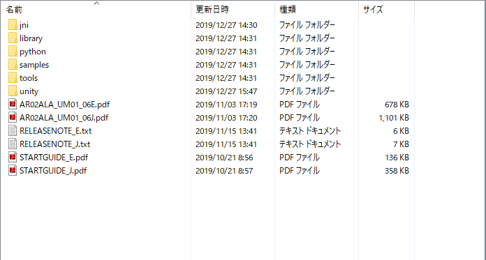
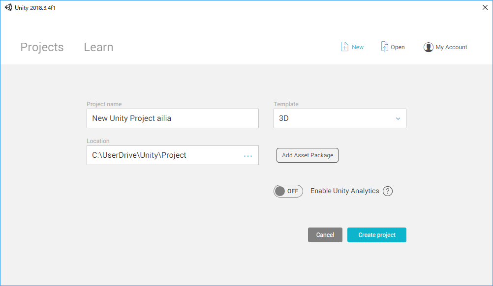
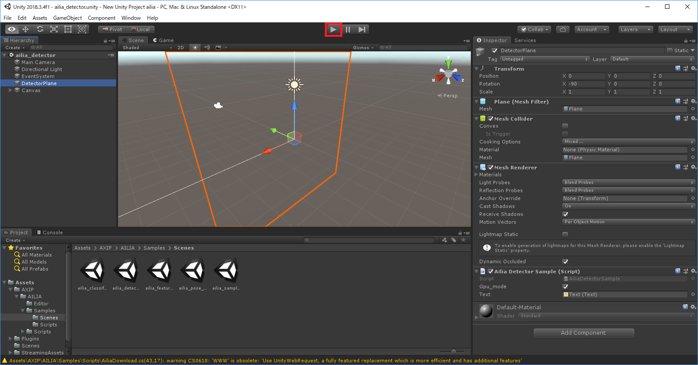
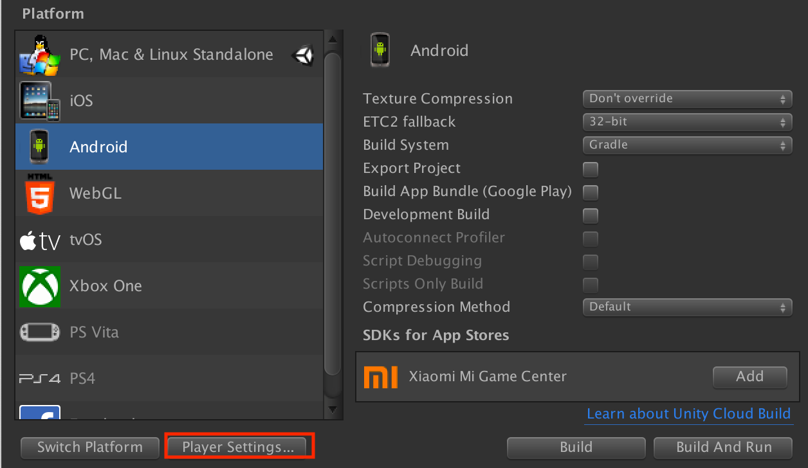
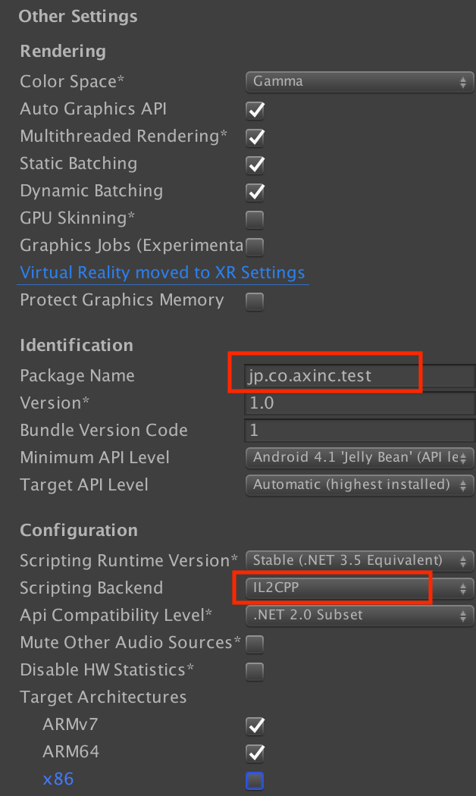

# ailia SDK チュートリアル(Unity)

# ailia SDK チュートリアル(Unity)

[Yuto Kuze](https://medium.com/@kuze_14593?source=post_page---byline--257fa1e98777---------------------------------------)

Jan 22, 2020

--

Share

ailia SDKをUnityで使用するチュートリアルです。ailia SDKを利用することでUnityを使用したディープラーニングの推論をGPUを使用して高速に行うことができます。ailia SDKについて詳しくは[こちら](https://ailia.jp/)をご覧ください。

今回はailia SDKのUnityパッケージサンプル動作までのチュートリアルを紹介します。

## **Unityの準備**

ailia SDKは 2017.4 LTS以降に対応しています。

Unityを持っていない方は、以下より対応するUnityをダウンロードして、インストールしてください。無料版でも問題なく動作します。

[## ゲームやモバイルアプリのクロスプラットフォーム開発用の強力な 2D、3D、VR、AR ソフトウェア。

### あらゆる業界と専門知識のレベルに対応する幅広いプランをご用意しています。すべてのプランはロイヤリティフリーです。 Unity の無料版で制作を開始 利用資格： 過去 12 か月の収益や調達した資金が 10 万米ドル以下…

store.unity.com](https://store.unity.com/ja?source=post_page-----257fa1e98777---------------------------------------#plans-individual)

## **UnityPackageのインポート**

ailia SDKの中身は以下のような構成になっています。

「unity」フォルダ直下にある「ailia\_[version].unitypackage」がUnity用のパッケージファイルになります。

Unityランチャーを起動して「New」より新規プロジェクトを作成。

Press enter or click to view image in full size

立ち上がったプロジェクトのメニューバーから「Assets」>「Import Package」>「Custom Package」を選択。

Press enter or click to view image in full size

上記の「ailia\_[version].unitypackage」を選択してImportします。

Press enter or click to view image in full size

Unityランチャーの起動画面から「ailia\_[version].unitypackage」をプロジェクトとして直接読み込む事も出来ます。

この時は前述のImport画面が立ち上がるのですが、Unityのバージョンによっては立ち上がらない事もあるので、その場合は新規プロジェクトと同様にメニューバーからImportして下さい。

## ライセンスファイルの配置

評価版の場合、Windowsの場合はailia.dllと同じフォルダ（Plugins/x64）、Macの場合は~/Library/SHALO/にライセンスファイルを配置してください。

Macの場合、Finderのメニューの「移動」から、「フォルダの場所を入力」で~/Libraryを指定して移動後、SHALOフォルダを作成し、そこにライセンスファイルを配置します。

ライセンスファイルが存在しない状態でサンプルを実行した場合、エラー（AILIA\_STATUS\_LICENSE\_NOT\_FOUND = -20）が発生します。

## **サンプル確認**

サンプルSceneは次のフォルダ内にあります。

「Assets」>「AXIP」>「AILIA」>「Sample」>「Scenes」

Press enter or click to view image in full size

*※Androidでのファイルアクセスの為にWWWクラスを使用しています。デフォルトではWarningが表示されますが動作には影響ありません。*

サンプルは以下の4つです。

・classifier

・detector

・feature extractor

## Get Yuto Kuze’s stories in your inbox

Join Medium for free to get updates from this writer.

Subscribe

Subscribe

Remember me for faster sign in

・pose estimator

今回はdetectorサンプルを確認してみます。

サンプルでは既にDetectorPlaneで「Ailia Detector Sample」がアタッチされています。(赤枠内)

Press enter or click to view image in full size

ScriptとTextのリンクが剥がれている時は下記のように設定し直して下さい。

上部のPlayボタンを押せばサンプルが実行されます。

Press enter or click to view image in full size

Press enter or click to view image in full size

*LowSpecなノートPCでも辛うじて動作可能です。それなりのスペックのPCならば違和感なく動作します。*

「sample selector」はアプリ化する時に使用するコントロールUIです。

Unity上では使用しませんが、AndroidビルドやiOSビルドをして実機で確認したい時にお使いください。

その他にもaxinc.では、「ailia Models」としてailia SDKですぐに使える学習済みモデルを揃えています。次の機会には、それらの学習済みモデルをImportして一からサンプル作成をする紹介が出来ればと考えています。

[## axinc-ai/ailia-models-unity

### The collection of pre-trained, state-of-the-art models for Unity. ailia models (Python version) ailia SDK is a…

github.com](https://github.com/axinc-ai/ailia-models-unity?source=post_page-----257fa1e98777---------------------------------------)

## アプリケーションの出力

ここからは、アプリケーションを出力する際に必要な設定となります。

### **共通設定**

アプリケーションとして出力する際には、ビルドするシーンを登録する必要があります。ビルドしたいsceneファイルを開いている状態で、File -> Build Settingsを選択し、Add Open Scenesをクリックして登録してください。

Press enter or click to view image in full size

### **Player Settings**

iOSとAndroidの設定は、File -> Build Settingsでプラットフォームを選択したあと、Player Settingsをクリックすることで行います。

Press enter or click to view image in full size

### **iOS向け設定**

iOSでビルドする際、Player SettingsでアプリケーションのバンドルIDを設定する必要があります。このIDでアプリケーションは一意に識別されます。iOSでカメラを使用する場合、Camera Usage Descriptionに任意のテキストを設定する必要があります。

### **Android向け設定**

Androidでビルドする際は、Player Settingsでアプリケーションのパッケージ名を指定する必要があります。このパッケージ名でアプリケーションは一意に識別されます。また、パフォーマンスを最大化するため、Scripting BackendはIL2CPPを選択して下さい。

ax株式会社はAIを実用化する会社として、クロスプラットフォームでGPUを使用した高速な推論を行うことができるailia SDKを開発しています。ax株式会社ではコンサルティングからモデル作成、SDKの提供、AIを利用したアプリ・システム開発、サポートまで、 AIに関するトータルソリューションを提供していますのでお気軽に[お問い合わせ](https://axinc.jp/)ください。

### 参考記事

[## ailia SDK チュートリアル(C++)

### ailia SDKをC++で使用するチュートリアルです。Mac、Windows、Linuxでの利用方法を解説します。

medium.com](https://medium.com/axinc/ailia-sdk-%E3%83%81%E3%83%A5%E3%83%BC%E3%83%88%E3%83%AA%E3%82%A2%E3%83%AB-c-dc949d9dcd28?source=post_page-----257fa1e98777---------------------------------------)

[## ailia SDK チュートリアル(Python)

### ailia SDKをPythonで使用するチュートリアルです。Pythonを使用することで様々なモデルの動作を簡単に試すことができます。

medium.com](https://medium.com/axinc/ailia-sdk-%E3%83%81%E3%83%A5%E3%83%BC%E3%83%88%E3%83%AA%E3%82%A2%E3%83%AB-python-28379dbc9649?source=post_page-----257fa1e98777---------------------------------------)