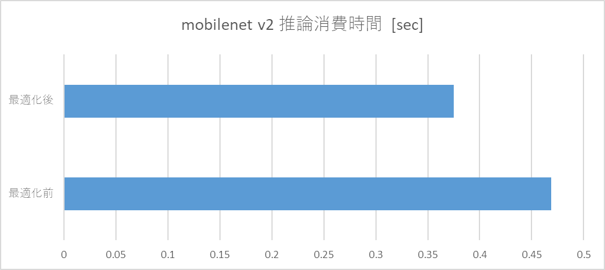
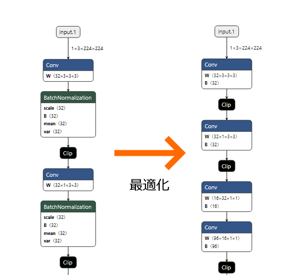

# ONNX 公式オプティマイザの活用

# ONNX 公式オプティマイザの活用

[](https://medium.com/@mogi_15387?source=post_page---byline--a9b6c8302374---------------------------------------)

[MOGI Kazuhiro](https://medium.com/@mogi_15387?source=post_page---byline--a9b6c8302374---------------------------------------)

6 min read

·

Apr 3, 2020

--

Share

エッジ向け推論フレームワークである[ailia SDK](https://ailia.jp/)ではONNXを使用してGPUを使用した高速な推論を行うことができます。この記事では、[ailia SDK](https://ailia.jp/)の開発の過程で得られたONNXのモデル最適化の知見を紹介します。

### ONNXモデルの最適化の必要性

ONNXは学習済みモデルの標準フォーマットであり、ディープラーニングフレームワーク間で学習済みモデルを交換することができます。

ONNX 形式のモデルファイルはそれぞれのディープラーニングフレームワークで学習したものを ONNX 形式に出力または変換して作成されるため、推論処理の観点からすると不要なオペレーションが含まれていることがあります。

## Get MOGI Kazuhiro’s stories in your inbox

Join Medium for free to get updates from this writer.

Subscribe

Subscribe

Remember me for faster sign in

この記事ではそうしたONNX形式モデルを推論処理向けに最適化するONNXの公式オプティマイザの紹介を行います。

[## onnx/onnx

### ONNX provides a C++ library for performing arbitrary optimizations on ONNX models, as well as a growing list of…

github.com](https://github.com/onnx/onnx/blob/master/docs/Optimizer.md?source=post_page-----a9b6c8302374---------------------------------------)

### ONNX 公式オプティマイザの効果

ONNX RuntimeはMicrosoftの開発しているONNXの推論に特化したディープラーニングフレームワークです。本記事では、速度評価にONNX Runtimeを使用します。

[## microsoft/onnxruntime

### ONNX Runtime is a performance-focused inference engine for ONNX (Open Neural Network Exchange) models. Models in the…

github.com](https://github.com/microsoft/onnxruntime?source=post_page-----a9b6c8302374---------------------------------------)

オリジナルの [ONNX Model Zoo](https://github.com/onnx/models) からダウンロードしてきた [mobilenet v2 モデル](https://github.com/onnx/models/tree/master/vision/classification/mobilenet)を利用してONNX Runtimeで同一入力画像データに対して、20 回推論を回して消費時間と、入力画像を識別した結果可能性の高かった3クラスを表示すると、次の出力となります。

```
elapsed: 0.46878528594970703  
+ idx=0  
  class=analog clock  
  prob=23.10076332092285  
+ idx=1  
  class=wall clock  
  prob=20.599037170410156  
+ idx=2  
  class=barometer  
  prob=17.743553161621094
```

一方、最適化実行後のモデルで推論を行うと、次の結果となります。

```
elapsed: 0.37501955032348633  
+ idx=0  
  class=analog clock  
  prob=23.10076904296875  
+ idx=1  
  class=wall clock  
  prob=20.599044799804688  
+ idx=2  
  class=barometer  
  prob=17.743555068969727
```

先頭行に表示しているのが推論で消費した実時間です。ONNX 公式が提供している最適化ライブラリにモデルを通すだけで、約0.469秒消費していた処理が約0.375秒の消費に収まるようになります。計算量の20%を削ることができるのは非常にコストパフォーマンスの高い作業と言えます。

Press enter or click to view image in full size



### 確認環境

この結果は次の環境で確認しました。

- Windows 10 / Intel Core i7-4770
- python 3.6.6
- numpy 1.18.1
- onnx 1.6.0
- onnxruntime 1.1.2
- opencv-python 4.2.0.32

### ベンチマークスクリプト

消費時間取得に利用した python スクリプトは次のものです。こちらはワークディレクトリから mobilenetv2\_1.0.onnx というモデルファイルと clock.jpg という画像ファイルを読み込んで ONNX Runtimeで推論を実行し、最後に結果を表示するという処理になっています。

inference.py

６行目のimport labels で取り込んでいるのは、次の imagenet ラベルをテキストで羅列したものです。

labels.py

スクリプトから読み込んでいるclock.jpg は次の画像を利用しました。


### 最適化スクリプト

最適化に利用したスクリプトは次のものです。onnx ファイルを読み込み、onnx.optimizer を利用して最適化を行い、保存する。それだけです。

optimizer.py

実際に最適化を行っているのは 11 行目の処理で、これだけで記事冒頭に書いた結果が得られます。

### 最適化スクリプトが実際に行うこと

このスクリプトでは公式 optimizer が用意している ‘fuse\_bn\_into\_conv’ という処理を適用しています。最適化前後の onnx ファイルを [Netron](https://lutzroeder.github.io/netron/) で比較すると処理内容が理解しやすくなります。



このように、BatchNormalization のパラメータを Conv の重みとバイアスに還元して BatchNormalization を省略するのが ‘fuse\_bn\_into\_conv’ です。

BatchNormalization は学習の安定化＆効率化のためにConvolutionの直後に置かれることが多い処理ですが、学習済みモデルからの推論時には固定パラメータのみになっているのでConvolutionのパラメータに還元して省略することが可能です。

これを行うと BatchNormalization の処理が完全に消え、そこで無駄に消費していた計算時間を省略することが可能になります。

### まとめ

本記事では、ONNXの公式オプティマイザを使用することで、学習済みモデルを最適化し、高速化が行えることを確認しました。次回は、公式オプティマイザの課題などを紹介します。

ax株式会社はAIを実用化する会社として、クロスプラットフォームでGPUを使用した高速な推論を行うことができるailia SDKを開発しています。ax株式会社ではコンサルティングからモデル作成、SDKの提供、AIを利用したアプリ・システム開発、サポートまで、 AIに関するトータルソリューションを提供していますのでお気軽に[お問い合わせ](https://axinc.jp/)ください。