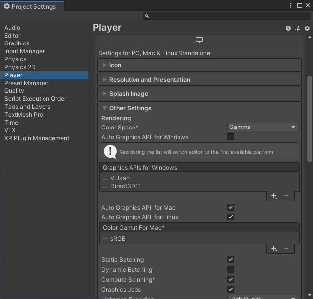

# Unity プラグインから Vulkan のテクスチャを扱う

# Unity プラグインから Vulkan のテクスチャを扱う

[Ryohei Nishimura](https://medium.com/@nishimura_77261?source=post_page---byline--daa1fd4a70fd---------------------------------------)

5 min read

·

Jul 19, 2020

--

Share

グラフィックス API のテクスチャを CPU を介さずに GPU アクセラレータで扱う機能を [ailia SDK](https://ailia.jp/)の将来のリリースで予定しています。特に Unity のテクスチャを Vulkan アクセラレータで扱いたい需要が多いと思います。しかし、 Unity のテクスチャを Vulkan で扱うための情報について、ネット上でにはあまり記事が書かれていないようです。ここでは、 Unity のテクスチャを Vulkan で扱うための情報を記事にしました。

## Unity のバックエンドを Vulkan にする

まず最初に行うべきことは、 Unity のバックエンドを Vulkan に設定することです。デフォルトでは Unity が自動的に API を選ぶようで、筆者の Windows 環境では DirectX 11 が選ばれているようです。まずはこれを明示的に Vulkan に変えるところから始めます。

Unity で適当なプロジェクトを開き、 File > Build Settings… > Player Settings… > Player > Auto Graphics API for \* のチェックボックスを外し、Graphics APIs for \* の + ボタンを押して Vulkan を追加、 Vulkan の左に表示されている 2 本線をドラッグして最上位に持っていきます。

## Unity から Vulkan を扱うインターフェース

まずすべきことは、 Unity から Vulkan を扱うインターフェースを得ることです。 IUnityGraphicsVulkan.h ヘッダファイルにこのインターフェースが定義されていますので、インクルードしておきます。

プラグインがロードされるときに呼ばれる UnityPluginLoad 関数の引数 IUnityInterfaces クラスを使って、 IUnityInterfaces::Get<IUnityGraphicsVulkan>() 関数を呼び出しましょう（本来は Unity のバックエンドが Vulkan であることを先に確認すべきですが、本題から離れるので割愛します）。返値として IUnityGraphicsVulkan オブジェクトへのポインタが得られますので、これをこの先の操作で使っていきます。

## Unity が使っている Vulkan のインスタンスについて

次にすべきことは、 Unity のバックエンドが使っている Vulkan のインスタンスを取得することです。

## Get Ryohei Nishimura’s stories in your inbox

Join Medium for free to get updates from this writer.

Subscribe

Subscribe

Remember me for faster sign in

IUnityGraphicsVulkan.h ヘッダファイルに UnityVulkanInstance 構造体が定義されています。この構造体へ Unity が使っている VkDevice や VkQueue などを取得します。 IUnityGraphicsVulkan::Instance() 関数の返値として、 UnityVulkanInstance 構造体の実体が返ります。 VkDevice や VkQueue などの Vulkan の API 呼び出しに不可欠なオブジェクトが得られました。

## いよいよテクスチャの取得

これから実際にテクスチャを取得するわけですが、 Unity 側とのイメージメモリバリアを適用しながらテクスチャを得るため、 API は少々複雑になります。

使うのは IUnityGraphicsVulkan::AccessTexture 関数ですが、引数が 7 個と多いので、一つ一つ説明していきます。

第 1 引数は void \* 型のポインタですが、これは C# の RenderTexture 本体から GetNativeTexturePtr() メソッドで得られるポインタを表す整数をそのままポインタにキャストして扱います。

第 2 引数は VkImageSubresource 型ですが、特に細かく管理する必要がない場合は、グローバル変数 UnityVulkanWholeImage を指定しておけば問題ありません。

第 3 引数は VkImageLayout 、第 4 引数は VkPipelineStageFlags 、第 5 引数は VkAccessFlags です。 Vulkan のイメージメモリバリアを意識して、 Vulkan 側での利用方法に合わせて設定しましょう。

第 6 引数は UnityVulkanResourceAccessMode の enum 型です。 kUnityVulkanResourceAccess\_ObserveOnly はテクスチャ本体にアクセスせず、例えばサイズのみを取得するような前提でテクスチャを得る場合に使います。 kUnityVulkanResourceAccess\_PipelineBarrier は標準的な用途に使います。 kUnityVulkanResourceAccess\_Recreate は Unity のテクスチャをコピーしたテクスチャが得られるようですが、実際に使ってみるとクラッシュするようで、ここの理解は今後の検討課題となります。

第 7 引数はお待たせしました、 VkImage などを含んだ構造体 UnityVulkanImage へのポインタで、ここに Vulkan のテクスチャのデータが格納されます。

ax株式会社はAIを実用化する会社として、クロスプラットフォームでGPUを使用した高速な推論を行うことができるailia SDKを開発しています。ax株式会社ではコンサルティングからモデル作成、SDKの提供、AIを利用したアプリ・システム開発、サポートまで、 AIに関するトータルソリューションを提供していますのでお気軽に[お問い合わせ](https://axinc.jp/)ください。