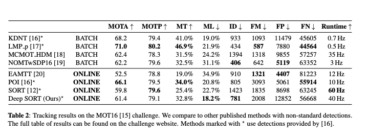

# DeepSort : 人物のトラッキングを行う機械学習モデル

# DeepSort : 人物のトラッキングを行う機械学習モデル

[Kazuki Kyakuno](https://kyakuno.medium.com/?source=post_page---byline--e8cb7410457c---------------------------------------)

9 min read

·

Aug 7, 2020

--

Share

[ailia SDK](https://ailia.jp/)で使用できる機械学習モデルである「DeepSort」のご紹介です。エッジ向け推論フレームワークである[ailia SDK](https://ailia.jp/)と[ailia MODELS](https://github.com/axinc-ai/ailia-models)に公開されている機械学習モデルを使用することで、簡単にAIの機能をアプリケーションに実装することができます。

## DeepSortの概要

DeepSortは人物のトラッキングを行う機械学習モデルです。人物にIDをつけてトラッキングすることができます。

Press enter or click to view image in full size

テスト動画：TownCentreXVID（<http://www.robots.ox.ac.uk/~lav/Research/Projects/2009bbenfold_headpose/project.html>）

[## Simple Online and Realtime Tracking with a Deep Association Metric

### Simple Online and Realtime Tracking (SORT) is a pragmatic approach to multiple object tracking with a focus on simple…

arxiv.org](https://arxiv.org/abs/1703.07402?source=post_page-----e8cb7410457c---------------------------------------)

従来、トラッキングでは、カルマンフィルタを使用したSortというアルゴリズムが使用されていました。[YOLO v3](https://medium.com/axinc/yolov3-66c9b998c096)で検出したバウンディングボックスを使用して、フレームの前後で近い大きさと近い動きのバウンディングボックスを対応づけることで、人物にIDをつけてトラッキングします。

しかし、Sortでは、人物が物体の影に隠れて、再び現れた場合に違うIDがつけられてしまうという問題がありました。DeepSortでは、人物の類似性を比較するAIモデルを使用することで、この問題を解決し、人物のIDのスイッチングを減少させることができます。

## DeepSortのアーキテクチャ

DeepSortでは、下記の手順で処理が行われます。Sortはカルマンフィルタ、ReIDは同一人物判定モデルです。

1. [YOLO v3](https://medium.com/axinc/yolov3-66c9b998c096)でバウンディングボックスを計算（detectins）
2. SortとReIDを使用してバウンディングボックス（detections）とトラッキング（tracks）を紐付け
3. 紐付けできない場合は新規IDを割り当ててトラッキング（tracks）に追加

detectionsは1フレームの人物リスト、tracksは現在追跡している人物のリストです。tracksのtrackそれぞれにIDが付与されており、detectionsのそれぞれのバウンディングボックスにtracksのtrackを割り当てることで、人物にIDを割り当てます。

detectionsとtracksの紐付けにおいては、ReIDを優先的に使用します。現在、トラッキングしている対象（tracks）の人物画像からReIDで計算した特徴ベクトルと、[YOLO v3](https://medium.com/axinc/yolov3-66c9b998c096)でバウンディングボックス（detections）で切り出した人物画像からReIDで計算した特徴ベクトルの距離を計算し、もっとも距離が小さい対象を同一人物と判定して、trackのIDを割り当てます。この時、trackの座標情報は考慮しません。距離の計算では、trackごとに過去100フレーム分の特徴ベクトルを保持し、全てに対してdetectionの特徴ベクトルとの距離を計算し、最小値を使用します。

通常、コスト関数＝（Sortの距離\*λ＋ReIDの距離）のように定義するのですが、論文ではλ＝0が経験的に良かったということで、座標情報を考慮しない形になっています。

> During our ex- periments we found that setting λ = 0 is a reasonable choice when there is substantial camera motion. In this setting, only appearance information are used in the association cost term. However, the Mahalanobis gate is still used to disregarded infeasible assignments based on possible object locations in- ferred by the Kalman filter.

ただし、Sortで過去のトラッキング情報から想定する現在フレームの位置を計算し、そこから大きく離れている場合は、IDを割り振りません。

その後、紐付けが行われなかったバウンディングボックスが存在する場合、従来のSortを使用してIDを割り振ります。

70フレームの間、バウンディングボックスが紐付けされなかった場合はトラッキングから削除します。

ReIDのモデルは、large-scale person re-identification datasetの1,261のペデストリアンの1,100,000画像から学習が行われています。

## DeepSortのインスタンス

DeepSortのインスタンスは以下のように確保します。

> MAX\_COSINE\_DISTANCE = 0.2 # threshold of matching object  
> NN\_BUDGET = 100
>
> # tracker class instance  
> metric = NearestNeighborDistanceMetric(  
> “cosine”, MAX\_COSINE\_DISTANCE, NN\_BUDGET  
> )
>
> tracker = Tracker(  
> metric,  
> max\_iou\_distance=0.7,  
> max\_age=70,  
> n\_init=3  
> )

MAX\_COSINE\_DISTANCEはReIDで同一人物判定を行うためのしきい値で、値が大きいほど同一人物と判定されやすくなります。NN\_BUDGETは、trackごとに過去何フレーム分の特徴ベクトルを保持して距離計算を行うかという値です。

## Get Kazuki Kyakuno’s stories in your inbox

Join Medium for free to get updates from this writer.

Subscribe

Subscribe

Remember me for faster sign in

Trackerのmax\_ageは割り当てられなかったtrackが何フレームで削除されるかという指定、n\_initは新しく割り当てられたtrackが何フレームで有効化されるかという指定です。max\_iou\_distanceは割り当てられなかったtrackが存在する場合に、従来のSortでIDを割り振りますが、その時にバウンディングボックスがどれくらい重なっていたら同一人物判定するかというしきい値です。

> # update tracker  
> tracker.predict()  
> tracker.update(detections)

ソースコード上は、sort/tracker.pyのupdateが呼ばれると、\_matchが呼ばれ、SortとReIDを使用するlinear\_assignment.matching\_cascadeと、Sortのみを使用するlinear\_assignment.min\_cost\_matchingが順に呼ばれます。

linear\_assignment.matching\_cascadeの中では、min\_cost\_matchingが呼ばれ、distance\_metricを呼び出すことで、ReIDによる距離計算が行われ、detections Nとtracks Mのコストマトリックスが計算されます。ここでは、座標情報は考慮せずにfeatureのみからコストが計算されます。その後、distance\_metricの中で、ReIDによる距離計算を行ったコストマトリックスに対して、gating\_distanceを呼び出すことで、Sortの距離計算が行われ、Sortの距離が一定より大きい場合はInfinityのコストをアサインします。最後に、コストマトリックスの中からコスト最小のIDを紐付けることで、Sort距離が一定以下で、もっともReIDの距離が近いdetectionとtrackが紐付けられます。

> gated\_cost=INFTY\_COST  
> cost\_matrix[row, gating\_distance > gating\_threshold] = gated\_cost  
> （sort/libnear\_assignment.py/gate\_cost\_matrix）

## DeepSortの評価

DeepSortはMOT Challengeのデータセットで評価されています。

[## MOT Challenge

### We have created a framework for the fair evaluation of multiple people tracking algorithms. In this framework we…

motchallenge.net](https://motchallenge.net/?source=post_page-----e8cb7410457c---------------------------------------)

Press enter or click to view image in full size

（出典：<https://arxiv.org/abs/1703.07402>）

単純なSORTに比べて、人物のIDのスイッチングが1423から781まで改善します。

## ailia SDKでDeepSortを使用する

ailia SDKでDeepSortを使用するには、下記のサンプルを使用します。

[## axinc-ai/ailia-models

### DeepSORT original mode: compare image mode: ['correct\_32\_1.jpg' , 'correct\_32\_2.jpg' ]: SAME person (confidence…

github.com](https://github.com/axinc-ai/ailia-models/tree/master/object_tracking/deepsort?source=post_page-----e8cb7410457c---------------------------------------)

このサンプルでは、YOLOv3で検出した人物に対して、DeepSortを使用してトラッキングを行います。下記のコマンドで、WEBカメラに対してトラッキングを行うことができます。

> python3 deepsort.py -v 0

また、2枚の静止画を与えることで、人物の類似度を計算することができます。

> python3 deepsort.py — pairimage IMAGE\_PATH1 IMAGE\_PATH2

なお、カルマンフィルタの計算にscipyを使用しているため、scipyのインストールが必要です。

ax株式会社はAIを実用化する会社として、クロスプラットフォームでGPUを使用した高速な推論を行うことができるailia SDKを開発しています。ax株式会社ではコンサルティングからモデル作成、SDKの提供、AIを利用したアプリ・システム開発、サポートまで、 AIに関するトータルソリューションを提供していますのでお気軽に[お問い合わせ](https://axinc.jp/)ください。

### 参考記事

[YOLO v3 : 物体の位置と種類を検出する機械学習モデル](https://medium.com/axinc/yolov3-66c9b998c096)

[YOLO v4 : 物体を検出する機械学習モデル](https://medium.com/axinc/yolov4-%E7%89%A9%E4%BD%93%E3%82%92%E6%A4%9C%E5%87%BA%E3%81%99%E3%82%8B%E6%A9%9F%E6%A2%B0%E5%AD%A6%E7%BF%92%E3%83%A2%E3%83%87%E3%83%AB-480f0a635317)

[M2Det : 高精度な物体検出モデル](https://medium.com/axinc/m2det-%E9%AB%98%E7%B2%BE%E5%BA%A6%E3%81%AA%E7%89%A9%E4%BD%93%E6%A4%9C%E5%87%BA%E3%83%A2%E3%83%87%E3%83%AB-bf92a8a3d423)