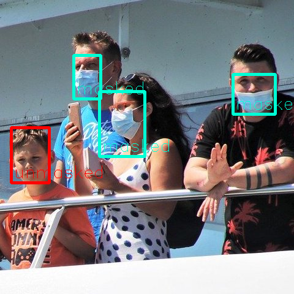

# FaceMaskDetection : マスクを付けているかを判定する機械学習モデル

# FaceMaskDetection : マスクを付けているかを判定する機械学習モデル

[Kazuki Kyakuno](https://kyakuno.medium.com/?source=post_page---byline--b06793f79a97---------------------------------------)

Sep 19, 2020

--

Share

[ailia SDK](https://ailia.jp/)で使用できる機械学習モデルである「FaceMaskDetection」のご紹介です。エッジ向け推論フレームワークである[ailia SDK](https://ailia.jp/)と[ailia MODELS](https://github.com/axinc-ai/ailia-models)に公開されている機械学習モデルを使用することで、簡単にAIの機能をアプリケーションに実装することができます。

## FaceMaskDetectionの概要

FaceMaskDetectionは、入力画像から顔の位置を検出するとともに、マスクを付けているかを判定する機械学習モデルです。従来の顔検出アルゴリズムでは、マスクを付けていない画像のみから学習を行っているため、マスクを付けている場合に顔の位置の検出精度が低下します。FaceMaskDetectionを使用することで、マスクを付けている場合でも高精度に顔の位置を検出でき、また、マスクを付けているか付けていないかを同時に判定することができます。

入力画像（出典：<https://pixabay.com/ja/photos/%E3%83%95%E3%82%A7%E3%83%AA%E3%83%BC-%E8%88%B9-%E4%B9%97%E5%AE%A2-%E3%82%AF%E3%83%AB%E3%83%BC%E3%82%BA-5484417/>）

出力画像

## FaceMaskDetectionのアーキテクチャ

FaceMaskDetectionはax株式会社で学習を行っており、モデルアーキテクチャはYOLOv3 TinyとMobilenetSSDを使用しています。通常の顔画像に加えて、マスクを付けた顔画像を加えて学習を行うことで、マスクを付けているかどうかの判定が行えるようになっています。

## Get Kazuki Kyakuno’s stories in your inbox

Join Medium for free to get updates from this writer.

Subscribe

Subscribe

Remember me for faster sign in

## ailia SDKからFaceMaskDetectionを使用する

ailia SDKで使用するサンプルは下記になります。

[## axinc-ai/ailia-models

### (Images from…

github.com](https://github.com/axinc-ai/ailia-models/tree/master/face_detection/face-mask-detection?source=post_page-----b06793f79a97---------------------------------------)

下記のコマンドで任意の画像に対してマスクを付けているかどうかを判定可能です。デフォルトではyolov3-tinyを使用します。

> *python3 face-mask-detection.py -i input.png -s output.png*

下記のコマンドでWEBカメラの映像に対してマスクを付けているかどうかを判定可能です。

> *python3 face-mask-detection.py -v 0*

-a mb2-ssdを追加することでmobilenet-ssd版を使用することも可能です。

> python3 face-mask-detection.py -v 0 -a mb2-ssd

ax株式会社はAIを実用化する会社として、クロスプラットフォームでGPUを使用した高速な推論を行うことができるailia SDKを開発しています。ax株式会社ではコンサルティングからモデル作成、SDKの提供、AIを利用したアプリ・システム開発、サポートまで、 AIに関するトータルソリューションを提供していますのでお気軽にお問い合わせください。