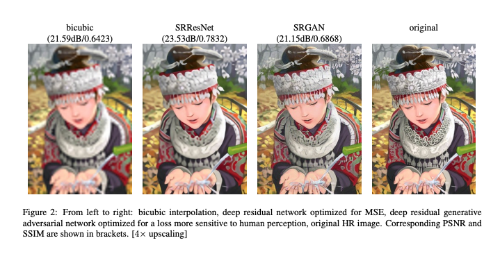
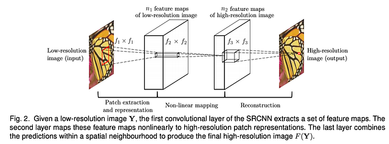
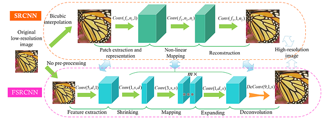

# SRResNet : 画像を高品質に拡大する機械学習モデル

# SRResNet : 画像を高品質に拡大する機械学習モデル

[Kazuki Kyakuno](https://kyakuno.medium.com/?source=post_page---byline--9e35b9a90586---------------------------------------)

6 min read

·

Oct 8, 2020

--

Share

[ailia SDK](https://ailia.jp/)で使用できる機械学習モデルである「SRResNet」のご紹介です。エッジ向け推論フレームワークである[ailia SDK](https://ailia.jp/)と[ailia MODELS](https://github.com/axinc-ai/ailia-models)に公開されている機械学習モデルを使用することで、簡単にAIの機能をアプリケーションに実装することができます。

## SRResNetの概要

SRResNetは高品質に画像を拡大する超解像モデルです。(1,3,64,64)のサイズの画像を入力として、4倍に拡大した(1,3,256,256)のサイズの画像を出力します。

## Get Kazuki Kyakuno’s stories in your inbox

Join Medium for free to get updates from this writer.

Subscribe

Subscribe

Remember me for faster sign in

従来のbilinearやbicubicによる拡大では、斜め線にジャギーが発生したり、ぼやっとした出力になるという問題があります。AI超解像を使用することで、解像感を保ったまま、シャープに画像を拡大することができます。

Press enter or click to view image in full size

出典：<https://arxiv.org/pdf/1609.04802.pdf>

SRResNetはPixelShufflerを使用することで、従来のDeconvolutionを使用したAI超解像よりもノイズが少ない画像を生成します。

[## Photo-Realistic Single Image Super-Resolution Using a Generative Adversarial Network

### Despite the breakthroughs in accuracy and speed of single image super-resolution using faster and deeper convolutional…

arxiv.org](https://arxiv.org/abs/1609.04802?source=post_page-----9e35b9a90586---------------------------------------)

## AI超解像の歴史

### SRCNN

Image Super-Resolution Using Deep Convolutional Networksで提案されたのがSRCNNです。Waifu2xでも使用されているアーキテクチャです。最初に解像度を上げた後に、複数の畳み込みを行う高精度画像を出力します。

Press enter or click to view image in full size

出典：<https://arxiv.org/pdf/1501.00092.pdf>

### FSRCNN

SRCNNの高速化のために提案されたのがFSRCNNです。Deconvolutionを使用して最後に解像度をあげることで、高速処理を実現しています。

Press enter or click to view image in full size

出典：<http://mmlab.ie.cuhk.edu.hk/projects/FSRCNN.html>

### ESPCN

Deconvolutionはチェッカーボードノイズが発生するという問題があり、この問題を解決したのがESPCN（SRResNet）です。PixelShuffler（Sub Pixel Convolutino）を使用することで、チェッカーボードノイズを抑制します。

Press enter or click to view image in full size

出典：<https://nuit-blanche.blogspot.com/2016/09/real-time-single-image-and-video-super.html>

### SRGAN

SRResNetのモデルアーキテクチャを使用した学習時の最適化の方法として、PSNRやSSIMを基準に学習を行なう方法と、GANを使って行う方法があります。PSNRやSSIMを基準にすると、数値的な性能は高いものの、解像感が出ないと言う問題があります。SRResNetのモデルを使用して、AIが生成した画像か、オリジナルの画像かをAIに判定させながら学習を行うことで、解像感を保ったまま超解像処理を行うモデルを構築することができます。この方式をSRGANと呼びます。

Press enter or click to view image in full size

出典：<https://openaccess.thecvf.com/content_cvpr_2017/papers/Ledig_Photo-Realistic_Single_Image_CVPR_2017_paper.pdf>

## SRResNetの使用方法

ailia SDKでSRResNet（SRGAN）を使用するには、下記のコマンドを使用します。-pオプションを使用することで、入力画像を64x64画素単位でタイリングして4倍の解像度に拡大することができます。

> python3 srresnet.py -i input.jpg -o output.jpg -p

[## axinc-ai/ailia-models

### Ailia input shape : (1,3,64,64) Range : [0.0, 1.0] Ailia output shape : (1,3,256,256) Range : [0, 1.0] Automatically…

github.com](https://github.com/axinc-ai/ailia-models/tree/master/super_resolution/srresnet?source=post_page-----9e35b9a90586---------------------------------------)

## 関連製品（ailia AI refiner）

ax株式会社と株式会社ラディウス・ファイブは、Adobe社が提供するソフトウェアであるAfter Effectsで使用できるAI超解像プラグインを販売しています。株式会社ラディウス・ファイブが独自に開発した超解像モデルと、ax株式会社が独自に開発したailia SDKを組み合わせた製品となります。

[## 実写映像やアニメをAIで高画質化するailia AI Refiner | cre8tiveAI

### ailia AI Refiner とは？ Adobe社が提供するソフトウェアであるAfter Effects® で使用できるプラグインです。 写真やイラストを世界最高水準で美しく高画質化します。 エッジでの推論に特化したailia SDK…

ja.cre8tiveai.com](https://ja.cre8tiveai.com/aar?source=post_page-----9e35b9a90586---------------------------------------)

ax株式会社はAIを実用化する会社として、クロスプラットフォームでGPUを使用した高速な推論を行うことができるailia SDKを開発しています。ax株式会社ではコンサルティングからモデル作成、SDKの提供、AIを利用したアプリ・システム開発、サポートまで、 AIに関するトータルソリューションを提供していますのでお気軽に[お問い合わせ](https://axinc.jp/)ください。