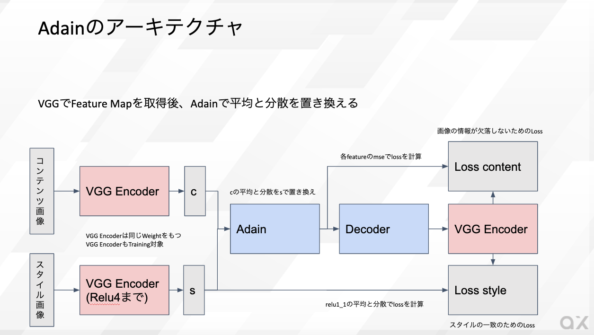
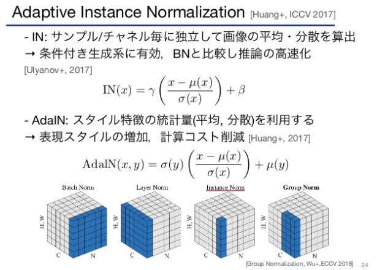

# Adain : 画像のスタイルを変換する機械学習モデル

# Adain : 画像のスタイルを変換する機械学習モデル

[Kazuki Kyakuno](https://kyakuno.medium.com/?source=post_page---byline--2443feba832b---------------------------------------)

Jul 19, 2020

--

Share

[ailia SDK](https://ailia.jp/)で使用できる機械学習モデルである「Adain」のご紹介です。エッジ向け推論フレームワークである[ailia SDK](https://ailia.jp/)と[ailia MODELS](https://github.com/axinc-ai/ailia-models)に公開されている機械学習モデルを使用することで、簡単にAIの機能をアプリケーションに実装することができます。

## Adainの概要

Adainは画像のスタイルを変換する機械学習モデルです。

[## Arbitrary Style Transfer in Real-time with Adaptive Instance Normalization

### Gatys et al. recently introduced a neural algorithm that renders a content image in the style of another image…

arxiv.org](https://arxiv.org/abs/1703.06868?source=post_page-----2443feba832b---------------------------------------)

従来のStyle Transferではスタイル画像ごとに学習が必要でしたが、Adainを使用することで再学習不要で任意の画像のスタイル変換を行うことができます。

Adainはコンテンツ画像とスタイル画像を入力として、コンテンツ画像のスタイルを変換します。

Press enter or click to view image in full size

入力画像（出典：<https://github.com/naoto0804/pytorch-AdaIN/tree/master/input>）

スタイル画像（出典：<https://github.com/naoto0804/pytorch-AdaIN/tree/master/input>）

Press enter or click to view image in full size

出力画像（出典：<https://github.com/naoto0804/pytorch-AdaIN/tree/master/input>）

## Adainのアーキテクチャ

AdainはAdaptive Instance Normalizationの略です。Adainのアーキテクチャは下記のようになっています。

Press enter or click to view image in full size

Adainのアーキテクチャ

StyleTransferの研究において、VGGのFeatureMapの平均と分散を書き換えることで画像のスタイルを変換できることが知られています。

Adainでは、コンテンツ画像とスタイル画像に対してVGGを適用してFeatureMapを取得したあと、コンテンツ画像のRelu4までのFeatureMapの平均と分散を、スタイル画像の平均と分散で置き換えます。その後、デコーダに通すことで画像を生成します。

学習時のロスは、生成した画像をVGGでエンコードしてFeatureMapを比較することで画像の情報が欠落しないようにし、また、relu\_1\_1の平均と分散でロスを計算することでスタイルを一致させるようにします。

## Get Kazuki Kyakuno’s stories in your inbox

Join Medium for free to get updates from this writer.

Subscribe

Subscribe

Remember me for faster sign in

AdaptiveInstanceNormalizationはInstanceNormalizationの改良版であり、通常のInstanceNormalizationと同じ操作で平均と分散を計算した後、スタイルの平均と分散で置き換えます。

（出典：<https://www.slideshare.net/takehiko-ohkawa/survey-of-imagetoimage-translation-179222370>）

実際のネットワークの定義は下記のリポジトリを参照してください。

[## naoto0804/pytorch-AdaIN

### This is an unofficial pytorch implementation of a paper, Arbitrary Style Transfer in Real-time with Adaptive Instance…

github.com](https://github.com/naoto0804/pytorch-AdaIN?source=post_page-----2443feba832b---------------------------------------)

デコーダではReflectionPad2dが使用されており、出力されるONNXはやや複雑なものとなります。

学習にはMSCOCOとWikiartが使用されています。

## ailia SDKでの利用

ailia SDKでは下記のサンプルで実行することができます。

[## axinc-ai/ailia-models

### (These images from https://github.com/naoto0804/pytorch-AdaIN/tree/master/input) Ailia input shape: (1, 3, 512, 512)…

github.com](https://github.com/axinc-ai/ailia-models/tree/master/style_transfer/adain?source=post_page-----2443feba832b---------------------------------------)

> #静止画に対してAdainを適用  
> python3 adain.py  
> #WEBカメラに対してAdainを適用  
> python3 adain.py -v 0

## まとめ

Adainは高速かつ高精度にスタイル変換を行える手法であり、Style Transferの一つの完成形になっているものと考えられます。

## GANへの応用

Image-to-Imageのドメイン変換において、MUNITからAdainが導入されており、CycleGANで使用されるCycle-Consistency-LossではないLossとしてStyle Lossが使用されています。こちらは、Council-GANの記事で紹介したいと思います。

[## NVlabs/MUNIT

### Copyright (C) 2018 NVIDIA Corporation. All rights reserved. Licensed under the CC BY-NC-SA 4.0 license (…

github.com](https://github.com/NVlabs/MUNIT?source=post_page-----2443feba832b---------------------------------------)

ax株式会社はAIを実用化する会社として、クロスプラットフォームでGPUを使用した高速な推論を行うことができるailia SDKを開発しています。ax株式会社ではコンサルティングからモデル作成、SDKの提供、AIを利用したアプリ・システム開発、サポートまで、 AIに関するトータルソリューションを提供していますのでお気軽に[お問い合わせ](https://axinc.jp/)ください。