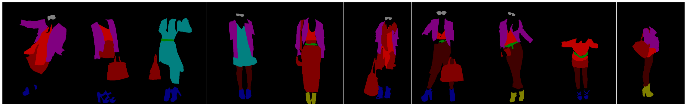

# ClothingDetection : 服装を検出する機械学習モデル

# ClothingDetection : 服装を検出する機械学習モデル

[Kazuki Kyakuno](https://kyakuno.medium.com/?source=post_page---byline--e75cc8bc75b7---------------------------------------)

Oct 20, 2020

--

1

Share

[ailia SDK](https://ailia.jp/)で使用できる機械学習モデルである「ClothingDetection」のご紹介です。エッジ向け推論フレームワークである[ailia SDK](https://ailia.jp/)と[ailia MODELS](https://github.com/axinc-ai/ailia-models)に公開されている機械学習モデルを使用することで、簡単にAIの機能をアプリケーションに実装することができます。

## ClothingDetectionの概要

Clothing DetectionはYOLOv3を使用した服装の認識モデルです。入力された画像から、トップスの位置やボトムスの位置を検出することができます。

出典：<https://github.com/simaiden/Clothing-Detection/blob/master/tests/0000003.jpg>

[## simaiden/Clothing-Detection

### All weights and config files are in…

github.com](https://github.com/simaiden/Clothing-Detection?source=post_page-----e75cc8bc75b7---------------------------------------)

## 検出可能なカテゴリ

ClothingDetectionではデータセットとしてModanetとDeepFashionV2を使用しており、入力された画像から下記のカテゴリのバウンディングボックスを計算可能です。

> DATASETS\_CATEGORY = {  
>  ‘modanet’: [  
>  “bag”, “belt”, “boots”, “footwear”, “outer”, “dress”, “sunglasses”,  
>  “pants”, “top”, “shorts”, “skirt”, “headwear”, “scarf/tie”  
>  ],  
>  ‘df2’: [  
>  “short sleeve top”, “long sleeve top”, “short sleeve outwear”, “long sleeve outwear”,  
>  “vest”, “sling”, “shorts”, “trousers”, “skirt”, “short sleeve dress”,  
>  “long sleeve dress”, “vest dress”, “sling dress”  
>  ]  
> }

ModaNetはeBdayの提供するファッションのセグメンテーションのためのデータセットです。13のファッションカテゴリーを含んでいます。

## Get Kazuki Kyakuno’s stories in your inbox

Join Medium for free to get updates from this writer.

Subscribe

Subscribe

Remember me for faster sign in

Press enter or click to view image in full size

出典：<https://github.com/eBay/modanet>

[## eBay/modanet

### Table of Contents ModaNet is a street fashion images dataset consisting of annotations related to RGB images. ModaNet…

github.com](https://github.com/eBay/modanet?source=post_page-----e75cc8bc75b7---------------------------------------)

DeepFashionV2はファッション検出のための大規模なデータセットです。491Kの画像と13のポピュラーなカテゴリを含んでおり、合計で801Kのファッションアイテムの画像を含んでいます。

Press enter or click to view image in full size

出典：<https://github.com/switchablenorms/DeepFashion2>

[## switchablenorms/DeepFashion2

### DeepFashion2 is a comprehensive fashion dataset. It contains 491K diverse images of 13 popular clothing categories from…

github.com](https://github.com/switchablenorms/DeepFashion2?source=post_page-----e75cc8bc75b7---------------------------------------)

## ClothingDetectionの使用方法

ailia SDKでClothing Detectionを使用するには下記のコマンドを使用します。WEBカメラから服装の認識が可能です。

> python3 clothing-detection.py -v 0

[## axinc-ai/ailia-models

### (Image from https://github.com/simaiden/Clothing-Detection/blob/master/tests/0000003.jpg) Shape : (1, 3, 416, 416)…

github.com](https://github.com/axinc-ai/ailia-models/tree/master/deep_fashion/clothing-detection?source=post_page-----e75cc8bc75b7---------------------------------------)

ax株式会社はAIを実用化する会社として、クロスプラットフォームでGPUを使用した高速な推論を行うことができるailia SDKを開発しています。ax株式会社ではコンサルティングからモデル作成、SDKの提供、AIを利用したアプリ・システム開発、サポートまで、 AIに関するトータルソリューションを提供していますのでお気軽に[お問い合わせ](https://axinc.jp/)ください。