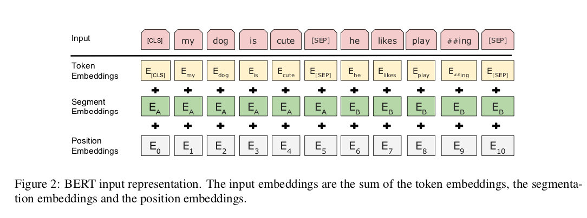
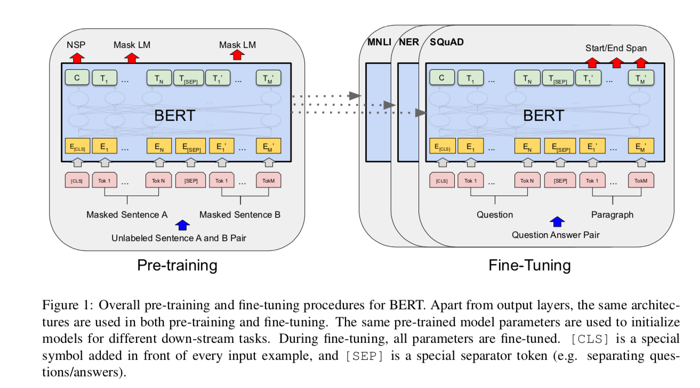

# BERT : 自然言語処理を効率的に学習する機械学習モデル

# BERT : 自然言語処理を効率的に学習する機械学習モデル

[Kazuki Kyakuno](https://kyakuno.medium.com/?source=post_page---byline--3a9c27d78cf8---------------------------------------)

14 min read

·

Nov 5, 2020

--

Share

[ailia SDK](https://ailia.jp/)で使用できる機械学習モデルである「BERT」のご紹介です。エッジ向け推論フレームワークである[ailia SDK](https://ailia.jp/)と[ailia MODELS](https://github.com/axinc-ai/ailia-models)に公開されている機械学習モデルを使用することで、簡単にAIの機能をアプリケーションに実装することができます。

## BERTの概要

BERTは自然言語処理の機械学習を高精度化するための土台となる機械学習モデルです。ビッグデータで事前に学習された学習済みモデルが公開されており、BERTをベースに再学習することで、様々な自然言語処理のタスクを高精度に解くことができます。

[## BERT: Pre-training of Deep Bidirectional Transformers for Language Understanding

### We introduce a new language representation model called BERT, which stands for Bidirectional Encoder Representations…

arxiv.org](https://arxiv.org/abs/1810.04805?source=post_page-----3a9c27d78cf8---------------------------------------)

## BERTの応用例

### MaskedLM

マスクされた単語を予測するタスクです。文章の校正に使用することができます。

### NER

文章から固有表現を抽出するタスクです。入力された単語が、人名なのか、地名なのか、組織名なのかをタグ付けすることができます。

### Sentiment Analysis

文章から感情を抽出するタスクです。入力された文字列が、ポジティブなのか、ネガティブなのかを分類することができます。

### Question Answering

コンテキストの文章と質問を与えることで、質問に対応する回答の、コンテキスト上の位置を計算するタスクです。チャットボットの自動応答などに使用することができます。

### Zero Shot Classification

文章とカテゴリのリストを与えることで、文章がどのカテゴリに属しているかを計算するタスクです。再学習不要でカテゴリ分類することができます。

## BERTのアーキテクチャ

BERTはMasked LMおよびNext Sentence Predictionという問題で学習されています。

Masked LMはテキストの一部をMaskし、そこに出現する単語を当てる問題です。例えば、「私は[Mask]で動く」という文章を与えることで、[Mask]に入る単語を当てることができます。

この場合、BERTの出力は、確率順に下記になります。

> 0 単独  
> 1 高速  
> 2 自動  
> 3 屋内

Next Sentence Predictionは、2つのセンテンスが同じ文かどうかを予測する問題です。50%の確率で実際に連続するセンテンス、50%の確率でランダムなセンテンスを与え、実際に連続しているかどうかを当てます。連続している場合はIsNext、連続していない場合はNotNextが出力されます。

BERTでは入力されたテキストを単語分割し、単語をトークンに変換します。各トークンには、単語に紐づいた番号が割り振られます。

例えば、「私はお金で動く。」という文章があった場合、BERTへの入力は下記となります。input\_idsのそれぞれが単語に対応しています。

> {‘input\_ids’: [[1325, 9, 4, 12, 11152, 8]]}

Press enter or click to view image in full size

BERTの入力（出典：出典：<https://arxiv.org/abs/1810.04805>）

BERTではこれらのトークンから特徴空間を獲得します。

## Fine Tuning

BERTの学習済みモデルは、そのまま使うことは珍しく、一般に、解きたい問題に応じてFine Tuning（転移学習）して使用します。

例えば、画像認識のモデルを学習する際は、大規模データセットであるImageNetで学習した重みを初期値として使用することが一般的です。ImageNetで学習した重みは、最初から画像の特徴を示す基底系を獲得しているため、重みを0から学習するのに比べて、短い時間で学習できますし、過学習も抑制することができます。それにより、少ないデータセットでも、きちんと過学習することなく、分類問題を解くことができます。

同様に、BERTでは、大規模データセットを使用して、自然言語の単語間の関係が事前に学習されています。そのため、少量のデータセットで再学習した場合でも、過学習を抑制して、精度の良いモデルを構築することができます。

Press enter or click to view image in full size

BERTを使用したFine-Tuning（出典：<https://arxiv.org/abs/1810.04805>）

実際に、BERTでは、GLUE（General Language Understanding Evaluation）やSQuAD（The Stanford Question Answering Dataset）などの各種のタスクで劇的な精度の改善を達成しています。

Press enter or click to view image in full size

BERTの性能（出典：<https://arxiv.org/abs/1810.04805>）

## Transformers

TransformersはBERTのPytorch実装であり、Pytorchと独自のデータセットを使用してBERTのFine Tuningが可能です。

[## huggingface/transformers

### State-of-the-art Natural Language Processing for PyTorch and TensorFlow 2.0 🤗 Transformers provides thousands of…

github.com](https://github.com/huggingface/transformers?source=post_page-----3a9c27d78cf8---------------------------------------)

Transformersには日本語の学習済みモデルが含まれています。また、Transformersに含まれるTokenizerを使用して、日本語を形態素解析してトークンに変換することができます。内部的にはMecabとそのPythonラッパーであるFugashiが使用されています。

## Transformersを使用してBERTのFine Tuningを行う

Transformersを使用して、BERTのFine Tuningを行うことで、テキストの分類問題を解いてみます。具体的に、与えられたテキストがPositiveなのか、Negativeなのかを予測します。

コードはaxinc-ai/bert-japanese-onnxに公開していますので、実際に動作させる場合はこちらをご利用ください。

[## axinc-ai/bert-japanese-onnx

### Tutorial to learn using Japanese bert, export to onnx and infer python3==3.7.8 torch==1.6.0 transformers==3.4.0…

github.com](https://github.com/axinc-ai/bert-japanese-onnx?source=post_page-----3a9c27d78cf8---------------------------------------)

まず、Transformersをインストールします。

> pip3 install transformers==3.4.0

学習を行うスクリプトは、公式のリポジトリの[transformers/examples/text-classification/run\_glue.py](https://github.com/huggingface/transformers/blob/master/examples/text-classification/run_glue.py)になります。代表的な自然言語処理のベンチマークであるGLUEの各種のタスクに対応したデータセットローダが含まれています。

## Get Kazuki Kyakuno’s stories in your inbox

Join Medium for free to get updates from this writer.

Subscribe

Subscribe

Remember me for faster sign in

今回は、独自のデータセットを読み込ませるため、データセットのローダーを自作する必要があります。実際に使用するデータセットのローダーは[glue\_processor.py](https://github.com/axinc-ai/bert-japanese-onnx/blob/main/glue_processor.py)を参照してください。

run\_glue.pyからは、学習用モデルとしてAutoModelForSequenceClassificationが、データセットのローダーとしてGlueDatasetがインスタンス化されます。GlueDatasetの中では、data\_args.task\_nameに応じて、データセットのローダーの実体がインスタンス化されます。独自のデータセットローダーを使うようにするため、run\_glue.pyを書き換えて、自作したデータセットのローダーを登録します。

データセットはtsv形式で、Tabで区切ったフォーマットになります。最初にテキストが入り、次にラベル番号が入ります。今回はPositiveに0、Negativeに1を割り当てています。

Press enter or click to view image in full size

<https://github.com/axinc-ai/bert-japanese-onnx/blob/main/data/original/train.tsv>

トレーニングを行います。

学習が終わるとスコアが表示されます。

> eval\_loss = 0.6668145656585693  
> eval\_acc = 1.0  
> epoch = 3.0  
> total\_flos = 2038927233024

学習済みモデルはoutput/originalフォルダに格納されます。学習済みモデルはpytorch\_model.binに、形態素解析した単語とトークンの紐付けはoutput/original/vocab.txtに出力されます。

学習時に、すでに学習済みモデルが存在するとエラーになるため、二回以上実行する場合は、二回目を実行する前にoutputフォルダを削除してください。

また、data/originalの下にデータのキャッシュファイルが作成されます。tsvファイルを更新しても、キャッシュを削除しないと昔のデータで学習されてしまいますので、注意してください。

学習済みモデルを使用して推論を行う場合、 — do\_predictオプションを使用します。

## BERTのONNXヘの変換

BERTの学習済みモデルをONNXに変換するには、transformers.convert\_graph\_to\_onnxを使用します。学習済みモデルのパスと、pipeline\_nameを指定することで、ONNXを出力可能です。

今回は、学習にAutoModelForSequenceClassificationを使用しているため、pipeline\_name=”sentiment-analysis”を指定します。pipeline\_nameとモデルの対応関係は下記を参照してください。

[## transformers.pipelines — transformers 3.4.0 documentation

### docs]def get\_framework ( model ): “”” Select framework (TensorFlow or PyTorch) to use. Args: model (:obj:`str`…

huggingface.co](https://huggingface.co/transformers/_modules/transformers/pipelines.html?source=post_page-----3a9c27d78cf8---------------------------------------)

学習したモデルはONNX Runtimeやailia SDKを使用して推論が可能です。下記のサンプルでは、ONNX Runtimeを使用して、「楽しかった」を与えるとPositiveが、「ダメだった」を与えるとNegativeが出力されます。

学習からONNXへのエクスポートまでを行うサンプルプログラム一式を下記に配置しています。

[## axinc-ai/bert-japanese-onnx

### Tutorial to learn using Japanese bert, export to onnx and infer python3==3.7.8 torch==1.6.0 transformers==3.4.0…

github.com](https://github.com/axinc-ai/bert-japanese-onnx?source=post_page-----3a9c27d78cf8---------------------------------------)

## Question Answering

TransformersはQuestion Answeringにも対応しています。Question Answeringは、コンテキストと質問を入力し、質問に対する回答を位置で出力します。

> 入力  
> {“question”: “What is ONNX Runtime ?”,  
> “context”: “ONNX Runtime is a highly performant single inference engine for multiple platforms and hardware”}
>
> 出力  
> {‘answer’: ‘highly performant single inference engine for multiple platforms and hardware’, ‘end’: 94, ‘score’: 0.751201868057251, ‘start’: 18}

学習済みモデルとしてdeepset/roberta-base-squad2を使用します。RoBERTaはBERTの改良モデルです。

モデルの入力は、input\_ids（batch x sequence）、attension\_mask（batch x sequence）、出力はoutput\_0（batch x sequence）、output\_1（batch x sequenze）です。Tokenizerでinput\_idsを計算してモデルに入力します。

Question AnsweringをONNXにエクスポートするには、Glueと同様にtransformers.convert\_graph\_to\_onnxを使用することができます。

ただし、エクスポートしたONNXのoutputからstartとendを計算するには、複雑な後処理が必要なため、onnx\_transformesを利用することを推奨します。

[## patil-suraj/onnx\_transformers

### Accelerated NLP pipelines for fast inference 🚀 on CPU. Built with 🤗 Transformers and ONNX runtime. pip install…

github.com](https://github.com/patil-suraj/onnx_transformers?source=post_page-----3a9c27d78cf8---------------------------------------)

## ailia SDKでBERTを使用する

ailia SDKでBERTを使用するには、下記のコマンドを使用します。

> python3 bert\_maskedlm.py

BERTではtransformersのtokenizerを使用するため、事前にailia-models/neural\_language\_processingフォルダにあるrequirements.txtを使用してtransformersをインストールしてください。

> pip3 install -r requirements.txt

ailia SDKでは、maskedlm、ner、question\_answering、sentiment\_analysis、zero\_shot\_classificationのモデルを用意しています。

実行例です。

[## ailia-models/natural\_language\_processing at master · axinc-ai/ailia-models

### The collection of pre-trained, state-of-the-art AI models for ailia SDK - ailia-models/natural\_language\_processing at…

github.com](https://github.com/axinc-ai/ailia-models/tree/master/natural_language_processing?source=post_page-----3a9c27d78cf8---------------------------------------)

ax株式会社はAIを実用化する会社として、クロスプラットフォームでGPUを使用した高速な推論を行うことができるailia SDKを開発しています。ax株式会社ではコンサルティングからモデル作成、SDKの提供、AIを利用したアプリ・システム開発、サポートまで、 AIに関するトータルソリューションを提供していますのでお気軽に[お問い合わせ](https://axinc.jp/)ください。