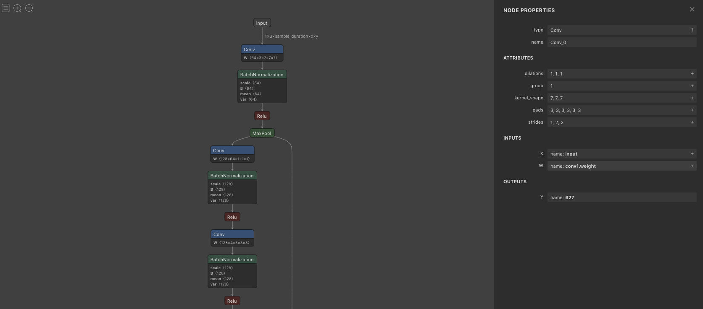

# ONNXの概要とオペレータ

# ONNXの概要とオペレータ

[Kazuki Kyakuno](https://kyakuno.medium.com/?source=post_page---byline--7304109cecbb---------------------------------------)

10 min read

·

Oct 28, 2020

--

Share

機械学習モデルの推論で広く使用されているONNXの概要とオペレータについて解説します。ONNXを使用することで、推論に特化したフレームワークを使用した高速な推論が可能になります。

## ONNXの概要

ONNXはOpen Neural Network Exchangeの略称で、推論で広く使用されている機械学習モデルのフォーマットです。PytorchやKerasなどの機械学習フレームワークからエクスポートすることができ、ONNX RuntimeやTensorRT、ailia SDKなどの推論に特化したSDKで推論ができるようになります。

Press enter or click to view image in full size

出典：<https://onnx.ai/>

## ONNXのメリット

PytorchやKerasなどは学習に最適化されているため、推論速度はあまり速くありません。ONNXに変換し、推論に特化したSDKを使用することで、推論を高速化することができます。

また、PytorchやKerasのモデルはフレームワークのバージョンアップに伴い互換性がなくなることがあります。例えば、あるバージョンのフレームワークで開発したモデルを、最新のバージョンで読み込ませようとすると、エラーが発生することができます。ONNXはファイルフォーマットが厳密に規定されているため、将来に渡って推論が行えることが期待できます。

## ONNXの記述対象

ONNXは計算グラフを記述します。機械学習のモデルはグラフ構造で定義され、入力データに対してConvやPoolingなどの処理を順次、実行していきます。ONNXにはどのような処理を行うかがノードとして記述され、ノードへの入出力を定義することで、計算グラフが構築されます。Convの重みパラメータはノードへの入力として与えられ、例えば、Convの場合はinput.1が処理データ、input.2が重み、input.3がバイアスになります。重みはInitializerノードに格納され、Convノードに供給されます。

Press enter or click to view image in full size

ONNXが記述する計算グラフの例

## ONNXのファイルフォーマット

ONNXはProtocol Bufferという形式でデータが格納されています。Protocol BufferはGoogleが開発したメッセージファイルフォーマットで、TensorflowやCaffeでも使用されています。

## Get Kazuki Kyakuno’s stories in your inbox

Join Medium for free to get updates from this writer.

Subscribe

Subscribe

Remember me for faster sign in

Protocol BufferはFloat32などのデータ型やデータの並びだけが規定されており、各データの意味付けは使用するソフトウェアに任されています。概念的にはjsonのようなイメージです。

## ONNXのバージョン

ONNXはオープンソースで開発されており、2020年10月現在、v1.7.0が最新です。

[## onnx/onnx

### Open Neural Network Exchange (ONNX) is an open ecosystem that empowers AI developers to choose the right tools as their…

github.com](https://github.com/onnx/onnx?source=post_page-----7304109cecbb---------------------------------------)

## ONNXのopset

ONNXのファイルフォーマットのバージョンはopsetという形で規定されてます。2020年10月現在、最新のopsetは12です。opsetに応じて、使用できるオペレータや、オペレータのプロパティが異なります。各opsetで追加・変更されたオペレータはReleasesで確認することができます。

[## Releases · onnx/onnx

### ONNX v1.7 is now available with exciting new features! We would like to thank everyone who contributed to this release…

github.com](https://github.com/onnx/onnx/releases?source=post_page-----7304109cecbb---------------------------------------)

## ONNXのオペレータ

ONNXにおいて、ConvolutionやPoolingはオペレータと呼ばれています。各オペレータの仕様はOperators.mdに記載されています。opset 10で142のオペレータが定義されています。

> Abs, Acos, Acosh, Add, And, ArgMax, ArgMin, Asin, Asinh, Atan, Atanh, AveragePool, BatchNormalization, BitShift, Cast, Ceil, Clip, Compress, Concat, Constant, ConstantOfShape, Conv, ConvInteger, ConvTranspose, Cos, Cosh, CumSum, DepthToSpace, DequantizeLinear, Div, Dropout, Elu, Equal, Erf, Exp, Expand, EyeLike, Flatten, Floor, GRU, Gather, GatherElements, Gemm, GlobalAveragePool, GlobalLpPool, GlobalMaxPool, Greater, HardSigmoid, Hardmax, Identity, If, InstanceNormalization, IsInf, IsNaN, LRN, LSTM, LeakyRelu, Less, Log, LogSoftmax, Loop, LpNormalization, LpPool, MatMul, MatMulInteger, Max, MaxPool, MaxRoiPool, MaxUnpool, Mean, Min, Mod, Mul, Multinomial, Neg, NonMaxSuppression, NonZero, Not, OneHot, Or, PRelu, Pad, Pow, QLinearConv, QLinearMatMul, QuantizeLinear, RNN, RandomNormal, RandomNormalLike, RandomUniform, RandomUniformLike, Reciprocal, ReduceL1, ReduceL2, ReduceLogSum, ReduceLogSumExp, ReduceMax, ReduceMean, ReduceMin, ReduceProd, ReduceSum, ReduceSumSquare, Relu, Reshape, Resize, ReverseSequence, RoiAlign, Round, Scan, Scatter, ScatterElements, Selu, Shape, Shrink, Sigmoid, Sign, Sin, Sinh, Size, Slice, Softmax, Softplus, Softsign, SpaceToDepth, Split, Sqrt, Squeeze, StringNormalizer, Sub, Sum, Tan, Tanh, TfIdfVectorizer, ThresholdedRelu, Tile, TopK, Transpose, Unique, Unsqueeze, Upsample, Where, Xor

[## onnx/onnx

### This file is automatically generated from the def files via this script. Do not modify directly and instead edit…

github.com](https://github.com/onnx/onnx/blob/master/docs/Operators.md?source=post_page-----7304109cecbb---------------------------------------)

opset 11ではResizeの仕様が大きく拡張されています。opset 10まではPytorchのBilinearの仕様とONNXのBilinearの仕様が異なり、PytorchとONNXで推論結果が異なっていましたが、opset 11でPytorchに対応したResizeのモードが追加され、推論結果が一致するようになりました。

## ONNXのエクスポート

Pytorchの場合、torch/onnxにエクスポートのコードがあります。PytorchのオペレータをONNXのオペレータに対応づけることでエクスポートします。opsetごとに使用できるONNXのオペレータが異なるため、エクスポートのコードはsymbolic\_opset10.pyのように分かれています。

[## pytorch/pytorch

### You can't perform that action at this time. You signed in with another tab or window. You signed out in another tab or…

github.com](https://github.com/pytorch/pytorch/tree/master/torch/onnx?source=post_page-----7304109cecbb---------------------------------------)

Kerasの場合も、keras-onnxでKerasのオペレータをONNXのオペレータに対応づけています。opsetごとに分岐があります。うまく推論結果が一致しない場合などは、これらのエクスポートコードのプロパティを調整する（attrs[‘coordinate\_transformation\_mode’] = ‘align\_corners’に固定するなど）で、推論結果を改善できる場合があります。

[## onnx/keras-onnx

### Convert tf.keras/Keras models to ONNX. Contribute to onnx/keras-onnx development by creating an account on GitHub.

github.com](https://github.com/onnx/keras-onnx/blob/master/keras2onnx/_builtin.py?source=post_page-----7304109cecbb---------------------------------------)

詳細なONNXへのエクスポート方法は下記の記事を参照ください。

[## ailia SDK チュートリアル(ONNXへのモデル変換)

### 学習フレームワークで学習したモデルをailia SDKで使用できる形にエクスポートするチュートリアルです。

medium.com](https://medium.com/axinc/%E5%AD%A6%E7%BF%92%E3%81%97%E3%81%9F%E3%83%A2%E3%83%87%E3%83%AB%E3%82%92ailia-sdk%E3%81%A7%E4%BD%BF%E7%94%A8%E3%81%A7%E3%81%8D%E3%82%8B%E5%BD%A2%E3%81%AB%E3%82%A8%E3%82%AF%E3%82%B9%E3%83%9D%E3%83%BC%E3%83%88%E3%81%99%E3%82%8B-add271b8ebdd?source=post_page-----7304109cecbb---------------------------------------)

## ONNXの最適化

各種のフレームワークが出力するONNXは冗長性があるため、オプティマイザを通すことで、より簡略化されたONNXに変換することができます。

例えば、定数に対するAddやDivなどの演算は事前に計算することができます。また、BatchNormはランタイムではスケールの乗算とバイアスの加算に落ちるため、Convの重みとバイアスに統合することができます。

オプティマイザの使用方法は下記の記事を参照ください。

[## ONNX 公式オプティマイザの活用

### ONNX 形式のモデルファイルは推論処理の観点からすると不要なオペレーションが含まれていることがあります。 この記事ではそうしたONNX形式モデルを推論処理向けに最適化するONNXの公式オプティマイザの紹介を行います。

medium.com](https://medium.com/axinc/onnx-%E3%83%A2%E3%83%87%E3%83%AB%E3%81%AE%E6%9C%80%E9%81%A9%E5%8C%96-%E5%85%AC%E5%BC%8F%E3%82%AA%E3%83%97%E3%83%86%E3%82%A3%E3%83%9E%E3%82%A4%E3%82%B6%E3%81%AE%E6%B4%BB%E7%94%A8-a9b6c8302374?source=post_page-----7304109cecbb---------------------------------------)

## ONNXの解析

出力されたONNXはNetronを使用することで解析することができます。詳細は下記の記事を参照ください。

[## Netronを使用したONNX モデルのビジュアライズ

### Netronはブラウザを含むクロスプラットフォームで動作する機械学習モデルのビジュアライズツールです。ONNXファイルやPrototxtをアップロードするだけでモデルの構造をビジュアライズすることができます。

medium.com](https://medium.com/axinc/onnx%E3%83%A2%E3%83%87%E3%83%AB%E3%81%AE%E3%83%93%E3%82%B8%E3%83%A5%E3%82%A2%E3%83%A9%E3%82%A4%E3%82%BA-netron%E3%81%AE%E7%B4%B9%E4%BB%8B-84487cb6ae35?source=post_page-----7304109cecbb---------------------------------------)

ax株式会社はAIを実用化する会社として、クロスプラットフォームでGPUを使用した高速な推論を行うことができるailia SDKを開発しています。ax株式会社ではコンサルティングからモデル作成、SDKの提供、AIを利用したアプリ・システム開発、サポートまで、 AIに関するトータルソリューションを提供していますのでお気軽に[お問い合わせ](https://axinc.jp/)ください。