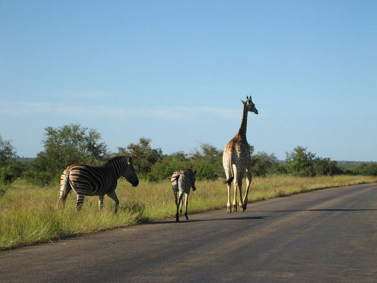
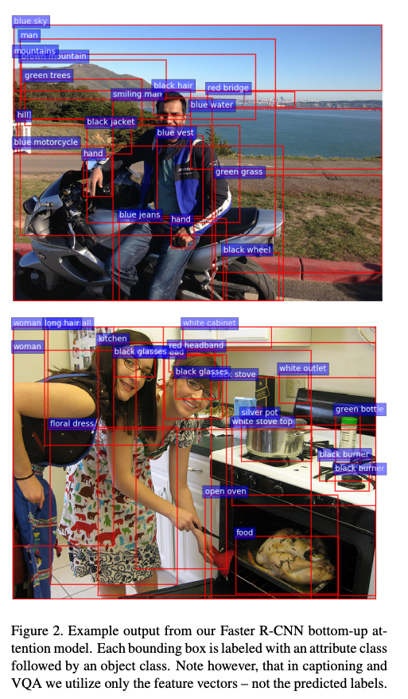
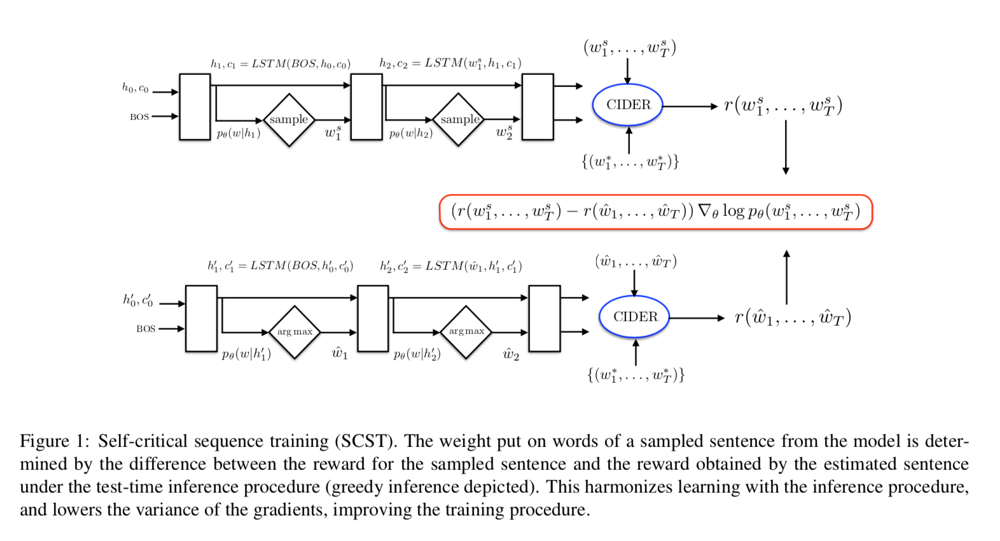

# Image Captioning Pytorch : 画像を説明する機械学習モデル

# Image Captioning Pytorch : 画像を説明する機械学習モデル

[Kazuki Kyakuno](https://kyakuno.medium.com/?source=post_page---byline--e690982af19---------------------------------------)

8 min read

·

Dec 1, 2020

--

Share

[ailia SDK](https://ailia.jp/)で使用できる機械学習モデルである「Image Captioning Pytorch」のご紹介です。エッジ向け推論フレームワークである[ailia SDK](https://ailia.jp/)と[ailia MODELS](https://github.com/axinc-ai/ailia-models)に公開されている機械学習モデルを使用することで、簡単にAIの機能をアプリケーションに実装することができます。

## Image Captioning Pytorchの概要

Image Captioning Pytorchは入力された画像から、入力された画像を示すテキストを出力する機械学習モデルです。Image Classificationタスクでは、入力された画像のラベルを出力しますが、Image Captioningタスクでは自然言語のキャプションを出力します。

入力画像（出典：http://images.cocodataset.org/train2017/000000505539.jpg）

出力されるキャプション

> a giraffe and a zebra standing in a field (FCモデル)
>
> a group of zebras and a giraffe in a field（FC＋RL＋SelfCriticalモデル）
>
> a group of zebras and a giraffe standing on a dirt road（FC＋RL＋new SelfCriticalモデル）

[## ruotianluo/ImageCaptioning.pytorch

### This is a codebase for image captioning research. It supports: A simple demo colab notebook is available here Python 3…

github.com](https://github.com/ruotianluo/ImageCaptioning.pytorch?source=post_page-----e690982af19---------------------------------------)

Image Captioning Pytorchは下記の論文をベースに実装されています。

[## Self-critical Sequence Training for Image Captioning

### Recently it has been shown that policy-gradient methods for reinforcement learning can be utilized to train deep…

arxiv.org](https://arxiv.org/abs/1612.00563?source=post_page-----e690982af19---------------------------------------)

## Image Captioning Pytorchのアーキテクチャ

Image CaptioningにはTopDownとBottomUpの2つのアプローチがあります。

TopDownアプローチでは、ResNet50などのImageClassificationの特徴抽出ネットワーク（Backbone）を使用した特徴ベクトル（Feature Vector）からキャプションを生成します。

BottomUpアプローチでは、Faster R-CNNなどのObjectDetectionのBackboneを使用したFeature Vectorからキャプションを生成します。

BottomUpアプローチの例（出典：<https://arxiv.org/pdf/1707.07998.pdf>）

Image Captioning PytorchはTopDownアプローチを採用しており、Feature Vectorを計算するEncoderと、キャプションを出力するDecoderで構成されています。Encoderの計算にはResNet101を使用しており、2048次元のFeature Vectorが出力されます。DecoderではLSTMを使用し、単語列とストップ記号を出力します。

## Get Kazuki Kyakuno’s stories in your inbox

Join Medium for free to get updates from this writer.

Subscribe

Subscribe

Remember me for faster sign in

Image Captioningの学習においては、従来、バイアスへの対策としてReinforcement Learning (RL) (強化学習) が提案されており、ベースラインとなっています。また、Self Critical Sequence Training (SCST)が提案されており、強化学習の安定性を改善しており、精度でSOTAを達成しています。

Press enter or click to view image in full size

出典：<https://arxiv.org/abs/1612.00563>

Image Captioning PytorchではSelf Criticalを改良したnew Self Criticalが使用されています。

> This “new self critical” is borrowed from “Variational inference for monte carlo objectives”. The only difference from the original self critical, is the definition of baseline.
>
> In the original self critical, the baseline is the score of greedy decoding output. In new self critical, the baseline is the average score of the other samples (this requires the model to generate multiple samples for each image).

[## ruotianluo/ImageCaptioning.pytorch

### Current ensemble only supports models which are subclass of AttModel. Here is example of the script to run ensemble…

github.com](https://github.com/ruotianluo/ImageCaptioning.pytorch/blob/master/ADVANCED.md?source=post_page-----e690982af19---------------------------------------)

## Image Captioning Pytorchのデータセット

Image Captioning Pytorchは、MSCOCOおよびFlickr30kデータセットで学習されています。

[## COCO - Common Objects in Context

### Edit description

cocodataset.org](https://cocodataset.org/?source=post_page-----e690982af19---------------------------------------#home)

[## BryanPlummer/flickr30k\_entities

### If you use our dataset, please cite our paper: @article{flickrentitiesijcv, title={Flickr30K Entities: Collecting…

github.com](https://github.com/BryanPlummer/flickr30k_entities?source=post_page-----e690982af19---------------------------------------)

## Image Captioning Pytorchの精度

精度は[MODEL\_ZOO.md](https://github.com/ruotianluo/ImageCaptioning.pytorch/blob/master/MODEL_ZOO.md)に記載されています。

Press enter or click to view image in full size

出典：<https://github.com/ruotianluo/ImageCaptioning.pytorch/blob/master/MODEL_ZOO.md>

## Image Captioning Pytorchの使用方法

Image Captioning Pytorchを使用するには下記のコマンドを使用します。WEBカメラから入力した画像に対してキャプションを生成します。

> python3 image\_captioning\_pytorch.py -v 0

モデルは、FC、FC+RL+SelfCritical、FC+RL+NewSelfCriticalが選択可能です。 — modelオプションでそれぞれ、fc、fc\_rl、fc\_nscを指定してください。

Image Captioning Pytorchはailia SDK 1.2.5以降で使用可能です。

[## axinc-ai/ailia-models

### (Image from http://images.cocodataset.org/train2017/000000505539.jpg) a giraffe and a zebra standing in a field…

github.com](https://github.com/axinc-ai/ailia-models/tree/master/image_captioning/image_captioning_pytorch?source=post_page-----e690982af19---------------------------------------)

ax株式会社はAIを実用化する会社として、クロスプラットフォームでGPUを使用した高速な推論を行うことができるailia SDKを開発しています。ax株式会社ではコンサルティングからモデル作成、SDKの提供、AIを利用したアプリ・システム開発、サポートまで、 AIに関するトータルソリューションを提供していますのでお気軽に[お問い合わせ](https://axinc.jp/)ください。