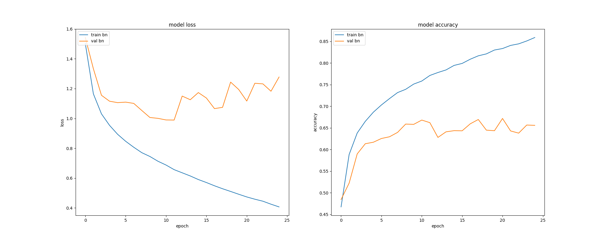
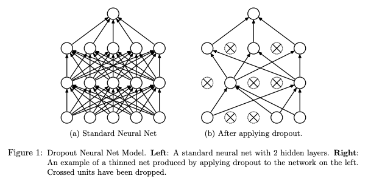
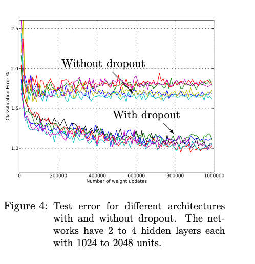
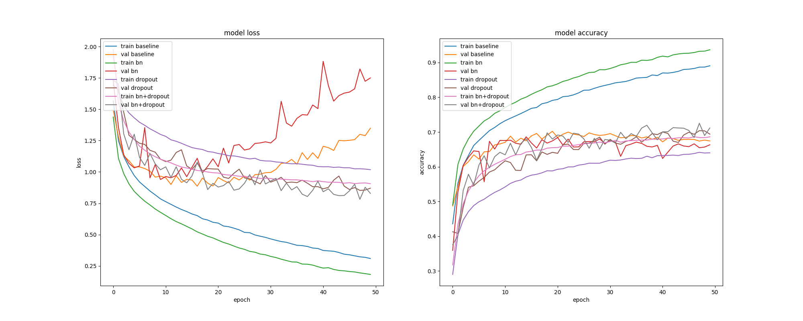
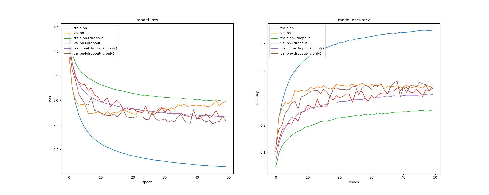

# Dropoutによる過学習の抑制

# Dropoutによる過学習の抑制

[Kazuki Kyakuno](https://kyakuno.medium.com/?source=post_page---byline--be5b9bba7e89---------------------------------------)

10 min read

·

May 13, 2020

--

Share

Kerasを使用して機械学習を行い、実アプリケーションに適用する場合、いかに過学習を抑制するかが重要になります。本記事では、Dropoutによる過学習の抑制の効果を検討します。

## 過学習とは

機械学習で学習を行う際、トレーニングデータに過剰に適合することで過学習が発生することがあります。過学習が発生すると、トレーニングデータでの精度は向上しますが、バリデーションデータでの精度が低下します。そのため、実験データでは精度が出るものの、現実のアプリケーションに適用した場合に、イレギュラーデータに対応できない場合があります。

下記の図はCifar10を使用した過学習の例です。EPOCHが10を超えたあたりから、トレーニングのlossは低下するものの、バリデーションのlossは増加に転じ、学習を進めるごとに精度が低下しています。トレーニングデータに過剰適応してしまい、汎化性能が失われていることを示しています。

Press enter or click to view image in full size

cifar10 + BatchNormalizationによる過学習の例

## Dropoutとは

過学習を抑制する方法として、Dropoutが提案されています。Dropoutは特定のレイヤーの出力を学習時にランダムで0に落とすことで、一部のデータが欠損していても正しく認識ができるようにします。これにより、画像の一部の局所特徴が過剰に評価されてしまうのを防ぎ、モデルのロバストさを向上させることができます。

（出典：<http://jmlr.org/papers/v15/srivastava14a.html>）

下記のグラフはDropoutの論文に掲載されている実験結果です。without dropoutに比べて、with dropoutではEPOCHを重ねても過学習を抑制でき、エラーレートを落としていくことができています。

（出典：<http://jmlr.org/papers/v15/srivastava14a.html>）

> 多数のパラメータを持つディープニューラルネットは非常に強力な機械学習 システムを構築することができます。しかし、このようなネットワークではオーバーフィットが深刻な問題となっています。また、大規模なネットワークは低速なため、テスト時に複数の大規模のネットワークの予測出力を組み合わせることでオーバーフィッティングに対処することは困難です。ドロップアウトはこの問題に対処するための手法です。キーとなるアイディアは、トレーニング中に、ユニットを（その接続とともに）ランダムにドロップアウトすることです。これにより、ユニットの共同適応が過剰になるのを防ぐことができます。学習中において、ドロップアウトは指数関数的な「間引きされた」ネットワークを構築します。テスト時に は、これらすべての「間引きされた」ネットワークの予測が平均化されることになります。単純に重みの少ない単一の間引きされていないネットワークを使用することで，より大きな重みを持つことができます．これにより オーバーフィッティングを低減し，他の正則化手法に比べて大幅な改善を実現します．我々はドロップアウトが教師付き学習におけるニューラルネットワークの性能を向上させることを、 画像認識、音声認識、文書分類、計算生物学などのタスクで示します。多くのベンチマークデータセットでstate-of-the-artの結果を得ることを示します。  
> （出典：<http://jmlr.org/papers/v15/srivastava14a.html>）

[## Dropout: A Simple Way to Prevent Neural Networks from Overfitting

### Nitish Srivastava, Geoffrey Hinton, Alex Krizhevsky, Ilya Sutskever, Ruslan Salakhutdinov ; 15(56):1929−1958, 2014…

jmlr.org](http://jmlr.org/papers/v15/srivastava14a.html?source=post_page-----be5b9bba7e89---------------------------------------)

## 実験環境

実際にKerasで3層のConvNetを作成し、Cifar10およびCifar100のデータセットで、各パターンのlossとaccuracyを見てみます。

評価対象は下記の4種類です。

・baseline : ConvNet  
・bn : ConvNet + BatchNormalization  
・dropout : ConvNet + Dropout  
・bn+dropout : ConvNet + BatchNormalization + Dropout

Dropoutは、Poolingの後と、FCの前の両方に挿入しています。

## Get Kazuki Kyakuno’s stories in your inbox

Join Medium for free to get updates from this writer.

Subscribe

Subscribe

Remember me for faster sign in

実験用のコードです。Kerasを使用しています。

## 実験結果

Cifar10の結果は下記となります。model lossのグラフにおいて、trainがトレーニングデータに対するloss、valがバリデーションデータに対するlossです。lossは低いほど高精度なモデルになります。

ベースラインやBatchNormalization単独ではEPOCHが進むに連れて過学習によるlossの急激な増加が見られます。BatchNormalizationとDropoutを併用することで、学習速度が低下するものの、過学習が抑制できることがわかります。また、過学習を抑制することができた結果として、最も低いlossを獲得できています。

Press enter or click to view image in full size

cifar10でのlossとaccuracy

Cifar100の結果は下記となります。BatchNormalizationはかなり急速にval lossを下げることができていますが、EPOCHが増えると過学習によりval lossが増加に転じることがわかります。BatchNormalizationとDropoutを組み合わせて使用した場合、収束までに時間はかかりますが、過学習を抑制できており、val lossはBatchNormalizationを単独で使用した場合よりも低減することができています。

Press enter or click to view image in full size

cifar100でのlossとaccuracy

## FC層の前にだけDropoutを適用

下記の論文では、BatchNormalizationとDropoutを併用した場合の性能低下に関する考察が行われており、BatchNormalizationの前にDropoutを入れることは非推奨となっています。

（出典：<https://arxiv.org/abs/1801.05134>）

> 本稿ではまず、「なぜ パワフルな2つのテクニックであるDropoutとBatchNormalizationは、組み合わせて使用するとパフォーマンスが低下するのか？」 という質問に、理論的、統計的な回答を示します。 理論的には、Dropoutは特定のニューラルユニットの分散は，訓練からテストまでの間で変化します。しかし、BNはその統計的分散を維持するため、全体の学習時に蓄積された分散は 、テスト段階では 矛盾したの分散の変化（このスキームを「分散シフト」と呼ぶ）により、推論の数値的な振る舞いが不安定になり、最終的にはエラー率の向上に繋がります。これは、BNの前にDropout を適用した場合に発生します。これらは、 DenseNet, ResNet、ResNeXt、Wide ResNetで得られた知見です。今回、明らかになったメカニズムをもとに、ドロップアウトを修正するいくつかの戦略を探り、分散シフトのリスクを回避することで、それらの組み合わせの限界を克服します。  
> （出典：<https://arxiv.org/abs/1801.05134>）

[## Understanding the Disharmony between Dropout and Batch Normalization by Variance Shift

### This paper first answers the question “why do the two most powerful techniques Dropout and Batch Normalization (BN)…

arxiv.org](https://arxiv.org/abs/1801.05134?source=post_page-----be5b9bba7e89---------------------------------------)

本論文では、FC層の前のみにDropoutを使用することで性能が改善することを示しています。そこで、従来のPoolingの後とFC層の前の両方にDropoutを入れるケースと、FC層の前にだけDropoutを入れるケースを比較します。

> 先行研究において検討されたFC層の前にDropoutを適用する方式 (Krizhevsky et al., 2012)をインスパイアし、我々は4つのアーキテクチャにおいてsoftmaxの前だけにDropoutを追加した。  
> （出典：<https://arxiv.org/abs/1801.05134>）

評価対象です。

・bn : ConvNet + BatchNormalization  
・bn+dropout : ConvNet + BatchNormalization + Dropout (pooling + fc)  
・bn+dropout : ConvNet + BatchNormalization + Dropout (fc only)

実験結果です。

Press enter or click to view image in full size

Cifar100におけるdropoutの挿入箇所による精度の違い

BatchNormalization + Dropout (FCの前のみ適用）が最も高速にval lossが低下するとともに、過学習を抑制できていることがわかります。

## まとめ

Dropoutを導入することで、BatchNormalizationと併用した場合も過学習を抑制できました。また、BatchNormalizationと併用する場合、DropoutはFCの前のみに適用するのが望ましいことを確認しました。

ax株式会社はAIを実用化する会社として、クロスプラットフォームでGPUを使用した高速な推論を行うことができる[ailia SDK](https://ailia.jp/)を開発しています。ax株式会社ではコンサルティングからモデル作成、SDKの提供、AIを利用したアプリ・システム開発、サポートまで、 AIに関するトータルソリューションを提供していますのでお気軽に[お問い合わせ](https://axinc.jp/)ください。