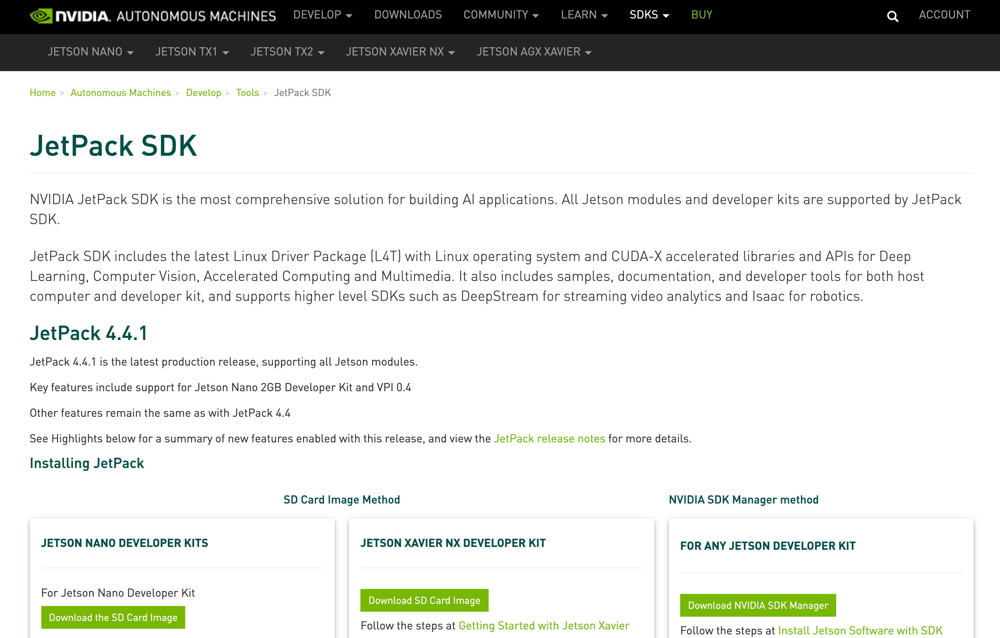

# JetsonにJetpackとTensorflowをインストールする

# JetsonにJetpackとTensorflowをインストールする

[](https://kyakuno.medium.com/?source=post_page---byline--2085075a8742---------------------------------------)

[Kazuki Kyakuno](https://kyakuno.medium.com/?source=post_page---byline--2085075a8742---------------------------------------)

12 min read

·

Oct 27, 2020

--

Share

NVIDIAの機械学習向けボードコンピュータであるJetsonにJetpackとTensorflowをインストールする方法を紹介します。

## Jetpackとは

JetpackはJetson向けにCUDA、cuDNN、TensorRT、DeepStream、OpenCVをパッケージしたソフトウェアです。

Press enter or click to view image in full size



出典：<https://developer.nvidia.com/embedded/jetpack>

## Jetpackのインストール

JetsonにJetpackをインストールするには、下記のコマンドを使用します。

```
sudo apt install nvidia-jetpack
```

[## How to Install JetPack :: NVIDIA JetPack Documentation

### Starting with JetPack 4.4, upgrading to the next JetPack release can be achieved using a package management tool like…

docs.nvidia.com](https://docs.nvidia.com/jetson/jetpack/install-jetpack/index.html?source=post_page-----2085075a8742---------------------------------------#how-to-install-jetpack)

上記の手順でJetpack 4.3をインストールすると、OpenCV 4.1.1 (GstreamerとPython対応版）が入ります。正常にインストールされたかどうかは下記のコマンドで確認することができます。

> import cv2  
> print(cv2.getBuildInformation())

Jetpackのインストールで‘Unable to locate package nvidia-jetpack’のエラーが発生する場合は、/etc/apt/sources.list.d/nvidia-l4t-apt-source.listに正しいリモートパスが登録されているか確認します。

```
deb https://repo.download.nvidia.com/jetson/common r32.4 main  
deb https://repo.download.nvidia.com/jetson/t194 r32.4 main
```

t194はボードの種類を示しています。

> t186 for Jetson TX2 series  
> t194 for Jetson AGX Xavier series or Jetson Xavier NX  
> t210 for Jetson Nano or Jetson TX1

[## Tegra Linux Driver

### Edit description

docs.nvidia.com](https://docs.nvidia.com/jetson/l4t/index.html?source=post_page-----2085075a8742---------------------------------------#page/Tegra%2520Linux%2520Driver%2520Package%2520Development%2520Guide%2Fquick_start.html%23wwpID0EXHA)

## Jetpackのアンインストール

JetsonにはJetpack以外でも、apt python3-opencvやapt-get install python3-opencvでOpenCVをインストールすることができます。その場合、少し古いOpenCV 3系が入ってしまいます。

OpenCV 3系が入った状態でJetpackをインストールした場合、OpenCVが古いまま残ってしまいます。そのような場合は、一度、Jetpackをアンインストールしてから再インストールします。

下記が公式のアンインストール手順です。最新のコマンドは[公式サイト](https://docs.nvidia.com/jetson/jetpack/install-jetpack/index.html#how-to-install-jetpack.)を参照してください。

If you are running JetPack 4.3, use the following command:

```
sudo apt autoremove --purge nvidia-container-csv-cuda libopencv-python libvisionworks-sfm-dev libvisionworks-dev libvisionworks-samples libnvparsers6 libcudnn7-doc libcudnn7-dev libnvinfer-samples libnvinfer-bin nvidia-container-csv-cudnn libvisionworks-tracking-dev vpi-samples tensorrt libopencv libnvinfer-doc libnvparsers-dev libcudnn7 libnvidia-container0 cuda-toolkit-10-0 nvidia-container-csv-visionworks graphsurgeon-tf libopencv-samples python-libnvinfer-dev libnvinfer-plugin-dev libnvinfer-plugin6 nvidia-container-toolkit libnvinfer-dev libvisionworks libopencv-dev nvidia-l4t-jetson-multimedia-api vpi-dev vpi python3-libnvinfer python3-libnvinfer-dev opencv-licenses nvidia-container-csv-tensorrt libnvinfer6 libnvonnxparsers-dev libnvonnxparsers6 uff-converter-tf nvidia-docker2 libvisionworks-sfm libnvidia-container-tools nvidia-container-runtime python-libnvinfer libvisionworks-tracking
```

If you are running JetPack 4.4, use the following command:

```
sudo apt autoremove --purge nvidia-container-csv-cuda libopencv-python libvisionworks-sfm-dev libvisionworks-dev libvisionworks-samples libnvparsers7 libcudnn8-doc libcudnn8-dev libnvinfer-samples libnvinfer-bin nvidia-container-csv-cudnn libvisionworks-tracking-dev vpi-samples tensorrt libopencv libnvinfer-doc libnvparsers-dev libcudnn8 libnvidia-container0 cuda-toolkit-10-2 nvidia-container-csv-visionworks graphsurgeon-tf libopencv-samples python-libnvinfer-dev libnvinfer-plugin-dev libnvinfer-plugin7 nvidia-container-toolkit libnvinfer-dev libvisionworks libopencv-dev nvidia-l4t-jetson-multimedia-api vpi-dev vpi python3-libnvinfer python3-libnvinfer-dev opencv-licenses nvidia-container-csv-tensorrt libnvinfer7 libnvonnxparsers-dev libnvonnxparsers7 uff-converter-tf nvidia-docker2 libvisionworks-sfm libnvidia-container-tools nvidia-container-runtime python-libnvinfer libvisionworks-tracking
```

これで、OpenCV 3系からOpenCV 4系に移行することができます。

## インストールされたパスの確認

JetpackでインストールされたOpenCVのパスは、下記のコマンドで確認できます。

> import cv2  
> print(cv2)

出力は下記です。

> /usr/lib/python3.6/dist-packages/cv2/python-3.6/cv2.cpython-36m-aarch64-linux-gnu.so

## TensorRTのテスト

JetpackにはTensorRTが付属しています。TensorRTのサンプルはusr/src/tensorrt/samplesに格納されています。

## Get Kazuki Kyakuno’s stories in your inbox

Join Medium for free to get updates from this writer.

Subscribe

Subscribe

Remember me for faster sign in

今回は、samples/python/yolov3\_onnxを使用します。

yolov3\_onnxではDarknetの重みをONNXに変換する必要があります。変換にはonnxのインストールが必要ですが、pip3 install onnxをするとprotobufに関するエラーが発生します。

[## Could not install ONNX on jetson nano · Issue #57 · jkjung-avt/tensorrt\_demos

### Dismiss GitHub is home to over 50 million developers working together to host and review code, manage projects, and…

github.com](https://github.com/jkjung-avt/tensorrt_demos/issues/57?source=post_page-----2085075a8742---------------------------------------)

そのため、pip3 install onnxを呼び出す前に、下記のスクリプトでprotobufをインストールする必要があります。

[## jkjung-avt/jetson\_nano

### You can’t perform that action at this time. You signed in with another tab or window. You signed out in another tab or…

github.com](https://github.com/jkjung-avt/jetson_nano/blob/master/install_protobuf-3.8.0.sh?source=post_page-----2085075a8742---------------------------------------)

protobufがインストールできたら、下記のコマンドでyolov3のモデルを変換します。yolov3\_to\_onnx.pyはpython2でしか動作しません。

> python2 -m pip install -r requirements.txt  
> python2 yolov3\_to\_onnx.py

モデルの変換に成功したら、推論を行うことができます。

> pip3 install -r requirements.txt  
> python3 onnx\_to\_tensorrt.py

## Tensorflowのインストール

JetsonにTensorflowをインストールするには、NVIDIAが提供しているバイナリを使用します。インストールの手順は下記のサイトに記載されており、pipでインストール可能です。

[## Jetson Platform

### This guide provides instructions for installing TensorFlow for Jetson Platform. TensorFlow™ is an open-source software…

docs.nvidia.com](https://docs.nvidia.com/deeplearning/frameworks/install-tf-jetson-platform/index.html?source=post_page-----2085075a8742---------------------------------------)

Tensorflowは2系と1系の両方が提供されています。Tensorflow 1系をインストールするにはtensorflow<2を指定します。tensorflow<2を指定すると、tensorflow==1.15.4がインストールされます。

なお、使用しているJetpackのバージョンに応じて、Tensorflowが使用するcuDNNのバージョンが異なるため、インストールするバージョンを合わせる必要があります。具体的に、Jetpackのバージョンに合わせて、v44の部分を書き換えます。Jetpack4.3の場合はv43を指定します。

```
sudo pip3 install --pre --extra-index-url https://developer.download.nvidia.com/compute/redist/jp/v44 ‘tensorflow<2’
```

インストールされるTensorflowはGPUに対応しています。pipでインストールすることで、Kerasも使用可能です。

> pip3 install keras==2.24.0

以上の設定で、keras-yolo3が動作します。

[## qqwweee/keras-yolo3

### A Keras implementation of YOLOv3 (Tensorflow backend) inspired by allanzelener/YAD2K. Download YOLOv3 weights from YOLO…

github.com](https://github.com/qqwweee/keras-yolo3?source=post_page-----2085075a8742---------------------------------------)

## 電力モードの確認

Jetsonには電力モードの設定があります。パフォーマンスを計測する際には、事前に、下記のコマンドで電力モードを確認してください。

> nvpmodel -q

MAXNと表示されると、最大動作モードになります。

> NV Fan Mode:quiet  
> NV Power Mode: MAXN

## 参考情報

Jetpackのバージョン情報まとめ

[## 【2020年版】NVIDIA Jetson Nano JetPackのバージョン情報まとめ、JetPack 4.4 DPは不具合多い (最新の JetPackでは…

### ・ (最新の JetPackでは 2019年当時の殆どの記事の内容がそのままではエラーが出て動かない様になりました) Tags: [Raspberry Pi], [電子工作], [ディープラーニング] ● 2020/10/21…

www.neko.ne.jp](http://www.neko.ne.jp/~freewing/raspberry_pi/nvidia_jetson_nano_2020_jetpack_44/?source=post_page-----2085075a8742---------------------------------------)

NVIDIA Xavier 消費電力測定

[## NVIDIA Xavier 消費電力測定

### NVIDIA製の自律動作マシン向け組み込みAIプラットフォームである「Jetson AGX Xavier」(以降、単に Xavier)。 今までのJetsonシリーズ (TK1、TX1、TX2)…

wazalabo.com](http://wazalabo.com/jetson_agx_xavier_power_comsumption.html?source=post_page-----2085075a8742---------------------------------------)

Jetson Nanoにあるnvpmodelコマンド

[## Jetson Nanoにあるnvpmodelコマンド - Qiita

### 今さらながらに nvpmodel というコマンドを調べてみた。 最初に nvpmodel -h の結果を読み解く(英語の訳は適当)。 yamamo-to@jetson-nano:~$ nvpmodel -p --verbose NVPM…

qiita.com](https://qiita.com/yamamo-to/items/6f0672a91c059a5493ed?source=post_page-----2085075a8742---------------------------------------)

ax株式会社はAIを実用化する会社として、クロスプラットフォームでGPUを使用した高速な推論を行うことができるailia SDKを開発しています。ax株式会社ではコンサルティングからモデル作成、SDKの提供、AIを利用したアプリ・システム開発、サポートまで、 AIに関するトータルソリューションを提供していますのでお気軽に[お問い合わせ](https://axinc.jp/)ください。