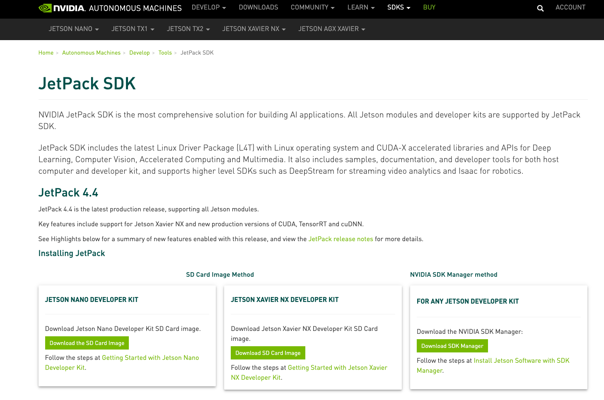

# ailia SDK 1.2.4をリリース

# ailia SDK 1.2.4をリリース

[Kazuki Kyakuno](https://kyakuno.medium.com/?source=post_page---byline--1ece1c22bf9e---------------------------------------)

6 min read

·

Sep 30, 2020

--

Share

クロスプラットフォームで利用できるGPU対応の高速AI推論フレームワークであるailia SDKのバージョン1.2.4のご紹介です。ailia SDKについては[こちら](https://ailia.jp/)をご覧ください。

## cuDNN8対応

cuDNN8とTensorCoreに対応しました。cuDNN8とTensorCoreに対応したことで、NVIDIAのGPU環境でより高速な推論が可能になります。

Windowsではailia\_cuda\_7.dllとailia\_cuda\_8.dllが、Linuxではailia\_cuda-7.soとailia\_cuda-8.soが含まれ、ailia SDKがインストールされている環境に応じてcuDNN7とcuDNN8を自動的に選択します。

Windowsで使用する場合は、CUDA TOOLKIT 11（cuda\_11.1.0\_456.43\_win10.exe）とcuDNN 8.0.3 for CUDA 11.0（cudnn-11.0-windows-x64-v8.0.3.33.zip）をインストールし、Pathにcudnn/cuda/binを、CUDA\_PATHにNVIDIA GPU Computing Toolkit/CUDA/v11.0を通します。

WinndowsのRTX2080でcuDNN7とcuDNN8を比較すると、FP32では性能差はあまりありませんが、FP16ではResNet50で30%程度高速になります。

ailia SDKでは、ユーザの環境に特別なライブラリをインストールしなくても使用できるVulkanによる推論と、限界までGPUパフォーマンスを引き出すcuDNNによる推論の両方に対応しています。

## Jetpack4.4対応

Jetsonにおいても、従来のJetpack4.2 + cuDNN7に加えて、Jetpack4.4 + cuDNN8による推論に対応しました。Jetpack4.4においては最初からcuDNN8がインストールされているため、特に設定は不要です。

Press enter or click to view image in full size

<https://developer.nvidia.com/embedded/jetpack>

## CPU高速化の強化

AVX実装に加えてSSE2実装を追加しました。また、Deconvolutionを含む各種レイヤーのCPU実装の高速化を行いました。

## Softplusレイヤーへの対応

新たにYOLOv4で使用されているSoftplusレイヤーに対応しました。

## AndroidのOpenCLバックエンドのサポート終了

Vulkanバックエンドが十分に高速になったことに伴い、AndroidのOpenCLバックエンドのサポートを終了しました。今後、OpenCLバックエンドはLinuxおよび組み込み機器向けの提供となります。

## opset=11対応（先行実装）

先行実装としてu2netで使用している範囲に限定されますが、opset=11に対応しました。これにより、PytorchのResizeの仕様に合わせたスケーリングが可能になり、u2netなど、Resizeを使用するモデルの精度が改善します。今後、opset=11のカバレッジを上げていく予定です。

## 5次元入力と3D Convolution対応（先行実装）

動画のアクション検出モデル（MARSやST-GCNなど）への対応を目的として、5次元以上の入出力に対応したAPIを追加しました。また、先行実装として3D ConvolutionのCPUとCUDA実装を追加しました。

## 新しく対応したモデル

ailia SDK 1.2.4で新しく対応したモデルは下記になります。

## Get Kazuki Kyakuno’s stories in your inbox

Join Medium for free to get updates from this writer.

Subscribe

Subscribe

Remember me for faster sign in

Council gan : 画像のドメイン変換モデル

[## axinc-ai/ailia-models

### (Image from CelebA dataset http://mmlab.ie.cuhk.edu.hk/projects/CelebA.html) (Image from CelebA dataset…

github.com](https://github.com/axinc-ai/ailia-models/tree/master/generative_adversarial_networks/council-GAN?source=post_page-----1ece1c22bf9e---------------------------------------)

Pytorch-ZOO GNet : 画像の生成モデル

[## axinc-ai/ailia-models

### Celeb model is converted from pre-trained model of Pytorch-ZOO GAN. The generative networks presented and used here…

github.com](https://github.com/axinc-ai/ailia-models/tree/master/generative_adversarial_networks/pytorch-gan?source=post_page-----1ece1c22bf9e---------------------------------------)

MiDaS : 画像から深度情報を推定するモデル

[## axinc-ai/ailia-models

### (Image from kitti dataset http://www.cvlibs.net/datasets/kitti/raw\_data.php) Shape : (1, 3, 128, 384) Shape : (1, 128…

github.com](https://github.com/axinc-ai/ailia-models/tree/master/depth_estimation/midas?source=post_page-----1ece1c22bf9e---------------------------------------)

MARS : 動画からアクションを検出するモデル

[## axinc-ai/ailia-models

### (Video from HMDB51 : https://serre-lab.clps.brown.edu/resource/hmdb-a-large-human-motion-database/) Shape : (1, 3…

github.com](https://github.com/axinc-ai/ailia-models/tree/master/action_recognition/mars?source=post_page-----1ece1c22bf9e---------------------------------------)

## 無償評価版

ailia SDK 1.2.4はailia SDKの公式サイトから無償評価版をダウンロード可能です。Windows、Mac、Linux、iOS、Android、Jetsonの各環境でailia SDKの評価が可能です。

[## ailia SDK（アイリア）- ディープラーニングフレームワーク -

### 物体検出・画像分類・特徴抽出。 クラウドで学習したモデルを簡単にアプリに組み込み。 高速なディープラーニングがあなたの手に。 エッジ(端末)側での推論に特化したディープラーニングミドルウェア…

ailia.jp](https://ailia.jp/?source=post_page-----1ece1c22bf9e---------------------------------------)

ax株式会社はAIを実用化する会社として、クロスプラットフォームでGPUを使用した高速な推論を行うことができるailia SDKを開発しています。ax株式会社ではコンサルティングからモデル作成、SDKの提供、AIを利用したアプリ・システム開発、サポートまで、 AIに関するトータルソリューションを提供していますのでお気軽に[お問い合わせ](https://axinc.jp/)ください。

### 参考記事

[## ailia SDKの概要

### ailia SDKはax株式会社および株式会社アクセルが開発・提供する推論に特化したAIフレームワークです。ailia SDKの特徴や何を目指しているかを紹介します。

medium.com](https://medium.com/axinc/ailia-sdk%E3%81%AB%E3%81%A4%E3%81%84%E3%81%A6-4735dc8ff2db?source=post_page-----1ece1c22bf9e---------------------------------------)

[## ailia SDK チュートリアル(Python)

### ailia SDKをPythonで使用するチュートリアルです。Pythonを使用することで様々なモデルの動作を簡単に試すことができます。

medium.com](https://medium.com/axinc/ailia-sdk-%E3%83%81%E3%83%A5%E3%83%BC%E3%83%88%E3%83%AA%E3%82%A2%E3%83%AB-python-28379dbc9649?source=post_page-----1ece1c22bf9e---------------------------------------)

[## ailia SDK API解説(Predict API)

### ailia SDKのコアAPIであるPredict APIのチュートリアルです。Predict APIはテンソルを入力してテンソルを出力する最も基本的なAPIとなります。

medium.com](https://medium.com/axinc/ailia-sdk-api%E8%A7%A3%E8%AA%AC-predict-api-dcae1dc62780?source=post_page-----1ece1c22bf9e---------------------------------------)