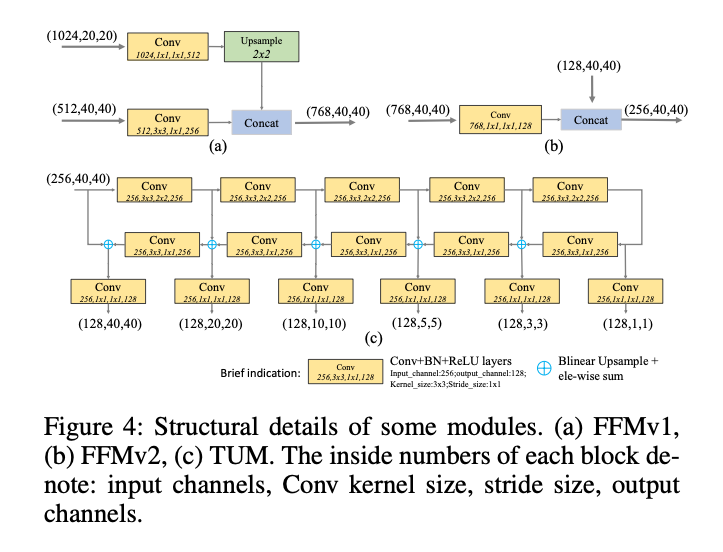
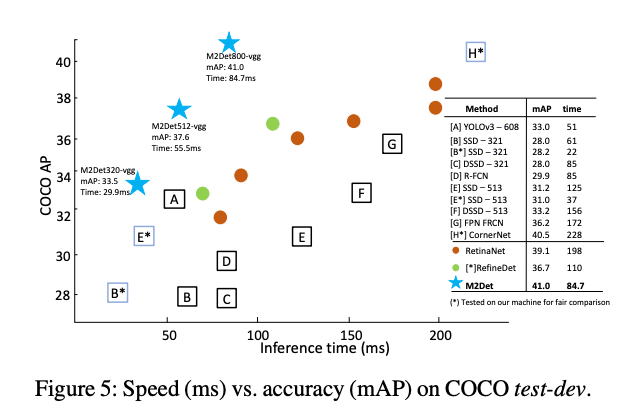
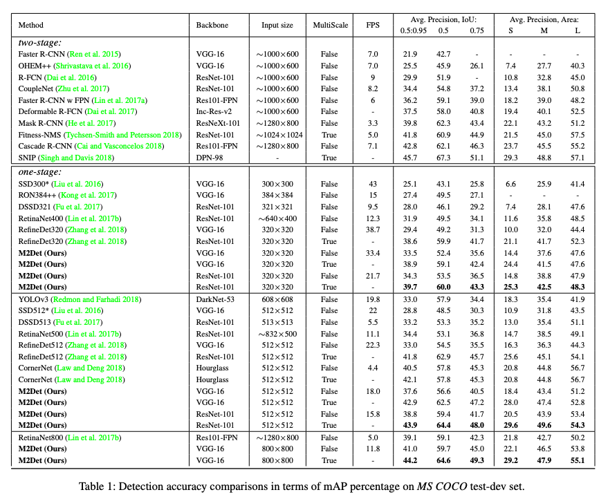

# M2Det : 高精度な物体検出モデル

# M2Det : 高精度な物体検出モデル

[Kazuki Kyakuno](https://kyakuno.medium.com/?source=post_page---byline--bf92a8a3d423---------------------------------------)

Jul 26, 2020

--

Share

[ailia SDK](https://ailia.jp/)で使用できる機械学習モデルである「M2Det」のご紹介です。エッジ向け推論フレームワークである[ailia SDK](https://ailia.jp/)と[ailia MODELS](https://github.com/axinc-ai/ailia-models)に公開されている機械学習モデルを使用することで、簡単にAIの機能をアプリケーションに実装することができます。

## M2Detの概要

M2Detは2018年11月に提案された高精度な物体検出モデルです。COCOの80カテゴリの物体のバウンディングボックスを検出することができます。

[## M2Det: A Single-Shot Object Detector based on Multi-Level Feature Pyramid Network

### Feature pyramids are widely exploited by both the state-of-the-art one-stage object detectors (e.g., DSSD, RetinaNet…

arxiv.org](https://arxiv.org/abs/1811.04533?source=post_page-----bf92a8a3d423---------------------------------------)

従来の物体検出では、Image ClassificationのBackbone（MobilenetやVGG、ResNetなど）を使用してバウンディングボックスを計算していました。例えば、SSDではImage ClassificationのBackboneで特徴量を抽出した後、同様のBackboneを後段に加えることでバウンディングボックスを計算しています。Feature Pyramidsを使用しているReinaDetでも同様で、SSDに比べて階層化したFeatureを使用するものの、物体検出のBackboneはImage Classificationベースでした。M2Detでは、Image ClassificationのBackboneで特徴量を抽出した後、物体検出に特化したBackboneを用いることで、高精度化を行います。

（出典：<https://arxiv.org/abs/1811.04533>）

この、物体検出に特化したBackboneをMLFPN（Multi-Level Feature Pyramid Network）と呼びます。MLFPNはTUM（Thinned U-shape Module）を階層化して用いています。

Press enter or click to view image in full size

（出典：<https://arxiv.org/abs/1811.04533>）

TUMは下記の構造を持ちます。

Press enter or click to view image in full size

（出典：<https://arxiv.org/abs/1811.04533>）

## M2Detの性能

M2DetはYOLOv3やRetinaDetよりも性能が高く、SOTAを達成しています。

（出典：<https://arxiv.org/abs/1811.04533>）

M2DetのBackboneにはVGG-16とResNet-101を使用しています。VGG-16の方が高速に動作し、ResNet-101の方が高精度です。

Press enter or click to view image in full size

（出典：<https://arxiv.org/abs/1811.04533>）

## ailia SDKでM2Detを使用する

ailia SDKでは下記のサンプルでM2Detを使用することができます。エクスポートしているのはVGG-16ベースのM2Detで、3x512x512を入力に取ります。

[## axinc-ai/ailia-models

### Shape : (1, 3, 448, 448) Range : [0.0, 1.0] category : [0,80] (coco dataset classes, 0 is reserved for backgrounds)…

github.com](https://github.com/axinc-ai/ailia-models/tree/master/object_detection/m2det?source=post_page-----bf92a8a3d423---------------------------------------)

下記のコマンドでWEBカメラに対してM2Detを使用した物体検出を行うことができます。

> python3 m2det.py -v 0

ax株式会社はAIを実用化する会社として、クロスプラットフォームでGPUを使用した高速な推論を行うことができるailia SDKを開発しています。ax株式会社ではコンサルティングからモデル作成、SDKの提供、AIを利用したアプリ・システム開発、サポートまで、 AIに関するトータルソリューションを提供していますのでお気軽に[お問い合わせ](https://axinc.jp/)ください。

### 参考記事

[YOLO v3 : 物体の位置と種類を検出する機械学習モデル](https://medium.com/axinc/yolov3-66c9b998c096)

## Get Kazuki Kyakuno’s stories in your inbox

Join Medium for free to get updates from this writer.

Subscribe

Subscribe

Remember me for faster sign in

[YOLO v4 : 物体を検出する機械学習モデル](https://medium.com/axinc/yolov4-%E7%89%A9%E4%BD%93%E3%82%92%E6%A4%9C%E5%87%BA%E3%81%99%E3%82%8B%E6%A9%9F%E6%A2%B0%E5%AD%A6%E7%BF%92%E3%83%A2%E3%83%87%E3%83%AB-480f0a635317)

[DeepSort : 人物のトラッキングを行う機械学習モデル](https://medium.com/axinc/deepsort-%E4%BA%BA%E7%89%A9%E3%81%AE%E3%83%88%E3%83%A9%E3%83%83%E3%82%AD%E3%83%B3%E3%82%B0%E3%82%92%E8%A1%8C%E3%81%86%E6%A9%9F%E6%A2%B0%E5%AD%A6%E7%BF%92%E3%83%A2%E3%83%87%E3%83%AB-e8cb7410457c)