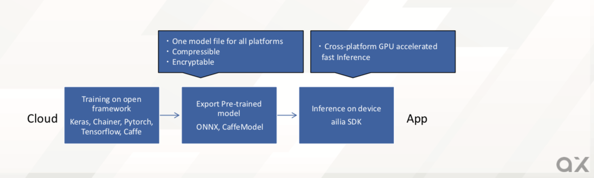

# ailia SDKの概要

# ailia SDKの概要

[Kazuki Kyakuno](https://kyakuno.medium.com/?source=post_page---byline--4735dc8ff2db---------------------------------------)

Jan 15, 2020

--

Share

クロスプラットフォームで利用できるGPU対応の高速AI推論フレームワークであるailia SDKのご紹介です。ailia SDKについては[こちら](https://ailia.jp/)をご覧ください。

## ailia SDKについて

ailia SDKはax株式会社および株式会社アクセルが開発・提供する推論に特化したAIフレームワークです。

ailia SDKはPytorch、Keras、TensorFlow、Chainerといった学習フレームワークで学習したモデルを読み込み、エッジ （端末側）で高速にオフラインで推論することができます。

100種類以上の学習済みモデルを使用して、お客様のアプリケーションに簡単にAI機能を実装することができます。

Press enter or click to view image in full size

<https://ailia.jp/>

## クロスプラットフォームで共通のモデルファイルが使用可能

ailia SDKはWindows、Mac、iOS、Android、Linux、Jetson、RaspberryPiのクロスプラットフォームに対応しており、全てのプラットフォームで共通のモデルファイルとAPIを使用できるという特徴があります。

一般的な推論フレームワークは、学習済みモデルのフォーマットであるONNXから、各プラットフォームごとに専用のフォーマットに変換することが多いのですが、ailia SDKはONNXファイルを直接、ランタイムでパースします。

これにより、サーバ側では単一のONNXファイルを配信すればよくなり、モデルの管理コストが下がります。また、プラットフォームごとに異なる変換ツールを使用する必要がなくなり、変換エラーを最小限に抑え、学習からデプロイまで一貫したワークフローを提供します。

Press enter or click to view image in full size

また、全てのプラットフォームで共通のAPIを使用できることから、WindowsやMacで開発したAIアプリケーションを、iOS、Androidなどのモバイルを含む全てのプラットフォームにそのままデプロイすることができます。

## Unity Pluginを提供

ailia SDKはC++、C#、Python、JNIに対応していますが、特に、クロスプラットフォーム対応ゲームエンジンのUnityとailia SDKのUnity Pluginを使用することで、クロスプラットフォームのメリットを最大限、活かすことができます。

[## Unity - Unity

### Unity is the ultimate game development platform. Use Unity to build high-quality 3D and 2D games, deploy them across…

unity.com](https://unity.com/ja?source=post_page-----4735dc8ff2db---------------------------------------)

WindowsやMacのUnity Editorで開発したAIアプリケーションを、そのまま、AndroidやiOS、Linuxの環境にデプロイすることができるため、開発者はエッジ端末が何かを意識することなく、好きな開発環境を使用することができます。

## Get Kazuki Kyakuno’s stories in your inbox

Join Medium for free to get updates from this writer.

Subscribe

Subscribe

Remember me for faster sign in

また、Unityの高度なUI機能や、3Dモデルとの連携なども自由に行うことができます。AIによるポーズ推定による3Dモデルとの連動や、WEBカメラの映像からの人物抽出などが簡単に実装可能です。

## パフォーマンスへのフォーカス

ailia SDKは速度にもフォーカスしています。特に、ConvolutionやPoolingなどの下回りを司るアクセラレータ層を自社開発しており、どのプラットフォームでもGPUを使用した高速な推論を実現します。

例えば、Mac、iOS向けにはMetalを、Windows、Android、Linux向けにはVulkanのバックエンドを提供しています。また、JetsonではCUDA + cuDNNを使用することができます。

さらに、CPU向けの最適化も行なっており、AVX2やSSE2、NEONを使用した高速推論が可能です。

Press enter or click to view image in full size

ailia SDKのアクセラレータ

## 依存関係の少なさ

ailia SDKのもう一つの特徴は、依存関係の少なさです。一般的に、推論フレームワークは、ProtocolBufferやnumpyなど、多くのライブラリに依存しています。

しかし、ailia SDKのコアランタイムは、内製の省メモリなProtocolBufferリーダや、独自のTensorクラスを実装しているため、これらのライブラリに依存しておらず、これらのライブラリのバージョンを気にする必要はありません。

そのため、長期間に渡って、安定した動作を保証することができます。また、不要な機能が含まれておらず、2〜8MB程度のライブラリサイズで単独で動作するため、Google CloudFunctionなどのサーバレス環境へのデプロイも可能になります。

## 学習済みモデルの提供

ax株式会社では、ailia SDKを軸としたプラットフォームの構築を目指しており、その中で、もっとも充実したモデルストアというのも目指しています。現在、その第一段階として、ailia SDKで使用できるオープンソースモデルを下記のgithubにアップロードしており、YOLOv3やHumanPartSegmentationなど、80種類以上のモデルが使用可能です。

[## axinc-ai/ailia-models

### Pretrained models for ailia SDK. Contribute to axinc-ai/ailia-models development by creating an account on GitHub.

github.com](https://github.com/axinc-ai/ailia-models?source=post_page-----4735dc8ff2db---------------------------------------)

世の中に多くの学習済みモデルは存在するのですが、学習時に使用されているフレームワークがTensorFlowやKeras、Pytorchと多様であり、さらにバージョン間で破壊的変更が行われることも多いため、学習済みモデルを手軽に試すことができません。まず、フレームワークのバージョンを合わるだけでも苦労します。さらにリポジトリには学習と推論がまとまって入っているため、使用方法を理解するまでにも時間がかかります。

ailia MODELSでは、ailia SDKを使用した簡単なサンプルと共に、変換済みのONNXモデルを提供しているため、ailia SDKを入れるだけで多種多様なモデルを試すことができます。今後、さらに手軽に、画像をアップロードするだけでAIの機能を試せる機能も提供予定です。

## AIに関するトータルソリューションの提供

ax株式会社ではSDKの提供のみならず、AIを使用したアプリケーションの開発も行なっています。ax株式会社はこれからも、AIを実用化する会社として、ailia SDKを軸としたプラットフォームを開発・提供していきます。

[## ax Inc.

### ax Inc.は推論に特化したAIフレームワークであるailiaの開発によって、クロスプラットフォームで一貫性のある推論環境を提供します。

axinc.jp](https://axinc.jp/?source=post_page-----4735dc8ff2db---------------------------------------)

ax株式会社はAIを実用化する会社として、クロスプラットフォームでGPUを使用した高速な推論を行うことができるailia SDKを開発しています。ax株式会社ではコンサルティングからモデル作成、SDKの提供、AIを利用したアプリ・システム開発、サポートまで、 AIに関するトータルソリューションを提供していますのでお気軽に[お問い合わせ](https://axinc.jp/)ください。