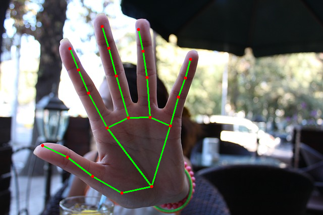
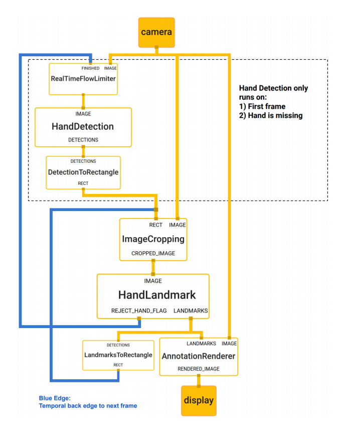
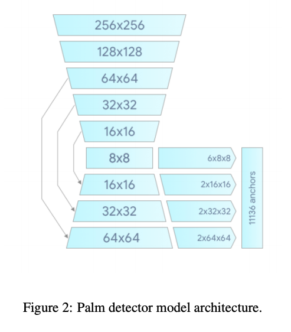

# BlazeHand : 手のキーポイントを検出する機械学習モデル

# BlazeHand : 手のキーポイントを検出する機械学習モデル

[](https://kyakuno.medium.com/?source=post_page---byline--e84e011ef7bc---------------------------------------)

[Kazuki Kyakuno](https://kyakuno.medium.com/?source=post_page---byline--e84e011ef7bc---------------------------------------)

Mar 11, 2021

--

Share

[ailia SDK](https://ailia.jp/)で使用できる機械学習モデルである「BlazeHand」のご紹介です。エッジ向け推論フレームワークである[ailia SDK](https://ailia.jp/)と[ailia MODELS](https://github.com/axinc-ai/ailia-models)に公開されている機械学習モデルを使用することで、簡単にAIの機能をアプリケーションに実装することができます。

## BlazeHandの概要

BlazeHandは手のキーポイントを検出する機械学習モデルです。手の詳細な動きを検出できるため、ジェスチャー操作などに応用可能です。

[## MediaPipe Hands: On-device Real-time Hand Tracking

### We present a real-time on-device hand tracking pipeline that predicts hand skeleton from single RGB camera for AR/VR…

arxiv.org](https://arxiv.org/abs/2006.10214?source=post_page-----e84e011ef7bc---------------------------------------)



出典：<https://pixabay.com/ja/photos/%E5%81%9C%E6%AD%A2-%E5%86%99%E7%9C%9F%E3%81%AA%E3%81%97-%E3%81%AA%E3%81%84%E6%92%AE%E5%BD%B1-%E6%89%8B-565609/>

検出可能なランドマークは下記となります。

Press enter or click to view image in full size


出典：<https://google.github.io/mediapipe/solutions/hands.html>

## BlazeHandのアーキテクチャ

BlazeHandは、BlazePalmとBlazeHandの2つのモデルで構成されており、BlazePalmで入力された画像から手の位置を検出した後、BlazeHandで手の画像から手のキーポイントを検出します。

## Get Kazuki Kyakuno’s stories in your inbox

Join Medium for free to get updates from this writer.

Subscribe

Subscribe

Remember me for faster sign in

BlazePalmによる手の検出は毎フレーム処理を行うと、負荷が高く、また、手をロストする場合もあります。そのため、最初のフレームではBlazePalmによる検出処理を行い、以降のフレームでは、BlazeHandで検出した手のキーポイントから少し大きなRectangle（ROI）を計算し、そのRectangleに対してBlazeHandを適用してRectangleを動かしていくことで、高速かつロバストな認識を実現しています。



出典：<https://arxiv.org/pdf/2006.10214.pdf>

手の位置の検出を行うBlazePalmはシンプルなSSD系のDetectorとなっています。BlazeFaceと似たアーキテクチャです。



出典：<https://arxiv.org/pdf/2006.10214.pdf>

手のキーポイントを検出するBlazeHandはFPNに似たアーキテクチャとなっています。学習には、Real Worldの画像と、3D CGで合成したSynthetic Imagesを使用しています。


出典：<https://arxiv.org/pdf/2006.10214.pdf>

BlazeHandの出力には21個のx,y,相対depthに加えて、手である確率を示すHand Presenceと、左手か右手かを示すHandednessの2つのフラグが含まれます。

## BlazeHandの使用方法

下記のコマンドでWEBカメラに対して認識が可能です。

```
python3 blazehand.py --video 0
```

[## axinc-ai/ailia-models

### (Image from https://pixabay.com/photos/stop-no-photo-no-photographing-hand-565609/) ailia input shape: (1, 3, 256, 256)…

github.com](https://github.com/axinc-ai/ailia-models/tree/master/hand_recognition/blazehand?source=post_page-----e84e011ef7bc---------------------------------------)

WEBカメラに対して認識を行った例は下記です。

ax株式会社はAIを実用化する会社として、クロスプラットフォームでGPUを使用した高速な推論を行うことができるailia SDKを開発しています。ax株式会社ではコンサルティングからモデル作成、SDKの提供、AIを利用したアプリ・システム開発、サポートまで、 AIに関するトータルソリューションを提供していますのでお気軽に[お問い合わせ](https://axinc.jp/)ください。