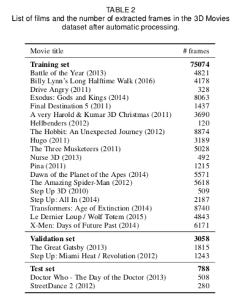
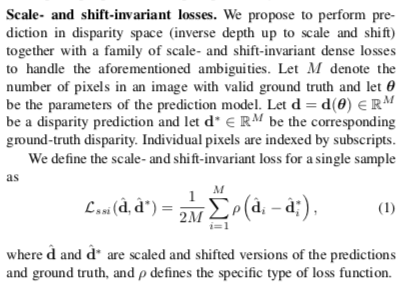
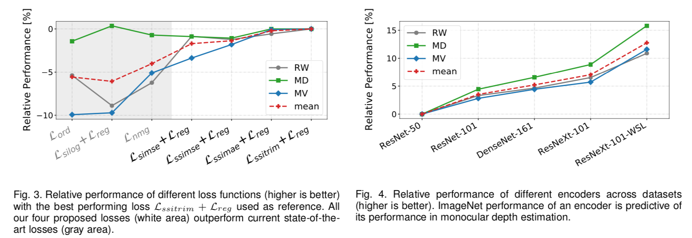

# Midas : 奥行きを推定する機械学習モデル

# Midas : 奥行きを推定する機械学習モデル

[Kazuki Kyakuno](https://kyakuno.medium.com/?source=post_page---byline--71e65a041e0f---------------------------------------)

Oct 13, 2020

--

Share

[ailia SDK](https://ailia.jp/)で使用できる機械学習モデルである「Midas」のご紹介です。エッジ向け推論フレームワークである[ailia SDK](https://ailia.jp/)と[ailia MODELS](https://github.com/axinc-ai/ailia-models)に公開されている機械学習モデルを使用することで、簡単にAIの機能をアプリケーションに実装することができます。

## Midasの概要

Midasは入力された画像から奥行きを推定する機械学習モデルです。任意の映像からデプス値（奥行き）を推定することができます。

Press enter or click to view image in full size

出典：<https://arxiv.org/pdf/1907.01341v3.pdf>

[## Towards Robust Monocular Depth Estimation: Mixing Datasets for Zero-shot Cross-dataset Transfer

### The success of monocular depth estimation relies on large and diverse training sets. Due to the challenges associated…

arxiv.org](https://arxiv.org/abs/1907.01341v3?source=post_page-----71e65a041e0f---------------------------------------)

[## intel-isl/MiDaS

### This repository contains code to compute depth from a single image. It accompanies our paper: Towards Robust Monocular…

github.com](https://github.com/intel-isl/MiDaS?source=post_page-----71e65a041e0f---------------------------------------)

## Midasのアーキテクチャ

深度データのデータセットにはスケールやバイアスに互換性がありませんでした。これは、ステレオカメラやレーザースキャナー、ライトセンサーなど、センシングの多様性に由来するものです。Midasでは、これらの多様性を吸収する新しいLoss Functionを導入することで、互換性の問題を解消し、複数のデータセットを同時に学習に使用できるようにします。

## Get Kazuki Kyakuno’s stories in your inbox

Join Medium for free to get updates from this writer.

Subscribe

Subscribe

Remember me for faster sign in

Midasは下記に示すように、複数のデータセットを使用して学習を行っています。そのため、道路以外の画像の奥行きも推定することができます。

Press enter or click to view image in full size

出典：<https://arxiv.org/pdf/1907.01341v3.pdf>

さらに、既存のデータセットを補完するために、3D MOVIEも学習に使用しています。

出典：<https://arxiv.org/pdf/1907.01341v3.pdf>

Midasの提案するLoss functionは下記となります。

出典：<https://arxiv.org/pdf/1907.01341v3.pdf>

ネットワークのアーキテクチャはResNetを使用しています。

Press enter or click to view image in full size

出典：<https://arxiv.org/pdf/1907.01341v3.pdf>

## Midasの使用方法

ailia SDKでMidasを使用するには下記のコマンドを使用します。WEBカメラからデプスを推定可能です。

> python3 midas.py -v 0

[## axinc-ai/ailia-models

### (Image from kitti dataset http://www.cvlibs.net/datasets/kitti/raw\_data.php) Shape : (1, 3, 128, 384) Shape : (1, 128…

github.com](https://github.com/axinc-ai/ailia-models/tree/master/depth_estimation/midas?source=post_page-----71e65a041e0f---------------------------------------)

また、より高精度なv2.1や、より高速なv2.1 smallも選択可能です。smallモデルの場合、通常モデルに比べて5倍の速度で動作し、リアルタイム処理が可能です。

> python3 midas.py -v 0 -v21  
> python3 midas.py -v 0 -v21 -t small

Midasの実行例です。

ax株式会社はAIを実用化する会社として、クロスプラットフォームでGPUを使用した高速な推論を行うことができるailia SDKを開発しています。ax株式会社ではコンサルティングからモデル作成、SDKの提供、AIを利用したアプリ・システム開発、サポートまで、 AIに関するトータルソリューションを提供していますのでお気軽に[お問い合わせ](https://axinc.jp/)ください。