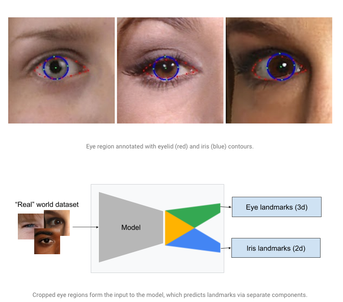
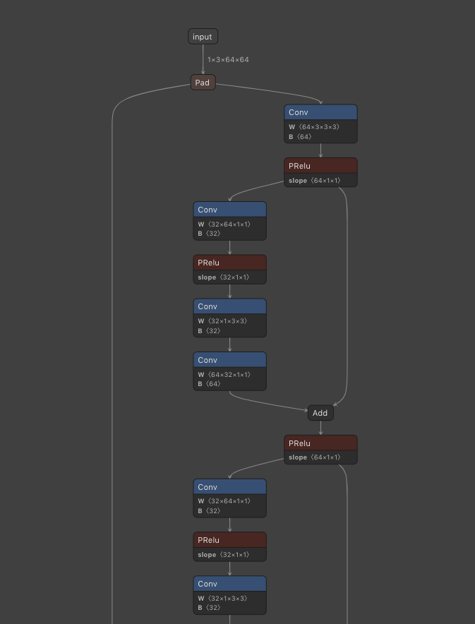

# MediaPipe Iris : 目のキーポイントを検出する機械学習モデル

# MediaPipe Iris : 目のキーポイントを検出する機械学習モデル

[](https://kyakuno.medium.com/?source=post_page---byline--a4742f143551---------------------------------------)

[Kazuki Kyakuno](https://kyakuno.medium.com/?source=post_page---byline--a4742f143551---------------------------------------)

Apr 7, 2021

--

Share

[ailia SDK](https://ailia.jp/)で使用できる機械学習モデルである「MediaPipe Iris」のご紹介です。エッジ向け推論フレームワークである[ailia SDK](https://ailia.jp/)と[ailia MODELS](https://github.com/axinc-ai/ailia-models)に公開されている機械学習モデルを使用することで、簡単にAIの機能をアプリケーションに実装することができます。

## MediaPipe Irisの概要

MediaPipe IrisはGoogleが2020年8月に公開した、画像から目のキーポイントを検出する機械学習モデルです。どこを見ているかの認識や、目のサイズからの距離推定、眠っているかどうかの検出などに使用可能です。



出典：<https://ai.googleblog.com/2020/08/mediapipe-iris-real-time-iris-tracking.html>

[## MediaPipe Iris: Real-time Iris Tracking & Depth Estimation

### A wide range of real-world applications, including computational photography (e.g., portrait mode and glint…

ai.googleblog.com](https://ai.googleblog.com/2020/08/mediapipe-iris-real-time-iris-tracking.html?source=post_page-----a4742f143551---------------------------------------)

## MediaPipe Irisのアーキテクチャ

MediaPipe Irisは下記の3つのモデルで構成されます。

・顔の位置を検出するBlazeFace  
・顔のキーポイントを検出するFaceMesh  
・目のキーポイントを検出するMediaPipe Iris

## Get Kazuki Kyakuno’s stories in your inbox

Join Medium for free to get updates from this writer.

Subscribe

Subscribe

Remember me for faster sign in

まずBlazeFaceを使用して顔の位置を検出し、検出した顔の画像に対してFaceMeshで468のキーポイントを取得、目の位置を検出します。

Press enter or click to view image in full size


入力画像（出典：<https://pixabay.com/ja/videos/%E5%A5%B3%E6%80%A7-%E3%83%A4%E3%83%B3%E3%82%B0-%E8%B1%AA%E8%8F%AF%E3%81%A7%E3%81%99-%E8%A1%A8%E7%8F%BE-32387/>）

Press enter or click to view image in full size


顔の位置とキーポイントの取得

検出した目の画像に対してMediaPipe Irisで71の目のキーポイントと、5の瞳孔のキーポイントを検出します。

Press enter or click to view image in full size


瞳孔のキーポイントを取得

MediaPipe IrisのモデルアーキテクチャはMobileNet系で、ConvlutionとDepthwiseConvolution、PReluの組み合わせになります。



MediaPipe Irisのグラフ

MediaPipe Irisへの入力画像の例です。左目に関しては水平フリップし、右目として入力します。入力画像の解像度は64x64、RGB順です。


入力1


入力2

## MediaPipe Irisの使用方法

下記のコマンドでWEBカメラから目を認識することができます。

```
$ python3 mediapipe_iris.py --video 0
```

[## axinc-ai/ailia-models

### (Image from https://pixabay.com/photos/person-human-male-face-man-view-829966/) ailia input shape: (1, 3, 128, 128) RGB…

github.com](https://github.com/axinc-ai/ailia-models/tree/master/face_recognition/mediapipe_iris?source=post_page-----a4742f143551---------------------------------------)

実行例です。

ax株式会社はAIを実用化する会社として、クロスプラットフォームでGPUを使用した高速な推論を行うことができるailia SDKを開発しています。ax株式会社ではコンサルティングからモデル作成、SDKの提供、AIを利用したアプリ・システム開発、サポートまで、 AIに関するトータルソリューションを提供していますのでお気軽に[お問い合わせ](https://axinc.jp/)ください。