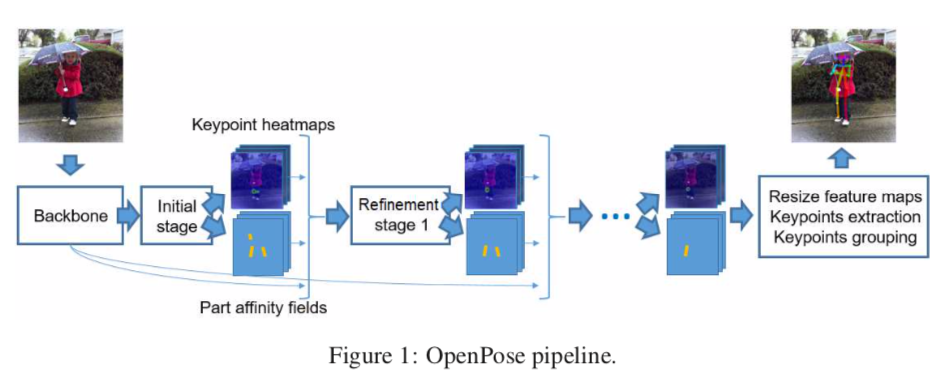
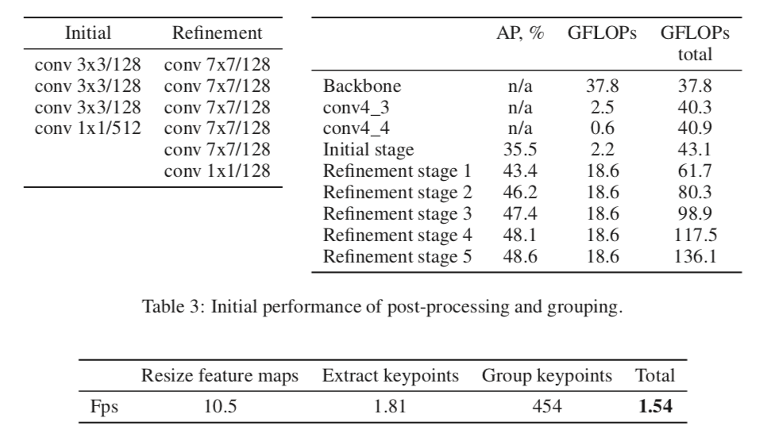
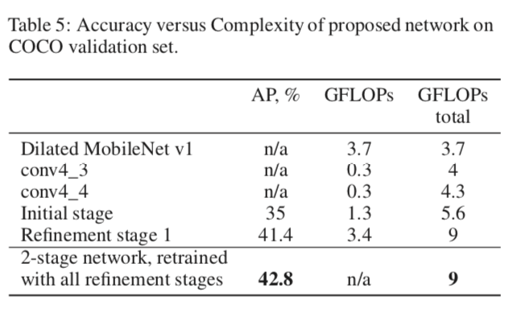
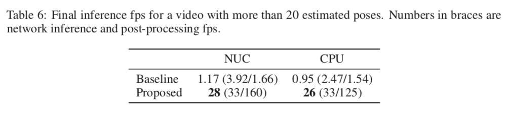

# LightWeightHumanPose : 高速に複数人の骨格を検出する機械学習モデル

# LightWeightHumanPose : 高速に複数人の骨格を検出する機械学習モデル

[](https://kyakuno.medium.com/?source=post_page---byline--bc34d420e6e2---------------------------------------)

[Kazuki Kyakuno](https://kyakuno.medium.com/?source=post_page---byline--bc34d420e6e2---------------------------------------)

Apr 12, 2021

--

Share

[ailia SDK](https://ailia.jp/)で使用できる機械学習モデルである「LightWeightHumanPose」のご紹介です。エッジ向け推論フレームワークである[ailia SDK](https://ailia.jp/)と[ailia MODELS](https://github.com/axinc-ai/ailia-models)に公開されている機械学習モデルを使用することで、簡単にAIの機能をアプリケーションに実装することができます。

## LightWeightHumanPoseの概要

LightWeightHumanPoseはIntelが2018年11月に公開した、高速に複数人を同時に検出する骨格検出モデルです。CPUでも高速に推論できるように最適化されています。


出典：<https://github.com/Daniil-Osokin/lightweight-human-pose-estimation.pytorch>

骨格検出モデルは、アクション検出やモーションキャプチャ、スポーツ解析などに応用が可能です。

[## Real-time 2D Multi-Person Pose Estimation on CPU: Lightweight OpenPose

### In this work we adapt multi-person pose estimation architecture to use it on edge devices. We follow the bottom-up…

arxiv.org](https://arxiv.org/abs/1811.12004?source=post_page-----bc34d420e6e2---------------------------------------)

## LightWeightHumanPoseのアーキテクチャ

骨格検出にはトップダウンアプローチとボトムアップアプローチがあります。

トップダウンアプローチでは、YOLOなどで人検出を行った後、検出した個々の人に対して骨格検出を行います。検出速度は人数に依存します。

ボトムアップアプローチでは、全てのキーポイントを先に検出し、キーポイントを人にグルーピングしていきます。このアプローチは全ての人に対してまとめて骨格検出を行うため高速です。

LightWeightHumanPoseはボトムアップアプローチの骨格検出モデルです。OpenPoseと同様に、入力画像からキーポイントごとのヒートマップと、キーポイント間の繋がりを示すPAFを計算します。

Press enter or click to view image in full size



出典：<https://arxiv.org/pdf/1811.12004>

PAFには、キーポイントA（肩など）があった場合に、キーポイントB（肘など）の集合のうち、どのキーポイントが同じ人物のキーポイントかを示す関連性が入っています。キーポイントAのある座標A1に対して、接続候補のキーポイントB1の関連性を計算するには、A1からB1の座標間の直線上のPAF値の合計を計算します。キーポイントB1〜BNの全てでこの値を計算し、合計値がもっとも大きな組み合わせを採用します。

## Get Kazuki Kyakuno’s stories in your inbox

Join Medium for free to get updates from this writer.

Subscribe

Subscribe

Remember me for faster sign in

オリジナルのOpenPoseはbackboneにVGG-19を使用しています。また、Refinmentを5回繰り返します。入力解像度は368x368です。

Press enter or click to view image in full size



出典：<https://arxiv.org/pdf/1811.12004>

LightWeightHumanPoseではbackboneにMobileNet v1を使用します。また、Refinmentを1回に削減するとともに、7x7のConvolutionを、同じreceptive field（参照画素）を持つように、1x1、3x3、3x3のConvolutionの組み合わせに置き換えます。



出典：<https://arxiv.org/pdf/1811.12004>

これにより、OpenPoseの演算量を136.1GFlopsから9GFlopsまで削減し、APは48.6に対して42.8を維持します。

Press enter or click to view image in full size



出典：<https://arxiv.org/pdf/1811.12004>

その結果、CPUで26FPSを達成します。

学習にはCOCO Datsetを使用しています。

## LightWeightHumanPoseの使用方法

下記のコマンドでWEBカメラに対して骨格検出を行います。ailia SDKでは、前処理と後処理をC++で実装しているため、通常のPython実装よりも高速に動作させることが可能です。

```
$ python3 lightweight-human-pose-estimation.py -v 0
```

例えば、RTX2080 + cuDNNの環境では、後処理を含めて11msで推論が可能です。

また、デフォルトの認識解像度は320x240ですが、より小さい人を認識したい場合は、-dwおよび-dhオプションで認識解像度を大きくすることができます。

```
$ python3 lightweight-human-pose-estimation.py -v 0 -dw 640 -dh 480
```

-dwおよび-dhオプションで認識解像度を160x120に下げることで、RaspberryPi4での推論速度を150ms程度まで上げることも可能です。

```
$ python3 lightweight-human-pose-estimation.py -v 0 -dw 160 -dh 120
```

[## axinc-ai/ailia-models

### (Image from…

github.com](https://github.com/axinc-ai/ailia-models/tree/master/pose_estimation/lightweight-human-pose-estimation?source=post_page-----bc34d420e6e2---------------------------------------)

LightWeightHumanPoseの実行例です。

ax株式会社はAIを実用化する会社として、クロスプラットフォームでGPUを使用した高速な推論を行うことができるailia SDKを開発しています。ax株式会社ではコンサルティングからモデル作成、SDKの提供、AIを利用したアプリ・システム開発、サポートまで、 AIに関するトータルソリューションを提供していますのでお気軽に[お問い合わせ](https://axinc.jp/)ください。