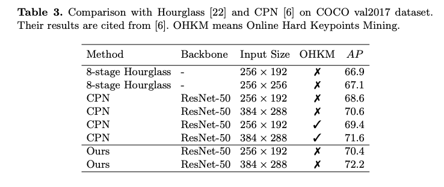
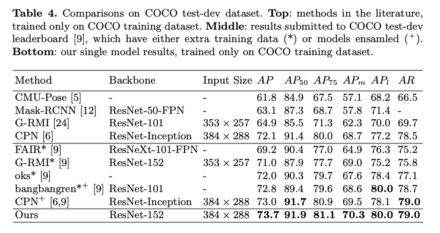
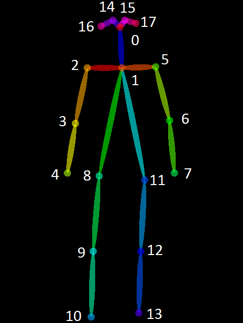

# PoseResnet : トップダウンで骨格検出を行う機械学習モデル

# PoseResnet : トップダウンで骨格検出を行う機械学習モデル

[Kazuki Kyakuno](https://kyakuno.medium.com/?source=post_page---byline--9e0d20396d1e---------------------------------------)

Oct 10, 2020

--

Share

[ailia SDK](https://ailia.jp/)で使用できる機械学習モデルである「PoseResnet」のご紹介です。エッジ向け推論フレームワークである[ailia SDK](https://ailia.jp/)と[ailia MODELS](https://github.com/axinc-ai/ailia-models)に公開されている機械学習モデルを使用することで、簡単にAIの機能をアプリケーションに実装することができます。

## PoseResnetの概要

PoseResnetはMicrosoft Researchがベースラインとして開発した、Single Personの骨格検出を行う機械学習モデルです。YOLOv3などで人物を検出した後、PoseResnetを使用することで骨格を検出することができます。

[## Simple Baselines for Human Pose Estimation and Tracking

### There has been significant progress on pose estimation and increasing interests on pose tracking in recent years. At…

arxiv.org](https://arxiv.org/abs/1804.06208?source=post_page-----9e0d20396d1e---------------------------------------)

[## microsoft/human-pose-estimation.pytorch

### This is an official pytorch implementation of Simple Baselines for Human Pose Estimation and Tracking . This work…

github.com](https://github.com/microsoft/human-pose-estimation.pytorch?source=post_page-----9e0d20396d1e---------------------------------------)

## トップダウンアプローチとボトムアップアプローチ

機械学習を使用してMulti Personの骨格を検出する方法には、トップダウンアプローチとボトムアップアプローチの2つがあります。

トップダウンアプローチは、YOLOv3などで人物を切り出し、Single Personの骨格検出モデルでキーポイントを計算します。高精度ですが、人数に応じて負荷が高くなります。

ボトムアップアプローチは、キーポイントを計算した後、PAF (Part Affinity Field)などを使用してキーポイントの繋がりを計算してグルーピングしていくことで、複数人を同時に認識します。OpenPoseなどが代表的で、安定したパフォーマンスで計算できますが、稀に間違ったキーポイントを接続することがあります。

## ConfidenceとPAF

トップダウンアプローチでもボトムアップアプローチでも、機械学習モデルはキーポイントのConfidence（信頼度）のヒートマップを出力します。ヒートマップは、キーポイントの位置で大きな値を持つように設計されています。ヒートマップに対して、最大値の場所を計算することで、キーポイントの位置を計算します。

入力画像（標準画像データベース）

Confidence

トップダウンアプローチの場合は1人しか写っていないためConfidenceのみからキーポイントを計算することができます。

対して、ボトムアップアプローチの場合は複数人が同時に写っており、複数のキーポイントが同時に検出されます。そのため、それぞれのキーポイントをグルーピングして複数人に割り当てる必要があります。

## Get Kazuki Kyakuno’s stories in your inbox

Join Medium for free to get updates from this writer.

Subscribe

Subscribe

Remember me for faster sign in

ボトムアップアプローチでは、PAFなどを使用してキーポイントとキーポイントをグルーピングします。PAFは、キーポイントとキーポイントの繋がりを示す情報です。キーポイントとキーポイントの間のPAFの値を積算し、もっとも値が大きい組み合わせを選択することで、キーポイントの割り当て問題を解きます。

PAF

## PoseResnetのアーキテクチャ

PoseResnetはトップダウンアプローチであるため、Confidenceのみを計算します。PoseResnetはベースラインとなるべく開発され、ResNetのbackbone networkにDeconvolutionを組み合わせたシンプルなアーキテクチャを採用しています。

Press enter or click to view image in full size

出典：<https://arxiv.org/pdf/1804.06208.pdf>

しかし、HourglassやCPNなど、従来のSOTAのアーキテクチャよりも性能が高く、COCOデータセットでmAP 73.7のSOTAを達成しています。

Press enter or click to view image in full size

出典：<https://arxiv.org/pdf/1804.06208.pdf>

CMU-Poseは有名なOpenPoseです。

Press enter or click to view image in full size

出典：<https://arxiv.org/pdf/1804.06208.pdf>

## キーポイントの形式

PoseResnetはOpenPoseと同様に、COCO形式の18キーポイントを出力します。

出典：<https://github.com/CMU-Perceptual-Computing-Lab/openpose/blob/master/doc/media/keypoints_pose_18.png>

## PoseResnetの使用方法

ailia SDKでは下記のサンプルでYOLOv3 Tinyによる人物検出とPoseResnetによる骨格検出をWEBカメラに対して適用することができます。変換元のモデルはpose\_resnet\_50\_256x192.pth.tarです。

> python3 pose\_resnet.py -v 0

[## axinc-ai/ailia-models

### Ailia input shape: (1, 3, 256, 192) Range: [-2.0, 2.0] Automatically downloads the onnx and prototxt files on the first…

github.com](https://github.com/axinc-ai/ailia-models/tree/master/pose_estimation/pose_resnet?source=post_page-----9e0d20396d1e---------------------------------------)

PoseResnetの実行例です。

ax株式会社はAIを実用化する会社として、クロスプラットフォームでGPUを使用した高速な推論を行うことができるailia SDKを開発しています。ax株式会社ではコンサルティングからモデル作成、SDKの提供、AIを利用したアプリ・システム開発、サポートまで、 AIに関するトータルソリューションを提供していますのでお気軽に[お問い合わせ](https://axinc.jp/)ください。