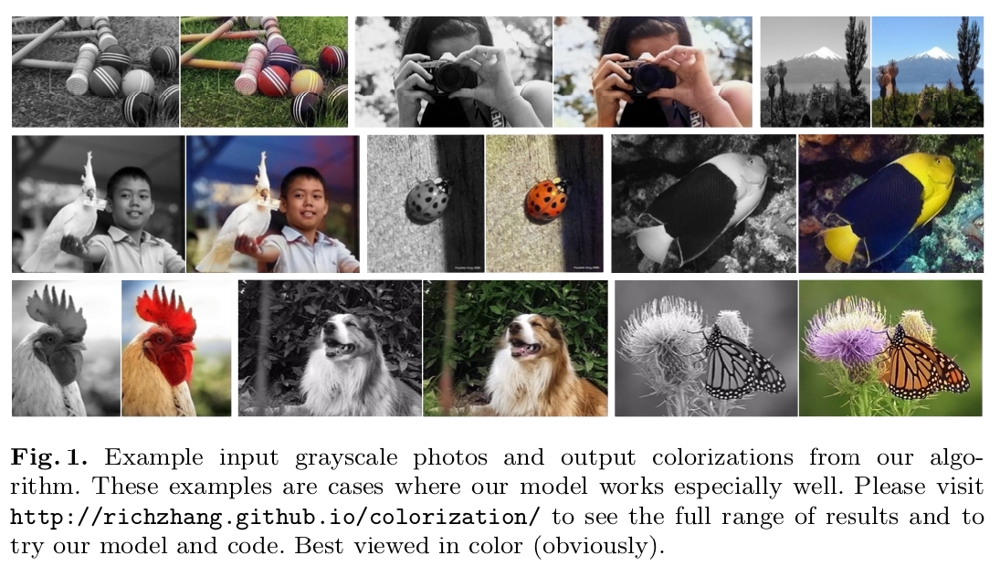
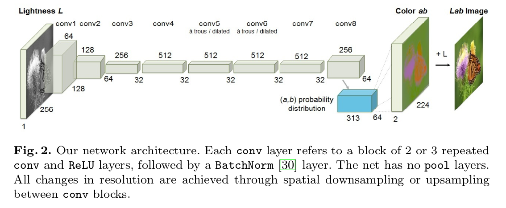
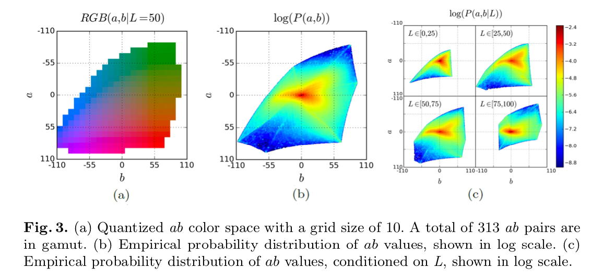

# Colorization : 白黒画像をカラー化する機械学習モデル

# Colorization : 白黒画像をカラー化する機械学習モデル

[](https://kyakuno.medium.com/?source=post_page---byline--177d3fd52e40---------------------------------------)

[Kazuki Kyakuno](https://kyakuno.medium.com/?source=post_page---byline--177d3fd52e40---------------------------------------)

Apr 19, 2021

--

Share

[ailia SDK](https://ailia.jp/)で使用できる機械学習モデルである「Colorization」のご紹介です。エッジ向け推論フレームワークである[ailia SDK](https://ailia.jp/)と[ailia MODELS](https://github.com/axinc-ai/ailia-models)に公開されている機械学習モデルを使用することで、簡単にAIの機能をアプリケーションに実装することができます。

## Colorizationの概要

Colorizationは2016年の3月に公開された、白黒の画像を入力として、カラー化して出力する機械学習モデルです。一般的に、草は緑で、空は青く、てんとう虫は赤くなります。機械学習モデルは、これらのsemantic（意味）をベースにカラー化を行います。

Press enter or click to view image in full size



出典：<https://arxiv.org/pdf/1603.08511.pdf>

[## Colorful Image Colorization

### Given a grayscale photograph as input, this paper attacks the problem of hallucinating a plausible color version of the…

arxiv.org](https://arxiv.org/abs/1603.08511?source=post_page-----177d3fd52e40---------------------------------------)

## Colorizationのアーキテクチャ

ColorizationはLab色空間で処理します。LighenessであるLを受け取り、abを推定します。出力されるabにLを追加し、RGB空間に戻します。

## Get Kazuki Kyakuno’s stories in your inbox

Join Medium for free to get updates from this writer.

Subscribe

Subscribe

Remember me for faster sign in

モデルアーキテクチャはVGGベースとなっています。

Press enter or click to view image in full size



出典：<https://arxiv.org/pdf/1603.08511.pdf>

本研究では、Colorizationに最適な誤差関数を提案しています。従来の画素値のL2誤差を最小化した場合、平均値に収束することが多く、彩度の低い画像が出力されます。

提案手法では、ab値の分布を誤差関数とすることで、この問題の解消を行っています。具体的に、ab値を量子化し、ab値の分布を近づけるように学習を行います。

Press enter or click to view image in full size



出典：<https://arxiv.org/pdf/1603.08511.pdf>

## Colorizationの使用方法

ailia SDKでColorizationを使用するには、下記のコマンドを使用します。任意の画像に対して処理を行い、カラー化した画像を取得することができます。

```
python3 colorization.py --input input.jpg --savepath output.jpg
```

[## axinc-ai/ailia-models

### (Image above is from https://github.com/richzhang/colorization/tree/master/imgs) Automatically downloads the onnx and…

github.com](https://github.com/axinc-ai/ailia-models/tree/master/image_manipulation/colorization?source=post_page-----177d3fd52e40---------------------------------------)

ax株式会社はAIを実用化する会社として、クロスプラットフォームでGPUを使用した高速な推論を行うことができるailia SDKを開発しています。ax株式会社ではコンサルティングからモデル作成、SDKの提供、AIを利用したアプリ・システム開発、サポートまで、 AIに関するトータルソリューションを提供していますのでお気軽に[お問い合わせ](https://axinc.jp/)ください。