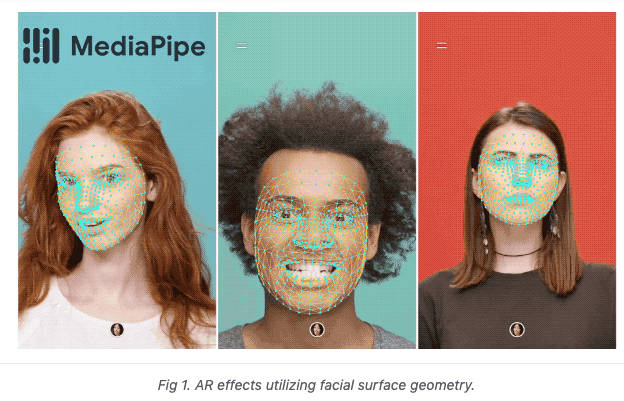
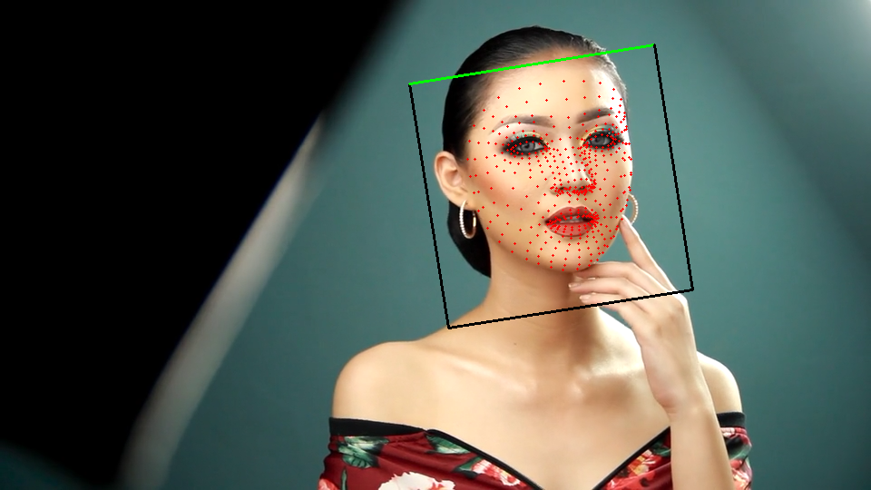
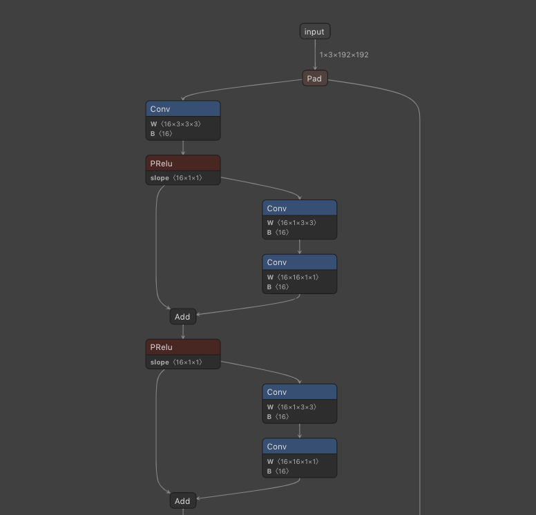

# FaceMesh : リアルタイムで顔のキーポイントを検出する機械学習モデル

# FaceMesh : リアルタイムで顔のキーポイントを検出する機械学習モデル

[](https://kyakuno.medium.com/?source=post_page---byline--bf223a50b7d6---------------------------------------)

[Kazuki Kyakuno](https://kyakuno.medium.com/?source=post_page---byline--bf223a50b7d6---------------------------------------)

Apr 9, 2021

--

Share

[ailia SDK](https://ailia.jp/)で使用できる機械学習モデルである「FaceMesh」のご紹介です。エッジ向け推論フレームワークである[ailia SDK](https://ailia.jp/)と[ailia MODELS](https://github.com/axinc-ai/ailia-models)に公開されている機械学習モデルを使用することで、簡単にAIの機能をアプリケーションに実装することができます。

## FaceMeshの概要

FaceMeshはGoogleが2019年3月に公開した、画像から顔のキーポイントを検出する機械学習モデルです。論文は2019年7月に公開されました。

一般的な顔のキーポイント検出は68点 (x,y)なのですが、FaceMeshでは468点 (x,y,z)を得ることができます。また、468点の手動でのアノテーションは難しいため、3DMMのレンダリング画像で学習したモデルを使って、現実の画像に対してアノテーションを行っています。

Press enter or click to view image in full size



出典：<https://google.github.io/mediapipe/solutions/face_mesh.html>

FaceMeshはARによるバーチャル試着などに応用することができます。

Press enter or click to view image in full size


出典：<https://google.github.io/mediapipe/solutions/face_mesh.html>

[## Face Mesh

### MediaPipe Face Mesh is a face geometry solution that estimates 468 3D face landmarks in real-time even on mobile…

google.github.io](https://google.github.io/mediapipe/solutions/face_mesh.html?source=post_page-----bf223a50b7d6---------------------------------------)

[## Real-time Facial Surface Geometry from Monocular Video on Mobile GPUs

### We present an end-to-end neural network-based model for inferring an approximate 3D mesh representation of a human face…

arxiv.org](https://arxiv.org/abs/1907.06724?source=post_page-----bf223a50b7d6---------------------------------------)

## FaceMeshのアーキテクチャ

FaceMeshでは、192x192解像度の顔の画像を入力として、468個の3次元のキーポイントを出力します。(x,y)は入力画像のピクセル座標、zはメッシュの重心からの相対的なdepth値です。

Press enter or click to view image in full size



FaceMeshの出力（出典：<https://pixabay.com/ja/videos/%E5%A5%B3%E6%80%A7-%E3%83%A4%E3%83%B3%E3%82%B0-%E8%B1%AA%E8%8F%AF%E3%81%A7%E3%81%99-%E8%A1%A8%E7%8F%BE-32387/>）

FaceMeshのモデルアーキテクチャはMobileNet系となっており、DepthwiseConvolutionとPointwiseConvolutionの組み合わせで構成されています。このモデルはMobile DeviceのGPUでリアルタイム推論が可能です。

Press enter or click to view image in full size


出典：<https://arxiv.org/pdf/1907.06724>

Press enter or click to view image in full size



[https://netron.app/?url=https://storage.googleapis.com/ailia-models/facemesh/facemesh.onnx.prototxt](https://netron.app/?url=https%3A%2F%2Fstorage.googleapis.com%2Failia-models%2Ffacemesh%2Ffacemesh.onnx.prototxt)

キーポイントの検出を行う機械学習モデルでは、2Dのヒートマップを用いる場合が多いのですが、演算負荷が高いという問題と、Depthを推定できないという問題があります。そのため、FaceMeshでは3次元の座標を直接、計算しています。

## Get Kazuki Kyakuno’s stories in your inbox

Join Medium for free to get updates from this writer.

Subscribe

Subscribe

Remember me for faster sign in

学習には、モバイルカメラで撮影した30Kの画像を使用しています。モバイルカメラで撮影した画像には、センサーとライティングの多様性があります。

30Kの画像に対して、キーポイントである468点のアノテーションを行うには膨大な工数が必要となります。

そこで、3DMM（3D morphable model）を使ったレンダリング画像を使用し、3DMMの頂点のサブセットをGround Truthとします。また、ネットワークに分岐を作成し、3Dのlandamarkとは別に、2Dのlandmarkを推論する機構を追加、468点よりも少ない数のキーポイントでannotationした現実の画像をGround Truthとして、3Dと2Dを同時に最適化します。

こうして学習したモデルで推論することで、データセットの30%で、Refinementすれば再学習に使用できる品質のGround Truthを得ることができました。Ground Truthの頂点のRefinementのため、複数の頂点を同時に動かせるBrushツールを使用してアノテーションします。

こうして、学習とデータセット更新の作業を反復することで、精度の高いモデルを実現しています。

なお、FaceMeshは1フレームごとに処理するモデルなため、フレーム間でジッターが発生する場合があります。ARアプリケーションで使用する場合は、1次元の時間方向フィルタを導入することが推奨されています。

## FaceMeshの使用方法

下記のコマンドでWEBカメラの映像に対してFaceMeshを適用することができます。

```
$ python3 facemesh.py -v 0
```

[## axinc-ai/ailia-models

### (Image from https://pixabay.com/photos/person-human-male-face-man-view-829966/) ailia input shape: (1, 3, 128, 128) RGB…

github.com](https://github.com/axinc-ai/ailia-models/tree/master/face_recognition/facemesh?source=post_page-----bf223a50b7d6---------------------------------------)

実行例です。

ax株式会社はAIを実用化する会社として、クロスプラットフォームでGPUを使用した高速な推論を行うことができるailia SDKを開発しています。ax株式会社ではコンサルティングからモデル作成、SDKの提供、AIを利用したアプリ・システム開発、サポートまで、 AIに関するトータルソリューションを提供していますのでお気軽に[お問い合わせ](https://axinc.jp/)ください。