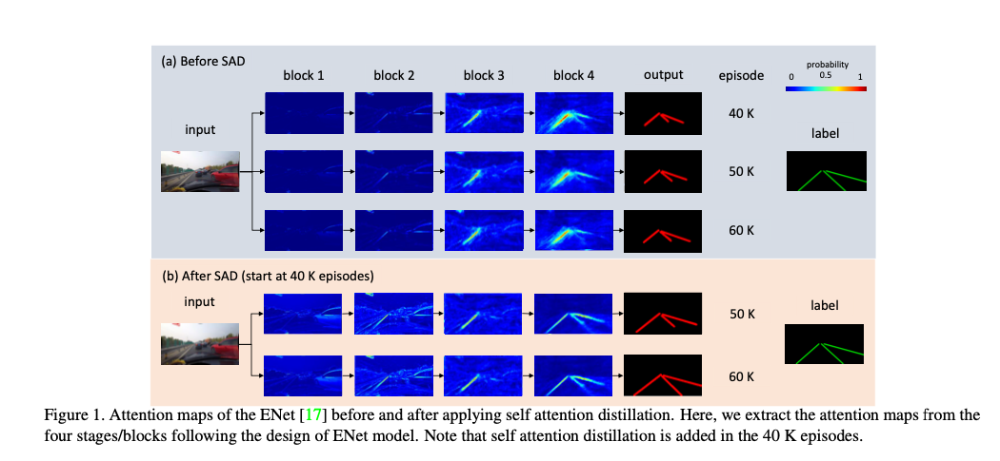
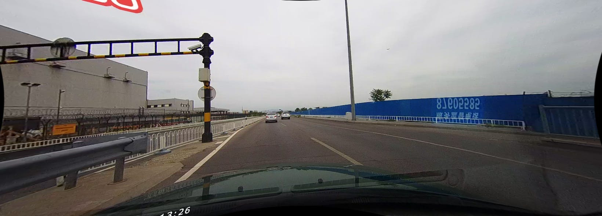
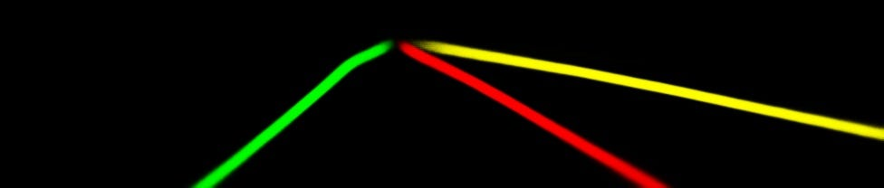

# CodesForLaneDetection : 道路の白線を検出する機械学習モデル

# CodesForLaneDetection : 道路の白線を検出する機械学習モデル

[](https://kyakuno.medium.com/?source=post_page---byline--1ffe7c6ccf1e---------------------------------------)

[Kazuki Kyakuno](https://kyakuno.medium.com/?source=post_page---byline--1ffe7c6ccf1e---------------------------------------)

Apr 27, 2021

--

Share

[ailia SDK](https://ailia.jp/)で使用できる機械学習モデルである「CodesForLaneDetection」のご紹介です。エッジ向け推論フレームワークである[ailia SDK](https://ailia.jp/)と[ailia MODELS](https://github.com/axinc-ai/ailia-models)に公開されている機械学習モデルを使用することで、簡単にAIの機能をアプリケーションに実装することができます。

## CodesForLaneDetectionの概要

CodesForLaneDetectionは2019年8月に公開された白線を検出する機械学習モデルです。白線の検出は自動運転などのアプリケーションに応用可能です。CodesForLaneDetectionでは、入力された画像に対して、ピクセル単位で白線をセグメンテーションします。

Press enter or click to view image in full size



出典：<https://arxiv.org/abs/1908.00821>

[## Learning Lightweight Lane Detection CNNs by Self Attention Distillation

### Training deep models for lane detection is challenging due to the very subtle and sparse supervisory signals inherent…

arxiv.org](https://arxiv.org/abs/1908.00821?source=post_page-----1ffe7c6ccf1e---------------------------------------)

## CodesForLaneDetectionのアーキテクチャ

白線の検出はLane Detectionという分野になります。Lane Detectionの認識対象となるレーンは、物体で遮蔽される、途切れる、照明条件が変化する、といった特性があり、難しいタスクです。また、レーンは長く細いため、アノテーションされるピクセル数は背景よりも少なく、スパース（疎）なセグメンテーションとなります。スパースなセグメンテーションを行う場合、アノテーションデータのレーンの幅を事前に太くする方法もありますが、認識精度が低下します。

スパースなセグメンテーションを直接行う場合、Multi Task Learning (MTL)やMessage Passing (MP)という技術が使用されます。しかし、MTLは追加のアノテーションが必要であり、MPは推論時間が増加するという問題があります。

## Get Kazuki Kyakuno’s stories in your inbox

Join Medium for free to get updates from this writer.

Subscribe

Subscribe

Remember me for faster sign in

CodesForLaneDetectionでは、Self Attention Distillation (SAD)によって、出力に近い層の情報を、入力に近い層に与えながら学習を進めることで、精度を改善します。具体的に、各ブロックのAttension Mapの出力が、次のブロックのAttension Mapに近づくような制約を加えて学習します。Attension Mapは各層の出力のチャンネル方向の二乗和を使用しています。

Press enter or click to view image in full size


出典：<https://arxiv.org/abs/1908.00821>

SADは学習に作用するため、任意のCNNと組み合わせて使用することができ、推論速度に影響を与えません。CNNのBackboneとしてはENet、ResNet、ERFNetが例示されています。ERFNet（Efficient Residual Factorized ConvNet for Real-time Semantic Segmentation）は2017年12月に公開されたリアルタイムセグメンテーション用のモデルアーキテクチャです。


ERFNetのアーキテクチャ（出典：<http://www.robesafe.uah.es/personal/eduardo.romera/pdfs/Romera17tits.pdf>）

CodesForLaneDetectionには、データセット（TuSimple、CULane、BDD100K）ごとに、ENet-TuSimple、ERFNet-CULane、ENet-BDD100K、の3つのモデルがあります。

## CodesForLaneDetectionの入力と出力

ERFNetの場合、入力はBGR順で(1,3,208,976）、出力は（1,5,208,976）となります。出力はチャンネル0を除く、チャンネル1〜5に4レーン分のヒートマップが出力されます。チャンネル1を青、チャンネル2を緑、チャンネル3を赤、チャンネル4を黄色として可視化すると、下記のようなレーンを取得することができます。

Press enter or click to view image in full size



入力：<https://github.com/czming/RONELD-Lane-Detection/tree/main/example/00000.jpg>

Press enter or click to view image in full size



出力

ERFNetの入力画像のアスペクト比の調整においては、画像のクロップが使用されています。

> image = image[240:, :, :]

## CodesForLaneDetectionの使用方法

下記のコマンドで任意の動画に対して白線の検出を行うことができます。現在はERFNet-CULaneのみ対応しています。

```
$ python3 codes-for-lane-detection.py --video VIDEO_PATH
```

[## ailia-models/road\_detection/codes-for-lane-detection at master · axinc-ai/ailia-models

### (Image from https://github.com/czming/RONELD-Lane-Detection/tree/main/example/00000.jpg) Input shape: (1, 3, 208, 976)…

github.com](https://github.com/axinc-ai/ailia-models/tree/master/road_detection/codes-for-lane-detection?source=post_page-----1ffe7c6ccf1e---------------------------------------)

実行例は下記となります。

ax株式会社はAIを実用化する会社として、クロスプラットフォームでGPUを使用した高速な推論を行うことができるailia SDKを開発しています。ax株式会社ではコンサルティングからモデル作成、SDKの提供、AIを利用したアプリ・システム開発、サポートまで、 AIに関するトータルソリューションを提供していますのでお気軽に[お問い合わせ](https://axinc.jp/)ください。