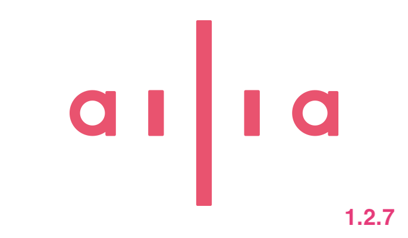
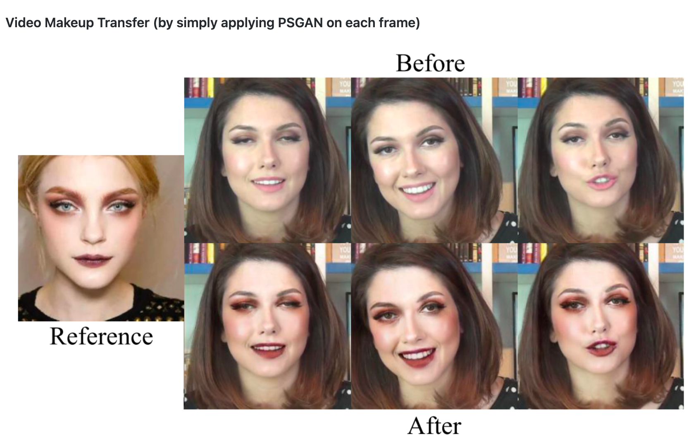
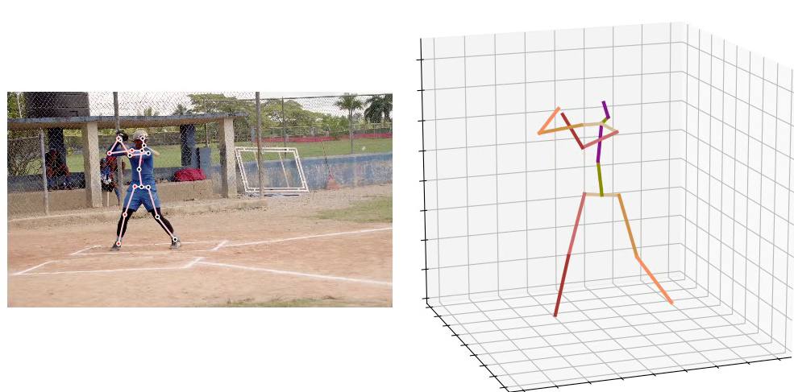

# ailia SDK 1.2.7をリリース

# ailia SDK 1.2.7をリリース

[Kazuki Kyakuno](https://kyakuno.medium.com/?source=post_page---byline--76115dd513c4---------------------------------------)

Apr 30, 2021

--

Share

クロスプラットフォームで利用できるGPU対応の高速AI推論フレームワークであるailia SDKのバージョン1.2.7のご紹介です。ailia SDKについては[こちら](https://ailia.jp/)をご覧ください。

## Get Kazuki Kyakuno’s stories in your inbox

Join Medium for free to get updates from this writer.

Subscribe

Subscribe

Remember me for faster sign in

ailia SDK 1.2.7は推論処理の高速化を中心としたリリースとなります。

## CPUの高速化

ConvTransposeNDの高速化を行なっています。特に、音声処理系の処理時間が大幅に改善します。また、M1 MacにおけるCPUパフォーマンスを全般的に改善しています。

## GPUの高速化

EltwiseにおいてTensorのBroadcastに関する専用処理を追加しました。主に、EfficientNet系で高速化が行われます。また、PaddingのGPU対応を強化しました。Vulkanにおいて、MatMulとGemmのカーネルを高速化しました。

## YOLOv4の高速化

Detector APIでYOLOv4に対応しました。従来、YOLOv4を動かす場合、Pythonによる前処理（スケール変換、チャンネル順変更）と後処理（NMS）が必要で、CPU性能の低いJetsonでは、GPUによる推論時間よりも前処理と後処理の負荷の方が高くなっていました。

> img = cv2.cvtColor(img, cv2.COLOR\_BGR2RGB)  
> img = np.transpose(img, [2, 0, 1])  
> img = img.astype(np.float32) / 255  
> img = np.expand\_dims(img, 0)  
> （処理負荷の高い前処理の例）

Detector APIでは、これらの前処理と後処理をailia SDKのC++コードの中で行うため、処理時間が大幅に改善します。実装においては、上記処理をバッファを経由せずに1回の演算で計算可能となっています。

## 新規レイヤーの追加

EyeLike、RandomNormal、RandomNormalLike、RandomUniform、RandomUniformLikeReduceLogSum、ReduceLogSumExp、Sizeに対応しました。また、MatMulにおいて5次元入力に対応します。

## 圧縮ツールの強化

新たにmin\_tensor\_sizeオプションを追加し、要素数の少ないテンソルを量子化対象から除外することができるようになりました。

## 新たに対応するモデル

[3d-photo-inpainting : 静止画からの動画生成](https://github.com/axinc-ai/ailia-models/tree/master/image_manipulation/3d-photo-inpainting)

Press enter or click to view image in full size

出典：https://github.com/vt-vl-lab/3d-photo-inpainting/blob/master/image/moon.jpg

[PSGAN : バーチャル化粧](https://github.com/axinc-ai/ailia-models/tree/master/style_transfer/psgan)

Press enter or click to view image in full size

出典：<https://github.com/wtjiang98/PSGAN>

[GAST : 高精度な3D骨格推定](https://github.com/axinc-ai/ailia-models/tree/master/pose_estimation/gast)

Press enter or click to view image in full size

出典：https://github.com/fabro66/GAST-Net-3DPoseEstimation/blob/master/data/video/baseball.mp4

[FLAVR : フレーム補完](https://github.com/axinc-ai/ailia-models/tree/master/frame_interpolation/flavr)

出典：https://github.com/tarun005/FLAVR

ax株式会社はAIを実用化する会社として、クロスプラットフォームでGPUを使用した高速な推論を行うことができるailia SDKを開発しています。ax株式会社ではコンサルティングからモデル作成、SDKの提供、AIを利用したアプリ・システム開発、サポートまで、 AIに関するトータルソリューションを提供していますのでお気軽に[お問い合わせ](https://axinc.jp/)ください。