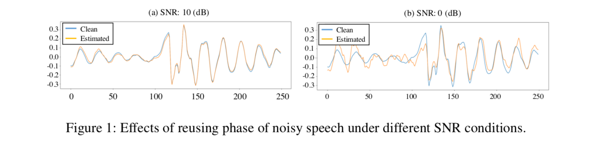
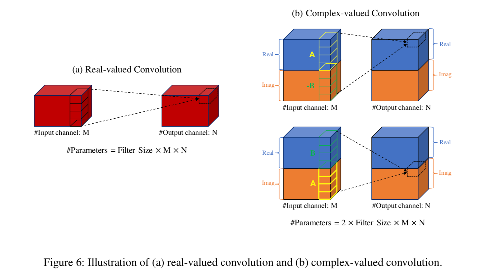
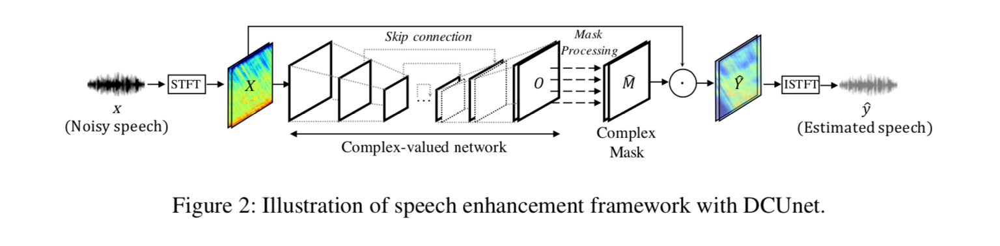
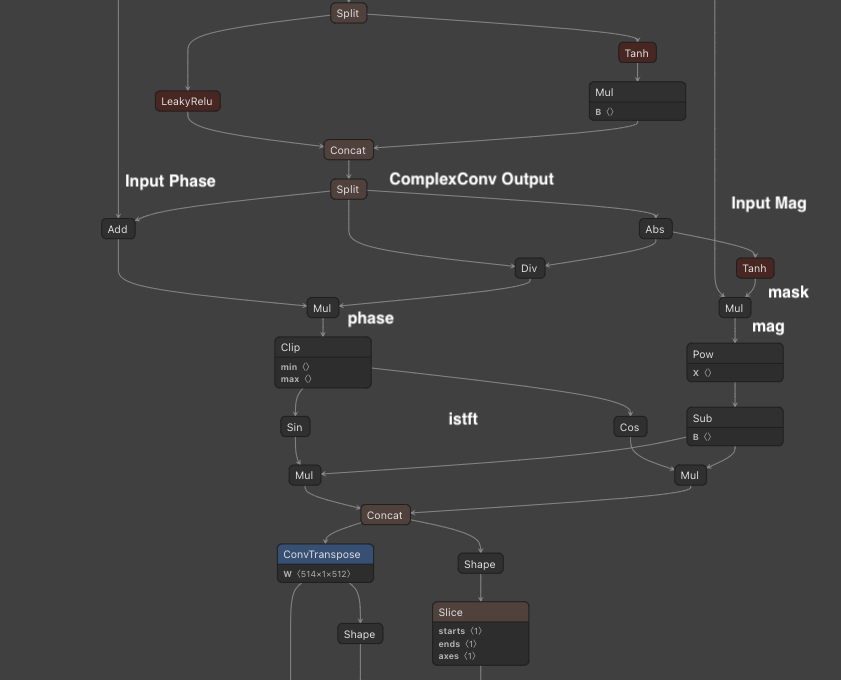

# UnetSourceSeparation : 雑音を除去して声だけを抽出する機械学習モデル

# UnetSourceSeparation : 雑音を除去して声だけを抽出する機械学習モデル

[](https://kyakuno.medium.com/?source=post_page---byline--5d23fd054eac---------------------------------------)

[Kazuki Kyakuno](https://kyakuno.medium.com/?source=post_page---byline--5d23fd054eac---------------------------------------)

May 2, 2021

--

Share

[ailia SDK](https://ailia.jp/)で使用できる機械学習モデルである「UnetSourceSeparation」のご紹介です。エッジ向け推論フレームワークである[ailia SDK](https://ailia.jp/)と[ailia MODELS](https://github.com/axinc-ai/ailia-models)に公開されている機械学習モデルを使用することで、簡単にAIの機能をアプリケーションに実装することができます。

## UnetSourceSeparationの概要

UnetSourceSeparationは2019年3月に公開された音声分離モデルです。入力された音声ファイルから、雑音を除去して声だけを抽出することができます。

[## Phase-aware Speech Enhancement with Deep Complex U-Net

### Most deep learning-based models for speech enhancement have mainly focused on estimating the magnitude of spectrogram…

arxiv.org](https://arxiv.org/abs/1903.03107v1?source=post_page-----5d23fd054eac---------------------------------------)

## UnetSourceSeparationのデモ

公式のボイス分離のデモは下記となります。元音声、処理済み音声が交互に再生されます。

## UnetSourceSeparationのアーキテクチャ

音声処理においては、入力音声に対してSTFT（短時間フーリエ変換）を行い、周波数空間でCNNを適用する手法が一般的です。FT（フーリエ変換）の出力はComplex Value（複素数）となり、Magnitude（振幅）とPhase（位相）で構成されます。

Phaseの推定は難しく、従来の音声分離では、Magnitudeのみを推定していました。しかし、元素材のPhaseをそのまま使用した場合、SNRが高い（雑音が少ない）場合は問題ないのですが、SNRが低い（雑音が大きい）場合は雑音が残るという問題がありました。

Press enter or click to view image in full size



出典：<https://arxiv.org/pdf/1903.03107v1>

UnetSourceSeparationでは、新たにComplex Value Convolutionを導入することで、Phaseの予測を可能とし、SOTAを達成しています。

Press enter or click to view image in full size



出典：<https://arxiv.org/pdf/1903.03107v1>

UnetSourceSeparationのアーキテクチャは下記となります。入力音声をSTFTし、周波数成分を取得したあと、Complex Convolutionを使用したUnetを通します。その後、雑音のマスクを作成し、元の周波数成分から雑音を除去した後、ISTFTで波形に戻します。

Press enter or click to view image in full size



出典：<https://arxiv.org/pdf/1903.03107v1>

雑音のマスキングにおいては、ComplexConvの出力にabsとtanhを通すことで雑音のマスクを作成し、その値を乗算することで行います。

ONNXでは下記のようなグラフでマスキングが実行されます。

Press enter or click to view image in full size



雑音のマスク

マスクは周波数ごとに0〜1.0の値を持ち、0で無音、1.0で入力音そのままとなります。maskの後段にclipを入れて、0.25〜1.0の値を持つように変更すると、25%は元の波形の雑音を維持するように変更することも可能です。

## Get Kazuki Kyakuno’s stories in your inbox

Join Medium for free to get updates from this writer.

Subscribe

Subscribe

Remember me for faster sign in

学習にはDSD100データセットを使用しています。

[## DSD100 | SigSep

### The dsd100 is a dataset of 100 full lengths music tracks of different styles along with their isolated drums, bass…

sigsep.github.io](https://sigsep.github.io/datasets/dsd100.html?source=post_page-----5d23fd054eac---------------------------------------)

## UnetSourceSeparationの使用方法

音声ファイルと出力ファイルを指定すると、音声を抽出します。AIモデルはモノラル信号に対する処理となるため、ステレオ信号が入力されるとモノラル信号に変換した上で処理します。

デフォルトでは雑音除去モデル（GeneralVoiceSeparation）になります。このモデルはサンプリングレート22050Hzのモノラル信号を扱います。

```
$ python3 unet_source_separation.py --input WAV_PATH --savepath SAVE_WAV_PATH
```

楽曲の音声抽出（SingingVoiceSeparation)を行うには、 — arch largeを指定します。このモデルはサンプリングレート44100Hzのモノラル信号を扱います。

```
$ python3 unet_source_separation.py --input WAV_PATH --savepath SAVE_WAV_PATH --arch large
```

ステレオ信号が入力された際に、各チャンネルをそれぞれ独立してAI処理することで、ステレオ信号を出力したい場合は、 -stオプションを使用します。

```
$ python3 unet_source_separation.py --input WAV_PATH --savepath SAVE_WAV_PATH --arch large -st
```

[## axinc-ai/ailia-models

### Noisy speech (audio file) Audio from creative commons youtube videos…

github.com](https://github.com/axinc-ai/ailia-models/tree/master/audio_processing/unet_source_separation?source=post_page-----5d23fd054eac---------------------------------------)

ax株式会社はAIを実用化する会社として、クロスプラットフォームでGPUを使用した高速な推論を行うことができるailia SDKを開発しています。ax株式会社ではコンサルティングからモデル作成、SDKの提供、AIを利用したアプリ・システム開発、サポートまで、 AIに関するトータルソリューションを提供していますのでお気軽に[お問い合わせ](https://axinc.jp/)ください。