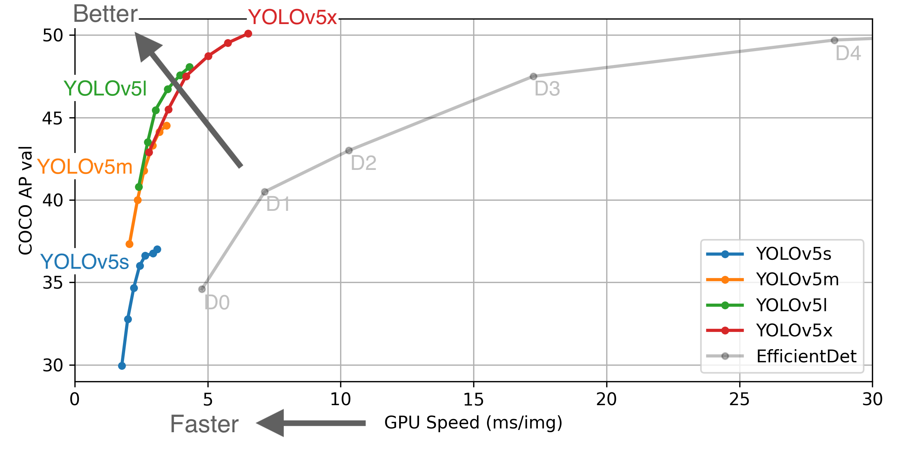
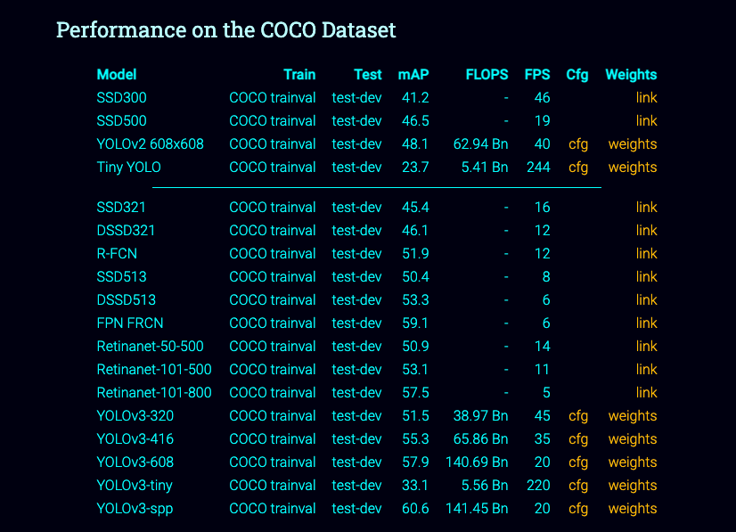
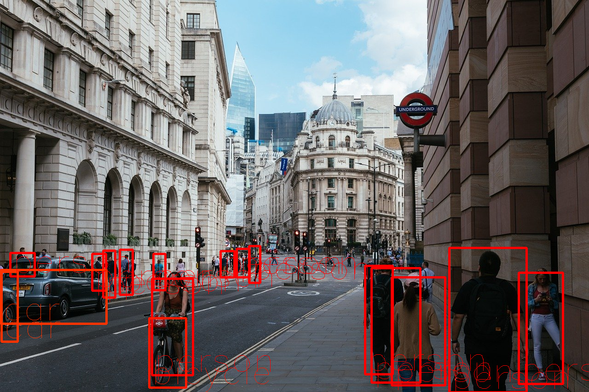
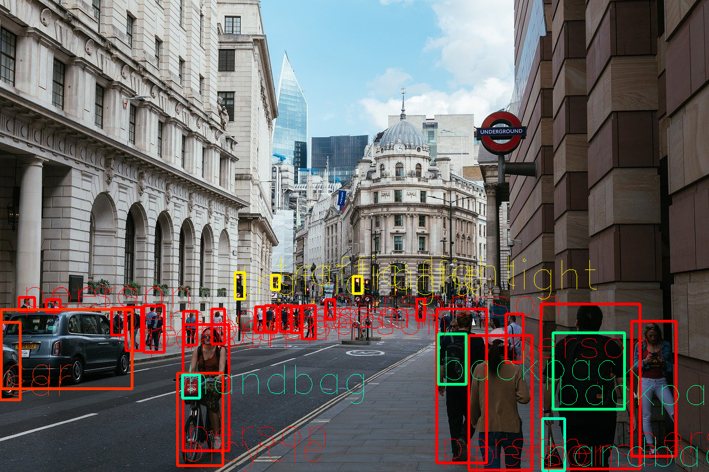
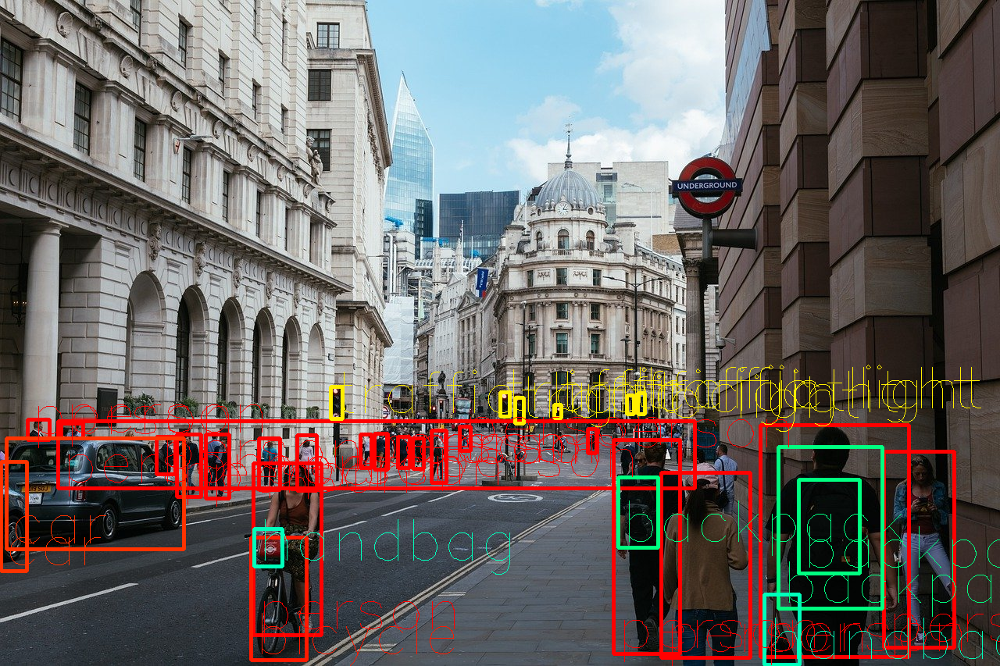

# YOLOv5 : 物体検出の最新モデル

# YOLOv5 : 物体検出の最新モデル

[](https://kyakuno.medium.com/?source=post_page---byline--5b7316d1e54d---------------------------------------)

[Kazuki Kyakuno](https://kyakuno.medium.com/?source=post_page---byline--5b7316d1e54d---------------------------------------)

6 min read

·

Jan 22, 2021

--

Share

[ailia SDK](https://ailia.jp/)で使用できる機械学習モデルである「YOLOv5」のご紹介です。エッジ向け推論フレームワークである[ailia SDK](https://ailia.jp/)と[ailia MODELS](https://github.com/axinc-ai/ailia-models)に公開されている機械学習モデルを使用することで、簡単にAIの機能をアプリケーションに実装することができます。

## YOLOv5の概要

YOLOv5は、YOLOv3のPytorchバージョンを開発していたultralyticsが開発した、最新の物体検出モデルです。2020年6月に公開されました。

[## ultralytics/yolov5

### This repository represents Ultralytics open-source research into future object detection methods, and incorporates…

github.com](https://github.com/ultralytics/yolov5?source=post_page-----5b7316d1e54d---------------------------------------)

## YOLOv5の種類

YOLOv5は、検出精度と演算負荷に応じてs、m、l、xまでの4モデルがあります。各モデルの性能は下記となります。

Press enter or click to view image in full size



出典：<https://github.com/ultralytics/yolov5>

YOLOv5 sモデルが17GFlopsでmAP 55.6です。

Press enter or click to view image in full size


出典：<https://github.com/ultralytics/yolov5>

YOLOv3–416は65.86GFlopsでmAP 55.3です。

Press enter or click to view image in full size



出典：<https://pjreddie.com/darknet/yolo/>

これより、YOLOv5 sモデルは、YOLOv3–416と同等の精度を、約1/4の演算量で達成しています。

## YOLOv5の出力

640x640の画像を入力した場合、下記の3つのテンソルが出力されます。

(1, 3, 80, 80, 85) # anchor 0  
(1, 3, 40, 40, 85) # anchor 1  
(1, 3, 20, 20, 85) # anchor 2

出力の内訳は、[cx, cy, w, h, conf, pred\_cls(80)]となります。

## Pytorchから使用する

PytorchからYOLOv5を使用するには、下記のコマンドを使用します。モデルファイルは自動的にダウンロードされます。

```
python detect.py --source in.mp4
```

## YOLOv5のONNXへのエクスポート

YOLOv5をONNXにエクスポートするには、下記のコマンドを使用します。

```
python3 models/export.py --weights yolov5s.pt --img 640 --batch 1  
python3 models/export.py --weights yolov5m.pt --img 640 --batch 1  
python3 models/export.py --weights yolov5l.pt --img 640 --batch 1
```

--img-sizeオプションでheight, width順で個別に認識解像度を指定することもできます。

```
python3 models/export.py — weights yolov5m.pt --img-size 640 1280 — batch 1
```

## YOLOv3との認識精度と推論速度の比較

YOLOv3とYOLOv5の認識精度と推論速度の比較です。推論速度はMacBook Pro 13を使用してIntel Core i5 2.3GHzで測定しています。conf\_thres=0.25,は、nms\_thres=0.45です。

Press enter or click to view image in full size


出典：<https://pixabay.com/ja/photos/%E3%83%AD%E3%83%B3%E3%83%89%E3%83%B3%E5%B8%82-%E9%8A%80%E8%A1%8C-%E3%83%AD%E3%83%B3%E3%83%89%E3%83%B3-4481399/>

評価結果は下記です。主観評価でも、YOLOv5のsモデルを使用することで、YOLOv3のfullモデルに近い性能を、1/4以下の演算量で達成することができています。

## Get Kazuki Kyakuno’s stories in your inbox

Join Medium for free to get updates from this writer.

Subscribe

Subscribe

Remember me for faster sign in

YOLOv3 tiny (640x640)（48ms）

Press enter or click to view image in full size



YOLOv4 tiny(640x640) (59ms)

Press enter or click to view image in full size


YOLOv5 s(640x640)（98ms）

Press enter or click to view image in full size



YOLOv3 (640x640)（477ms）

Press enter or click to view image in full size



YOLOv4 (640x640) (653ms)

Press enter or click to view image in full size


YOLOv5 m (640x640)（229ms）

Press enter or click to view image in full size


YOLOv5 l (640x640)（438ms）

Press enter or click to view image in full size


## ailia SDKからの利用

ailia SDKから利用するには、下記のコマンドを使用します。

> python3 yolov5.py -v input.mp4

実行例です。

[## axinc-ai/ailia-models

### (Image from https://github.com/ultralytics/yolov5/blob/master/data/images/bus.jpg) Shape : (1, 3, 640, 640) Range …

github.com](https://github.com/axinc-ai/ailia-models/tree/master/object_detection/yolov5?source=post_page-----5b7316d1e54d---------------------------------------)

ax株式会社はAIを実用化する会社として、クロスプラットフォームでGPUを使用した高速な推論を行うことができるailia SDKを開発しています。ax株式会社ではコンサルティングからモデル作成、SDKの提供、AIを利用したアプリ・システム開発、サポートまで、 AIに関するトータルソリューションを提供していますのでお気軽に[お問い合わせ](https://axinc.jp/)ください。