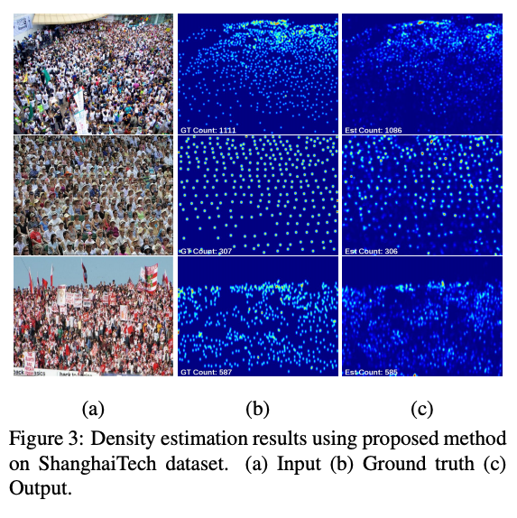
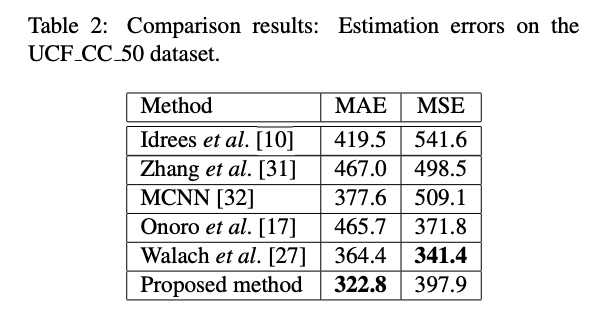

# CrowdCounting : 画像から人数を計測する機械学習モデル

# CrowdCounting : 画像から人数を計測する機械学習モデル

[Kazuki Kyakuno](https://kyakuno.medium.com/?source=post_page---byline--459e8b3fc184---------------------------------------)

Oct 19, 2020

--

Share

[ailia SDK](https://ailia.jp/)で使用できる機械学習モデルである「CrowdCounting」のご紹介です。エッジ向け推論フレームワークである[ailia SDK](https://ailia.jp/)と[ailia MODELS](https://github.com/axinc-ai/ailia-models)に公開されている機械学習モデルを使用することで、簡単にAIの機能をアプリケーションに実装することができます。

## CrowdCountingの概要

CrowdCountCascadedMtlは2017年8月に発表された、入力された画像から映っている人数を計測する機械学習モデルです。コンサート会場など大規模な群衆での計測に適しています。

出典：<https://arxiv.org/pdf/1707.09605.pdf>

[## CNN-based Cascaded Multi-task Learning of High-level Prior and Density Estimation for Crowd…

### Estimating crowd count in densely crowded scenes is an extremely challenging task due to non-uniform scale variations…

arxiv.org](https://arxiv.org/abs/1707.09605?source=post_page-----459e8b3fc184---------------------------------------)

[## svishwa/crowdcount-cascaded-mtl

### This is implementation of the paper CNN-based Cascaded Multi-task Learning of High-level Prior and Density Estimation…

github.com](https://github.com/svishwa/crowdcount-cascaded-mtl?source=post_page-----459e8b3fc184---------------------------------------)

## CrowdCountingのアーキテクチャ

CrowdCountingでは群衆の分布を示すDensityMapを計算し、出力されたDensity Mapの値を積算することで人数を予測します。

## Get Kazuki Kyakuno’s stories in your inbox

Join Medium for free to get updates from this writer.

Subscribe

Subscribe

Remember me for faster sign in

CrowdCountCascadedMtlでは、人数をカウントするClassifierモデルを使用して学習したHigh-level prior stageの出力を、Density estimation stageに入力することで、高精度化を行っています。

Press enter or click to view image in full size

出典：<https://arxiv.org/pdf/1707.09605.pdf>

学習と評価にはShanghai Tech datasetとUCF\_CC\_50を使用しており、共に高い性能を示しています。

出典：<https://arxiv.org/pdf/1707.09605.pdf>

出典：<https://arxiv.org/pdf/1707.09605.pdf>

出典：<https://arxiv.org/pdf/1707.09605.pdf>

出典：<https://arxiv.org/pdf/1707.09605.pdf>

## CrowdCountingの使用方法

ailia SDKでCrowdCountingを使用するには下記のコマンドを使用します。WEBカメラに映っている人数を計測することができます。

> python3 crowdcount-cascaded-mtl.py -v 0

実行例です。

[## axinc-ai/ailia-models

### Ailia input shape: (1, 1, 480, 640) Automatically downloads the onnx and prototxt files on the first run. It is…

github.com](https://github.com/axinc-ai/ailia-models/tree/master/crowd_counting/crowdcount-cascaded-mtl?source=post_page-----459e8b3fc184---------------------------------------)

ax株式会社はAIを実用化する会社として、クロスプラットフォームでGPUを使用した高速な推論を行うことができるailia SDKを開発しています。ax株式会社ではコンサルティングからモデル作成、SDKの提供、AIを利用したアプリ・システム開発、サポートまで、 AIに関するトータルソリューションを提供していますのでお気軽に[お問い合わせ](https://axinc.jp/)ください。