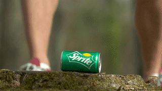
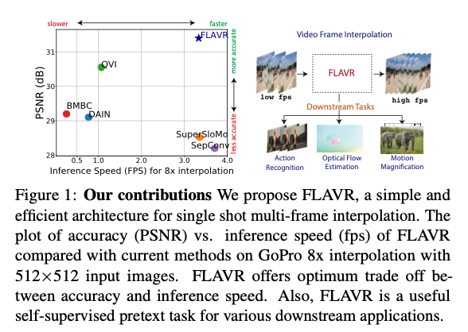
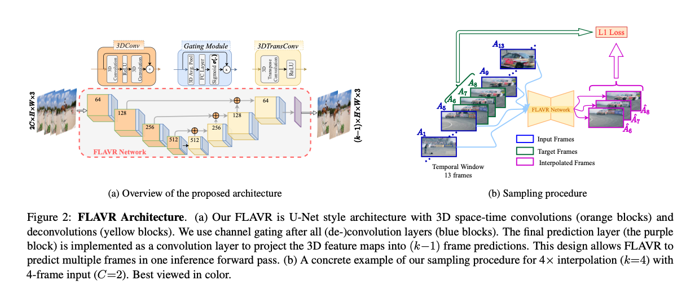
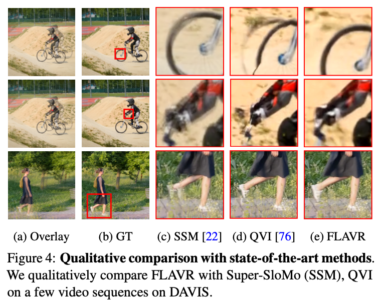

# FLAVR : 動画のフレームレートを上げる機械学習モデル

# FLAVR : 動画のフレームレートを上げる機械学習モデル

[](https://kyakuno.medium.com/?source=post_page---byline--6a18211445da---------------------------------------)

[Kazuki Kyakuno](https://kyakuno.medium.com/?source=post_page---byline--6a18211445da---------------------------------------)

8 min read

·

May 7, 2021

--

Share

[ailia SDK](https://ailia.jp/)で使用できる機械学習モデルである「FLAVR」のご紹介です。エッジ向け推論フレームワークである[ailia SDK](https://ailia.jp/)と[ailia MODELS](https://github.com/axinc-ai/ailia-models)に公開されている機械学習モデルを使用することで、簡単にAIの機能をアプリケーションに実装することができます。

## FLAVRの概要

FLAVRは2020年12月に公開された機械学習モデルで、入力動画のフレームを補完してフレームレートを上げることができます。



出典：<https://github.com/tarun005/FLAVR>

[## FLAVR: Flow-Agnostic Video Representations for Fast Frame Interpolation

### A majority of methods for video frame interpolation compute bidirectional optical flow between adjacent frames of a…

arxiv.org](https://arxiv.org/abs/2012.08512?source=post_page-----6a18211445da---------------------------------------)

## FLAVRのアーキテクチャ

フレーム補完はVideo Frame Interpolationという分野に属し、一般に、下記の三つの方法が使用されています。

・Phase based  
・Flow based  
・Kernel based

Phase basedの方法では、各フレームをwaveletの[線型結合](https://ja.wikipedia.org/wiki/%E7%B7%9A%E5%9E%8B%E7%B5%90%E5%90%88#:~:text=%E7%B7%9A%E5%9E%8B%E7%B5%90%E5%90%88%EF%BC%88%E3%81%9B%E3%82%93%E3%81%91%E3%81%84%E3%81%91%E3%81%A4,%E3%81%82%E3%82%8B%E3%81%84%E3%81%AF%E7%B7%9A%E5%9E%8B%E5%92%8C%E3%81%A8%E3%82%82%E5%91%BC%E3%81%B6%E3%80%82&text=%E3%81%84%E3%81%8F%E3%81%A4%E3%81%8B%E3%81%AE%E3%83%99%E3%82%AF%E3%83%88%E3%83%AB%E3%82%92,%E3%82%92%E4%BD%9C%E3%82%8B%E3%81%93%E3%81%A8%E3%81%8C%E3%81%A7%E3%81%8D%E3%82%8B%E3%80%82)と見なし、waveletのphaseとmagnitudeを、古典的なアルゴリズム、もしくは、CNNを使用して補完します。

Flow basedの方法では、フレーム間の動きベクトルで表現されるoptical flowを計算し、補完します。optical flowの計算にはPWC-Netなどが使用されます。しかし、Flow basedの方法では、optical flowの予測性能に最終出力が強く依存するという課題があります。その結果、optical flowの予測性能が低い場合にアーティファクト（ノイズ）が目立ちやすくなります。また、線形（リニア）ではない動きに弱いという問題もあります。

Kernel basedの方法では、入力画像に空間的な適応的フィルタを適用してリサンプルすることで補完画像を得ます。しかし、従来の方法は、計算量の問題から局所近傍のみからサンプリングしていました。例えば、CAINでは、channel attensionを提案しましたが、入力画像間の複雑な空間的・時間的な依存関係を捉えることができません。

FLAVRでは、3D space-time convolutionの導入によってこれらの問題を解決します。3D space-time convolutionはアクション検出の分野で広く使用されている技術です。FLAVRでは、3D space-time convolutionをフレーム補完の問題に適用することで、複雑な入力フレーム間の時間情報の抽象化モデリングを実現し、正確かつシャープな予測を可能とします。

FLAVRは従来技術と比べて、高速で高精度です。



出典：<https://arxiv.org/pdf/2012.08512>

FLAVRはU-Netをベースに3D space-time convolutionを導入しています。前方2フレーム、後方2フレームの合計4フレームを参照して、補完フレームを生成します。フレームレートを4倍にする場合、4フレームを入力として、3フレームを出力します。

Press enter or click to view image in full size



出典：<https://arxiv.org/pdf/2012.08512>

3D space-time convolutionにおける各3D filterは5次元のweightを持ち、ci \*co \*t \* h \*wとなります。tは時間方向です。通常のConvolutionは4次元のweightを持ちますが、これを5次元に拡張したのが3D space-time convolution (一般に呼ばれる3D Convolution）となります。

U-NetのエンコーダはResNet-3D 18をベースとしており、デコーダは3DTransConvでUpsamplingしています。

## Get Kazuki Kyakuno’s stories in your inbox

Join Medium for free to get updates from this writer.

Subscribe

Subscribe

Remember me for faster sign in

また、Spatio-Temporal Feature Gatingを使用した、self-attention機構を導入しています。具体的に、全てのConv3Dの出力にgating moduleを挿入しています。gating moduleはspatio-temporal pooling layerと、学習可能なweightとbiasから構成されます。

gating moduleの出力の可視化です。self-attensionによってmotion boundariesを適切に抽出することが可能となります。


出典：<https://arxiv.org/pdf/2012.08512>

gating moduleは[Learnable pooling with Context Gating for video classification](https://arxiv.org/abs/1706.06905)をベースとしています。Context Gatingは自然言語処理のGated Linear Unit (GLU)を元に開発されており、各層で通過させたい情報の制御を可能にしつつ勾配消失を防ぎます。

[## Learnable pooling with Context Gating for video classification

### Current methods for video analysis often extract frame-level features using pre-trained convolutional neural networks…

arxiv.org](https://arxiv.org/abs/1706.06905?source=post_page-----6a18211445da---------------------------------------)

FLAVRはVideo-90K、UCF101、DAVISデータセットにおいて、DAINやCAINよりも高い性能を達成しています。

Press enter or click to view image in full size


出典：<https://arxiv.org/pdf/2012.08512>

FLAVRの出力画像の比較です。[SSM：Super slomo: High quality estimation of multiple intermediate frames for video interpolation](https://github.com/avinashpaliwal/Super-SloMo)および[QVI：Quadratic video interpolation. In Advances in Neural Information Processing Systems](https://github.com/xuxy09/QVI)と比較を行なっています。

Press enter or click to view image in full size



出典：<https://arxiv.org/pdf/2012.08512>

FLAVRの客観指標での比較です。PSNRとSSIMはいずれも従来技術を上回っています。


出典：<https://arxiv.org/pdf/2012.08512>

### FLAVRの使用方法

下記のコマンドで任意の動画のフレーム数を4倍に拡張することができます。hwには出力したい動画の解像度を指定します。どれくらいフレームレートを拡張するかはipオプションで指定することができ、2、4、8を指定することができます。

GPU実行

```
python3 flavr.py -v puppy.mp4 -ip 4 -s output.mp4 -hw 360,640
```

CPU実行（MacBookProの内蔵グラフィックスの場合はCPUの方が高速）

```
python3 flavr.py -v puppy.mp4 -e 0 -ip 4 -s output.mp4 -hw 360,640
```

[## axinc-ai/ailia-models

### (Image from Vimeo-90K dataset http://data.csail.mit.edu/tofu/dataset/vimeo\_septuplet.zip) Automatically downloads the…

github.com](https://github.com/axinc-ai/ailia-models/tree/master/frame_interpolation/flavr?source=post_page-----6a18211445da---------------------------------------)

実行例は下記となります。

ax株式会社はAIを実用化する会社として、クロスプラットフォームでGPUを使用した高速な推論を行うことができるailia SDKを開発しています。ax株式会社ではコンサルティングからモデル作成、SDKの提供、AIを利用したアプリ・システム開発、サポートまで、 AIに関するトータルソリューションを提供していますのでお気軽に[お問い合わせ](https://axinc.jp/)ください。