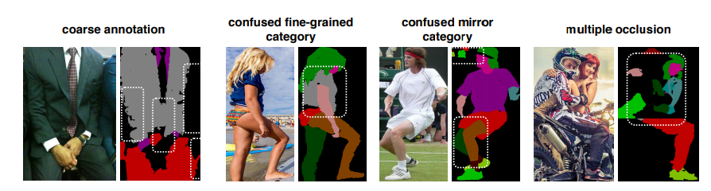
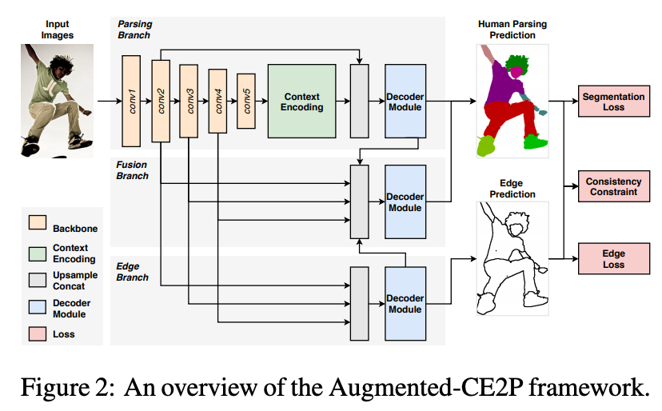
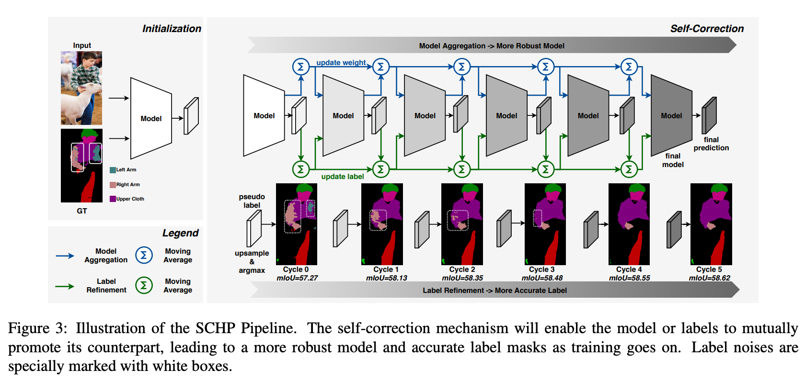

# HumanPartSegmentation : 人物の部位をセグメンテーションする機械学習モデル

# HumanPartSegmentation : 人物の部位をセグメンテーションする機械学習モデル

[Kazuki Kyakuno](https://kyakuno.medium.com/?source=post_page---byline--e8a0e405255---------------------------------------)

7 min read

·

Oct 11, 2020

--

Share

[ailia SDK](https://ailia.jp/)で使用できる機械学習モデルである「HumanPartSegmentation」のご紹介です。エッジ向け推論フレームワークである[ailia SDK](https://ailia.jp/)と[ailia MODELS](https://github.com/axinc-ai/ailia-models)に公開されている機械学習モデルを使用することで、簡単にAIの機能をアプリケーションに実装することができます。

## HumanPartSegmentationの概要

Self-Correction for Human ParsingはBaiduResearchが2019年の10月に発表した、人物の部位ごとにセグメンテーションを行うことができる機械学習モデルです。

[## Self-Correction for Human Parsing

### Labeling pixel-level masks for fine-grained semantic segmentation tasks, e.g. human parsing, remains a challenging…

arxiv.org](https://arxiv.org/abs/1910.09777?source=post_page-----e8a0e405255---------------------------------------)

[## PeikeLi/Self-Correction-Human-Parsing

### An out-of-box human parsing representation extractor. Our solution ranks 1st for all human parsing tracks (including…

github.com](https://github.com/PeikeLi/Self-Correction-Human-Parsing?source=post_page-----e8a0e405255---------------------------------------)

対応している部位は下記になります。

> CATEGORY = (  
>  ‘Background’, ‘Hat’, ‘Hair’, ‘Glove’, ‘Sunglasses’, ‘Upper-clothes’, ‘Dress’, ‘Coat’,  
>  ‘Socks’, ‘Pants’, ‘Jumpsuits’, ‘Scarf’, ‘Skirt’, ‘Face’, ‘Left-arm’, ‘Right-arm’,  
>  ‘Left-leg’, ‘Right-leg’, ‘Left-shoe’, ‘Right-shoe’  
> )

入力と出力の例は下記になります。

Press enter or click to view image in full size

出典：<https://github.com/PeikeLi/Self-Correction-Human-Parsing/blob/master/demo/demo.jpg>

Press enter or click to view image in full size

処理結果

## HumanPartSegmentationのアーキテクチャ

HumanPartSegmentationはLIPデータセットの50000画像から学習を行ないますが、HumanPartSegmentationにはデータセットが不完全であるという問題があります。通常のセグメンテーションでは、1つの物体に1つのカテゴリを使用しますが、HumanPartSegmentationでは1つの物体に2つのカテゴリを割り当てるため、アノテーションのコストが高く、ノイズやラベル間違いなどがGT（Ground Truth）のデータに含まれてしまいます。

Press enter or click to view image in full size

GTに含まれるノイズの例（出典：<https://arxiv.org/pdf/1910.09777.pdf>）

SCHP（Self-Correction for Human Parsning）では、データセットにノイズが含まれることを前提に、セグメンテーションのクラス間のエッジに対するLossを使用した学習を行うと共に、GTのラベルデータをRefineしながら学習を行うことで、より高精度なセグメンテーションを実現します。

## Get Kazuki Kyakuno’s stories in your inbox

Join Medium for free to get updates from this writer.

Subscribe

Subscribe

Remember me for faster sign in

ネットワークアーキテクチャはbackbone networkにresnet101を使用したCE2Pとなっています。2018年9月に発表されたDevil in the Details: Towards Accurate Single and Multiple Human Parsingのアーキテクチャで、セグメンテーションのクラス間のエッジに関するLossを加えることで精度を改善する手法です。従来はセグメンテーションのGTは正しい前提で学習をしていましたが、CE2PではセグメンテーションのGTにノイズが含まれることを前提として、特定のクラスのセグメンテーション内に孤立して現れる別クラスのノイズに対処しています。

[## Devil in the Details: Towards Accurate Single and Multiple Human Parsing

### Human parsing has received considerable interest due to its wide application potentials. Nevertheless, it is still…

arxiv.org](https://arxiv.org/abs/1809.05996?source=post_page-----e8a0e405255---------------------------------------)

Press enter or click to view image in full size

出典：<https://arxiv.org/pdf/1910.09777.pdf>

SCHPの特徴的な手法として、自己修正学習サイクルを使用して、GTのラベルを修正しながら学習を行っています。2015年3月に発表された蒸留の論文であるDistilling the Knowledge in a Neural Networkで示されたように、マルチクラスのラベルにはDark informationが含まれていることが知られています。preudo-maskを使用することで、正解ラベルのみを含むOne-Hotのラベルに対して、Dark informationが含まれるSoft-Targetのラベルを生成することができます。

[## Distilling the Knowledge in a Neural Network

### A very simple way to improve the performance of almost any machine learning algorithm is to train many different models…

arxiv.org](https://arxiv.org/abs/1503.02531?source=post_page-----e8a0e405255---------------------------------------)

SCHPでは、GTのラベルで学習した後、学習したモデルでラベルを付け直し、新しいラベルで学習することを繰り返していくことで、よりノイズの少ない教師ラベルを生成し、より精度の高いモデルを生成します。

Press enter or click to view image in full size

学習されたモデルはCVPR2019LIPチャレンジでSOTAを達成しています。

## HumanPartSegmentationの使用方法

ailia SDKでHumanPartSegmentationを使用する場合、下記のコマンドでWEBカメラ入力に対して処理を適用することができます。

> python3 human\_part\_segmentation.py -v 0

実行例です。

[## axinc-ai/ailia-models

### (Image from https://github.com/PeikeLi/Self-Correction-Human-Parsing/blob/master/demo/demo.jpg) Shape : (1, 3, 473…

github.com](https://github.com/axinc-ai/ailia-models/tree/master/image_segmentation/human_part_segmentation?source=post_page-----e8a0e405255---------------------------------------)

ax株式会社はAIを実用化する会社として、クロスプラットフォームでGPUを使用した高速な推論を行うことができるailia SDKを開発しています。ax株式会社ではコンサルティングからモデル作成、SDKの提供、AIを利用したアプリ・システム開発、サポートまで、 AIに関するトータルソリューションを提供していますのでお気軽に[お問い合わせ](https://axinc.jp/)ください。