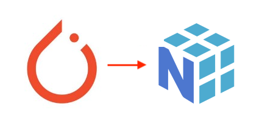

# torchとnumpyの演算子の相互変換

# torchとnumpyの演算子の相互変換

[Kazuki Kyakuno](https://kyakuno.medium.com/?source=post_page---byline--bc78a59a335b---------------------------------------)

5 min read

·

Jan 29, 2021

--

Share

torchとnumpyの演算子の相互変換方法について解説します。

## 概要

### torchとnumpyの変換

Pytorchで学習した機械学習モデルをONNXにエクスポートして使用する場合、Pytorchで記述された後処理をnumpyに置き換える必要があります。Pytorchの演算とnumpyの演算は似ているAPIが多いものの、微妙に仕様が異なります。本記事では、置き換えの際のAPIの対応関係をまとめます。

### torchについて

PytorchはFacebookの開発しているAIフレームワークです。AIのレイヤーに加えて、numpyに相当するtensorの演算をサポートしています。

[## pytorch/pytorch

### PyTorch is a Python package that provides two high-level features: Tensor computation (like NumPy) with strong GPU…

github.com](https://github.com/pytorch/pytorch?source=post_page-----bc78a59a335b---------------------------------------)

### numpyについて

numpyは機械学習で広く使用されている数値演算ライブラリです。バックエンドはCで実装されており、Pythonで高速な数値演算が可能です。

[## numpy/numpy

### NumPy is the fundamental package needed for scientific computing with Python. It provides: a powerful N-dimensional…

github.com](https://github.com/numpy/numpy?source=post_page-----bc78a59a335b---------------------------------------)

## 相互運用

### torchからnumpyへの変換

torchのTensorからnumpyのArrayを取得します。

numpy\_tensor = torch\_tensor.numpy()

### numpyからtorchへの変換

numpyのArrayからtorchのTensorに変換します。

torch\_tensor = torch.from\_numpy(numpy\_tensor)

## APIの対応関係

### 新しいテンソルの確保

指定したshapeの新しいテンソルを確保します。

y = torch.FloatTensor(a.shape)

y = np.zeros(a.shape)

### 要素ごとの最大と最小

2つのテンソルの要素ごとの最大値と最小値を計算します。

y = torch.max(a,b)  
y = torch.min(a,b)

y = np.maximum(a,b)  
y = np.minimum(a,b)

### 最大値の計算

テンソルの最大値と最大要素のインデックスを計算します。torchでは1つのAPIで同時に計算しますが、numpyでは2つのAPIに分解する必要があります。

## Get Kazuki Kyakuno’s stories in your inbox

Join Medium for free to get updates from this writer.

Subscribe

Subscribe

Remember me for faster sign in

y\_value, y\_idx= torch.max(a, 1, keepdim=True)

y\_value = np.max(a, axis=1, keepdims=True)  
y\_idx = np.argmax(a.numpy(), axis=1)  
y\_idx = y\_idx.reshape((y\_idx.shape[0],1))

### 並べ替え

テンソルの並べ替えとインデックスを計算します。torchでは1つのAPIで同時に計算しますが、numpyでは2つのAPIに分解する必要があります。

y\_value, y\_idx = torch.sort(a, descending=True)

y\_value = np.sort(a)  
y\_value = y\_value[::-1]  
y\_idx = np.argsort(a)  
y\_idx = y\_idx[::-1]

### クリップ

テンソルの値をクリップします。Noneを使用することで片方向のみClipすることができます。

y = torch.clamp(a,min=b)

y = np.clip(a,n,None)

### サイズ変更

要素数に-1を指定することで、特定の次元のサイズを自動計算することができます。

y = a.view(1,-1,1)

y = a.reshape(1,-1,1)

### テンソルの結合

2つのテンソルを結合します。

y = torch.cat(a,b)

y = np.concatenate(a,b)

### ユニークな要素の抽出

テンソルからユニークな要素を抽出します。

y = a.unique()

y = np.unique(a)

### 次元の追加

テンソルの次元を拡張します。

y = a.unsqueeze(0)

y = np.expand\_dims(a,0)

### Softmax

ソフトマックスを実行します。

y = torch.softmax(x)

def softmax(x):  
 s= np.sum(np.exp(x))  
 return np.exp(x)/s  
y = softmax(x)

ax株式会社はAIを実用化する会社として、クロスプラットフォームでGPUを使用した高速な推論を行うことができるailia SDKを開発しています。ax株式会社ではコンサルティングからモデル作成、SDKの提供、AIを利用したアプリ・システム開発、サポートまで、 AIに関するトータルソリューションを提供していますのでお気軽に[お問い合わせ](https://axinc.jp/)ください。