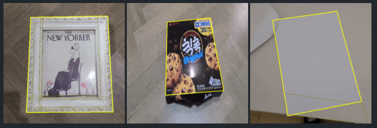
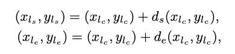

# M-LSD : ワイヤーフレームを検出する機械学習モデル

# M-LSD : ワイヤーフレームを検出する機械学習モデル

[](https://kyakuno.medium.com/?source=post_page---byline--876bef18d908---------------------------------------)

[Kazuki Kyakuno](https://kyakuno.medium.com/?source=post_page---byline--876bef18d908---------------------------------------)

Aug 31, 2021

--

Share

[ailia SDK](https://ailia.jp/)で使用できる機械学習モデルである「M-LSD」のご紹介です。エッジ向け推論フレームワークである[ailia SDK](https://ailia.jp/)と[ailia MODELS](https://github.com/axinc-ai/ailia-models)に公開されている機械学習モデルを使用することで、簡単にAIの機能をアプリケーションに実装することができます。

## M-LSDの概要

M-LSDはNAVERが開発した、入力された物体のワイヤーフレームを検出する機械学習モデルです。紙や本の輪郭を正確に検出可能なため、OCRの前処理などに使用可能です。

Press enter or click to view image in full size



出典：<https://github.com/navervision/mlsd>

[## Towards Real-time and Light-weight Line Segment Detection

### Previous deep learning-based line segment detection (LSD) suffer from the immense model size and high computational…

arxiv.org](https://arxiv.org/abs/2106.00186?source=post_page-----876bef18d908---------------------------------------)

## M-LSDのアーキテクチャ

従来のライン検出のアプローチは複数のモジュールを使用する複雑なものでした。M-LSDでは、シングルショットでラインを検出するため、高速な処理が可能です。

Press enter or click to view image in full size


出典：<https://arxiv.org/pdf/2106.00186.pdf>

BackboneにはMobileNetV2を使用しており、後段にヒートマップを生成するためのブロックを追加しています。

Press enter or click to view image in full size


出典：<https://arxiv.org/pdf/2106.00186.pdf>

線分は下記のように、Tri-Points（TP）として定義されています。中心点を示すlcと、始点への差分であるds、終点への差分であるdeによって線分を表現します。

## Get Kazuki Kyakuno’s stories in your inbox

Join Medium for free to get updates from this writer.

Subscribe

Subscribe

Remember me for faster sign in


出典：<https://arxiv.org/pdf/2106.00186.pdf>

AIモデルの出力は、線分の中心点を表すCenter mapからTopK Layerを使用して計算した線分の中心点を表す（1,200,2）のベクトルlcと、線分の確信度であるである（1,200）のスコア、中心点から線分の始点と終点への差分を示すベクトルである（1,256,256,4）のDisplacement mapとなります。AIモデルの出力である中心点・始点・終点の3つのベクトルを加算することで、線分を計算可能です。



出典：<https://arxiv.org/pdf/2106.00186.pdf>

データセットはWireframeとYorkUrbanを使用しています。


出典：<https://arxiv.org/pdf/2106.00186.pdf>

## M-LSDの使用方法

下記のコマンドを使用することで、WEBカメラから認識可能です。ailia SDK 1.2.8以降に対応しています。

```
$ python3 mlsd.py -v 0
```

[## ailia-models/line\_segment\_detection/mlsd at master · axinc-ai/ailia-models

### (Image from…

github.com](https://github.com/axinc-ai/ailia-models/tree/master/line_segment_detection/mlsd?source=post_page-----876bef18d908---------------------------------------)

実行例です。

ax株式会社はAIを実用化する会社として、クロスプラットフォームでGPUを使用した高速な推論を行うことができるailia SDKを開発しています。ax株式会社ではコンサルティングからモデル作成、SDKの提供、AIを利用したアプリ・システム開発、サポートまで、 AIに関するトータルソリューションを提供していますのでお気軽に[お問い合わせ](https://axinc.jp/)ください。