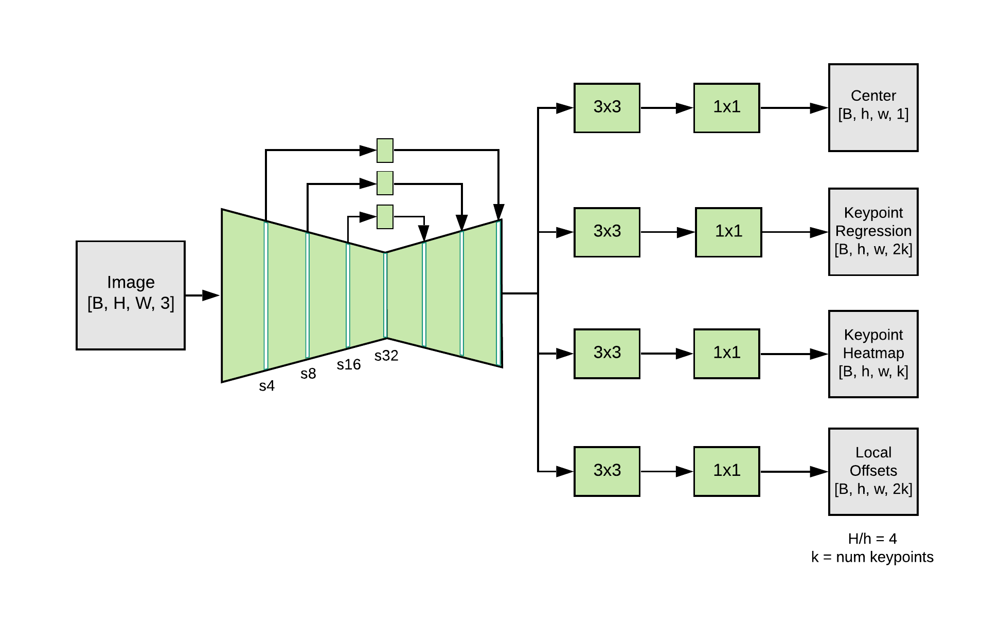
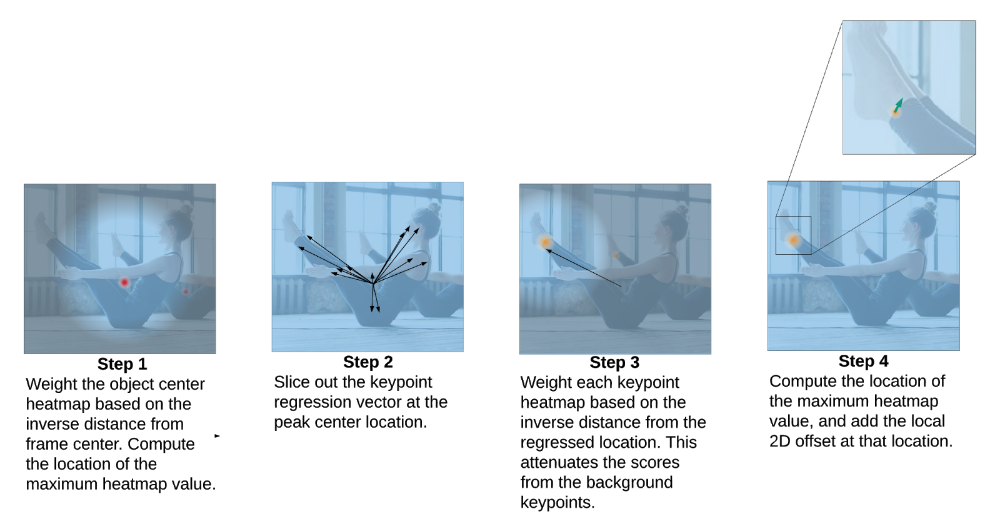

# MoveNet : 動きの激しい動画向け骨格検出モデル

# MoveNet : 動きの激しい動画向け骨格検出モデル

[](https://kyakuno.medium.com/?source=post_page---byline--d26d9e06126c---------------------------------------)

[Kazuki Kyakuno](https://kyakuno.medium.com/?source=post_page---byline--d26d9e06126c---------------------------------------)

Sep 2, 2021

--

Share

[ailia SDK](https://ailia.jp/)で使用できる機械学習モデルである「MoveNet」のご紹介です。エッジ向け推論フレームワークである[ailia SDK](https://ailia.jp/)と[ailia MODELS](https://github.com/axinc-ai/ailia-models)に公開されている機械学習モデルを使用することで、簡単にAIの機能をアプリケーションに実装することができます。

## MoveNetの概要

MoveNetは2021年5月17日にGoogleが公開した骨格検出モデルです。従来の骨格検出技術と比べて、動きの激しい動画での検出精度を改善しています。ライブフィットネスやスポーツのアプリに最適です。

Press enter or click to view image in full size


出典：<https://blog.tensorflow.org/2021/05/next-generation-pose-detection-with-movenet-and-tensorflowjs.html>

[## Next-Generation Pose Detection with MoveNet and TensorFlow.js

### May 17, 2021 - Posted by Ronny Votel and Na Li, Google Research Today we're excited to launch our latest pose detection…

blog.tensorflow.org](https://blog.tensorflow.org/2021/05/next-generation-pose-detection-with-movenet-and-tensorflowjs.html?source=post_page-----d26d9e06126c---------------------------------------)

## MoveNetのアーキテクチャ

MoveNetは17個の2次元のキーポイントを高速かつ高精度に検出します。LightnigとThunderの二つのモデルがあり、Lightningが速度が要求されるアプリ、Thunderが精度が要求されるアプリに使用可能です。LightningもThunderもデスクトップPC、ノートPC、スマートフォンで30FPS以上で動作します。

## Get Kazuki Kyakuno’s stories in your inbox

Join Medium for free to get updates from this writer.

Subscribe

Subscribe

Remember me for faster sign in

アーキテクチャはCenterNetに近いものとなっています。FeatureExtractorはMobileNetV2にFeature Pyramid Network（FPN）を付加したものになっています。output strideを4に設定することで、高解像度を扱うことができるようになっています。

Press enter or click to view image in full size



出典：<https://blog.tensorflow.org/2021/05/next-generation-pose-detection-with-movenet-and-tensorflowjs.html>

AIモデルの出力は、Person center heatmap、Keypoint regression field、Person keypoint heatmap、2D per-keypoint offset fieldとなります。

Press enter or click to view image in full size



出典：<https://blog.tensorflow.org/2021/05/next-generation-pose-detection-with-movenet-and-tensorflowjs.html>

学習にはCOCOデータセットと、Googleの社内用データセットの両方を使用しています。COCOデータセットは、ポーズが大幅に変わったり、モーションブラーがかかっているような厳しい環境のデータは含まれておらず、フィットネスやダンスのアプリには向いていないという問題があります。Googleの社内用データセットでは、YouTubeのyoga、fitness、danceのビデオにアノテーションして使用しています。各動画は3フレームしか使用せず、データセットの多様性を確保しています。

Press enter or click to view image in full size


出典：<https://blog.tensorflow.org/2021/05/next-generation-pose-detection-with-movenet-and-tensorflowjs.html>

## MoveNetの使用方法

MoveNetを使用するには下記のコマンドを使用します。Webカメラから認識が可能です。

```
$ python3 movenet.py -v 0
```

実行例です。

[## ailia-models/pose\_estimation/movenet at master · axinc-ai/ailia-models

### (Image from…

github.com](https://github.com/axinc-ai/ailia-models/tree/master/pose_estimation/movenet?source=post_page-----d26d9e06126c---------------------------------------)

ax株式会社はAIを実用化する会社として、クロスプラットフォームでGPUを使用した高速な推論を行うことができるailia SDKを開発しています。ax株式会社ではコンサルティングからモデル作成、SDKの提供、AIを利用したアプリ・システム開発、サポートまで、 AIに関するトータルソリューションを提供していますのでお気軽に[お問い合わせ](https://axinc.jp/)ください。