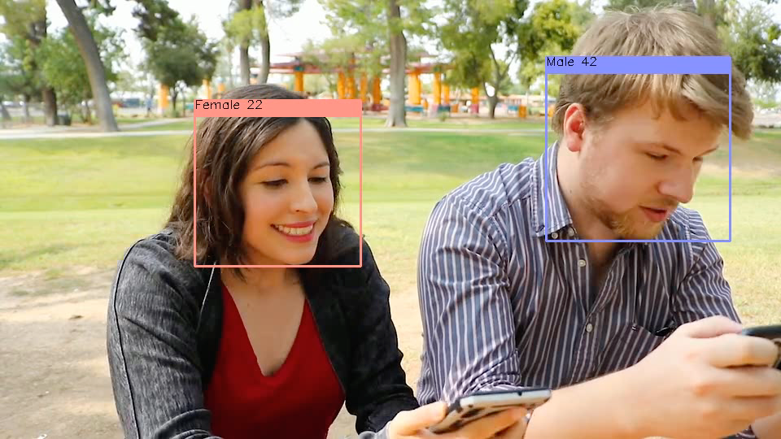
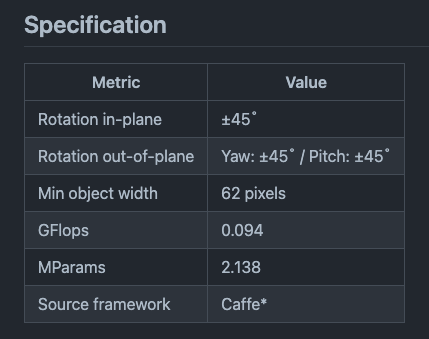
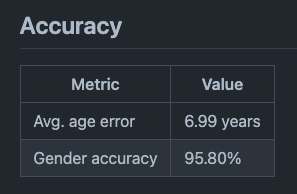
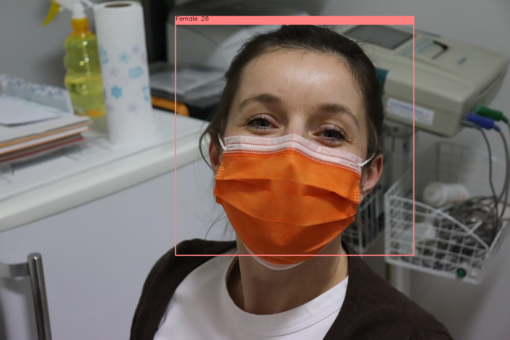

# AgeGenderRecognitionRetail : 年齢と性別を識別する機械学習モデル

# AgeGenderRecognitionRetail : 年齢と性別を識別する機械学習モデル

[](https://kyakuno.medium.com/?source=post_page---byline--3632935d19ec---------------------------------------)

[Kazuki Kyakuno](https://kyakuno.medium.com/?source=post_page---byline--3632935d19ec---------------------------------------)

Sep 3, 2021

--

Share

[ailia SDK](https://ailia.jp/)で使用できる機械学習モデルである「AgeGenderRecognitionRetail」のご紹介です。エッジ向け推論フレームワークである[ailia SDK](https://ailia.jp/)と[ailia MODELS](https://github.com/axinc-ai/ailia-models)に公開されている機械学習モデルを使用することで、簡単にAIの機能をアプリケーションに実装することができます。

## AgeGenderRecognitionRetailの概要

AgeGenderRecognitionRetailはIntelが開発した年齢と性別を識別するための機械学習モデルです。顔画像を入力として、年齢と性別を出力することができます。

Press enter or click to view image in full size



出典：<https://pixabay.com/ja/videos/%E3%82%AB%E3%83%83%E3%83%97%E3%83%AB-%E8%8B%A5%E3%81%84%E3%81%A7%E3%81%99-%E9%9B%BB%E8%A9%B1-50020/>

[## open\_model\_zoo/models/intel/age-gender-recognition-retail-0013 at master ·…

### Fully convolutional network for simultaneous Age/Gender recognition. The network is able to recognize age of people in…

github.com](https://github.com/openvinotoolkit/open_model_zoo/tree/master/models/intel/age-gender-recognition-retail-0013?source=post_page-----3632935d19ec---------------------------------------)

## AgeGenderRecognitionRetailのアーキテクチャ

AgeGenderRecognitionRetailは62x62ピクセルの顔画像を入力として、性別と年齢を出力します。性別は2次元の確率ベクトル、年齢は1次元の数値として出力されます。


出典：<https://github.com/openvinotoolkit/open_model_zoo/tree/master/models/intel/age-gender-recognition-retail-0013>

年齢は0〜1.0の値として出力されるため、100倍することで年齢を計算します。

Press enter or click to view image in full size


出典：<https://github.com/openvinotoolkit/open_model_zoo/blob/master/demos/interactive_face_detection_demo/cpp/detectors.cpp>

モデルアーキテクチャはシンプルなCNNです。学習にはCaffeが使用されています。

Press enter or click to view image in full size


AgeGenderRecognitionRetailはIntelの20000枚のInternalデータセットを使用して学習されています。このモデルは18〜75歳までを認識可能です。子供の画像は含まれていないため、子供の年齢の識別を行うことはできません。

## Get Kazuki Kyakuno’s stories in your inbox

Join Medium for free to get updates from this writer.

Subscribe

Subscribe

Remember me for faster sign in

顔の角度は45度まで対応しています。できるだけ正面顔の方が精度が高くなるため、HopeNetなどの顔向き検出モデルの併用が望ましいと考えています。



出典：<https://github.com/openvinotoolkit/open_model_zoo/tree/master/models/intel/age-gender-recognition-retail-0013>

精度は年齢の誤差が6.99 years、性別の精度で95.80%です。



出典：<https://github.com/openvinotoolkit/open_model_zoo/tree/master/models/intel/age-gender-recognition-retail-0013>

また、公式のデモアプリでは、動画に適用する場合に、顔をトラッキングして複数フレームの結果を平滑化しています。年齢は5%ずつ更新、性別は確率値の総和で計算しています。


出典：<https://github.com/openvinotoolkit/open_model_zoo/blob/master/demos/interactive_face_detection_demo/cpp/face.cpp>

マスクを使用している場合でも、正面顔であればそれなりの精度での検出が可能です。

Press enter or click to view image in full size



出典：<https://pixabay.com/ja/photos/%e7%9c%8b%e8%ad%b7%e5%a9%a6-%e3%83%9e%e3%82%b9%e3%82%af%e3%82%b5%e3%83%bc%e3%82%b8%e3%82%ab%e3%83%ab%e3%83%9e%e3%82%b9%e3%82%af-4962034/>

## AgeGenderRecognitionRetailの使用方法

AgeGenderRecognitionRetailを使用するには下記のコマンドを使用します。WEBカメラから認識可能です。

```
$ python3 age-gender-recognition-retail.py -v 0
```

[## ailia-models/face\_recognition/age-gender-recognition-retail at master · axinc-ai/ailia-models

### (Image from…

github.com](https://github.com/axinc-ai/ailia-models/tree/master/face_recognition/age-gender-recognition-retail?source=post_page-----3632935d19ec---------------------------------------)

指定したフォルダ内の画像に対して顔認識を行った後、年齢を推定するには下記のコマンドを使用します。

```
$ python3 age-gender-recognition-retail.py -i faces -d
```

実行例です。

ax株式会社はAIを実用化する会社として、クロスプラットフォームでGPUを使用した高速な推論を行うことができるailia SDKを開発しています。ax株式会社ではコンサルティングからモデル作成、SDKの提供、AIを利用したアプリ・システム開発、サポートまで、 AIに関するトータルソリューションを提供していますのでお気軽に[お問い合わせ](https://axinc.jp/)ください。