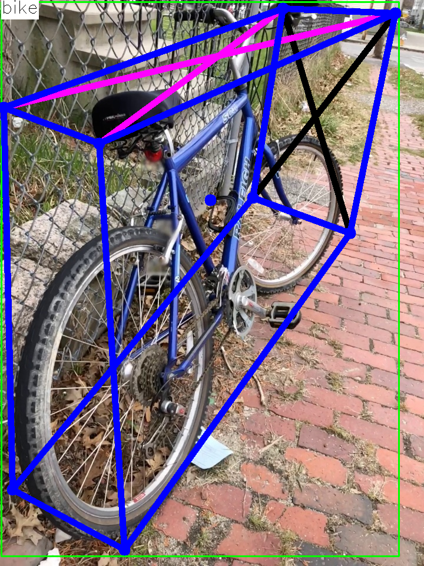
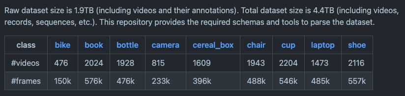

# 3DObjectDetectionPytorch : 3Dの物体検出モデル

# 3DObjectDetectionPytorch : 3Dの物体検出モデル

[](https://kyakuno.medium.com/?source=post_page---byline--8df18b8eb5d1---------------------------------------)

[Kazuki Kyakuno](https://kyakuno.medium.com/?source=post_page---byline--8df18b8eb5d1---------------------------------------)

Sep 21, 2021

--

Share

[ailia SDK](https://ailia.jp/)で使用できる機械学習モデルである「3DObjectDetectionPyrorch」のご紹介です。エッジ向け推論フレームワークである[ailia SDK](https://ailia.jp/)と[ailia MODELS](https://github.com/axinc-ai/ailia-models)に公開されている機械学習モデルを使用することで、簡単にAIの機能をアプリケーションに実装することができます。

## 3DObjectDetectionPytorchの概要

3DObjectDetectionPytorchは3DのBounding Boxを計算する機械学習モデルです。YOLOなどでは一般的に2DのBounding Boxを計算しますが、3D ObjectDetectionPytorchでは、奥行き情報を含む3DのBounding Boxを計算します。

Press enter or click to view image in full size



出典：Objectronデータセット

[## GitHub - sovrasov/3d-object-detection.pytorch

### This project provides code to train a two stage 3d object detection models on the Objectron dataset. Training includes…

github.com](https://github.com/sovrasov/3d-object-detection.pytorch?source=post_page-----8df18b8eb5d1---------------------------------------)

## 3DObjectDetectionPytorchのアーキテクチャ

3DObjectDetectionPytorchは下記の9クラスの認識が可能です。

> OBJECTRON\_CLASSES = (‘bike’, ‘book’, ‘bottle’, ‘cereal\_box’, ‘camera’, ‘chair’, ‘cup’, ‘laptop’, ‘shoe’)

まず、MobileNetV2 SSDで物体の2DのBounding Boxを計算した後、MobileNetV3のregression\_modelで3DのBounding Boxを計算します。regression\_modelでは、(1,3,224,224)の画像を入力として、(9,1,9,2)の各クラスごとの9つの(x,y)のキーポイントが出力されます。

## Get Kazuki Kyakuno’s stories in your inbox

Join Medium for free to get updates from this writer.

Subscribe

Subscribe

Remember me for faster sign in

3D Object Detection PytorchはGoogleが公開しているObjectronデータセットで学習されています。

Press enter or click to view image in full size


出典：<https://github.com/google-research-datasets/Objectron>

[## GitHub — google-research-datasets/Objectron: Objectron is a dataset of short, object-centric video…

### Objectron is a dataset of short, object-centric video clips. In addition, the videos also contain AR session metadata…

github.com](https://github.com/google-research-datasets/Objectron?source=post_page-----8df18b8eb5d1---------------------------------------)

ObjectronデータセットはAR向けに開発されたデータセットで、15Kのアノテーション済みの動画と、4Mのアノテーション済みの画像が含まれています。

Press enter or click to view image in full size



出典：<https://github.com/google-research-datasets/Objectron>

## 3DObjectDetectionPytorchを使用する

3DObjectDetectionPytorchを使用するには下記のコマンドを使用します。WEBカメラから認識可能です。

```
$ python3 3d-object-detection.pytorch.py -v 0
```

実行例です。

[## ailia-models/object\_detection\_3d/3d-object-detection.pytorch at master · axinc-ai/ailia-models

### (Image from Objectron Dataset…

github.com](https://github.com/axinc-ai/ailia-models/tree/master/object_detection_3d/3d-object-detection.pytorch?source=post_page-----8df18b8eb5d1---------------------------------------)

## 関連情報

ailia SDKでは、Objectronデータセットを使用して学習したモデルとして、Googleのmediapipe\_objectronも使用可能です。

[## ailia-models/object\_detection\_3d/mediapipe\_objectron at master · axinc-ai/ailia-models

### (Image from Objectron Dataset…

github.com](https://github.com/axinc-ai/ailia-models/tree/master/object_detection_3d/mediapipe_objectron?source=post_page-----8df18b8eb5d1---------------------------------------)

ax株式会社はAIを実用化する会社として、クロスプラットフォームでGPUを使用した高速な推論を行うことができるailia SDKを開発しています。ax株式会社ではコンサルティングからモデル作成、SDKの提供、AIを利用したアプリ・システム開発、サポートまで、 AIに関するトータルソリューションを提供していますのでお気軽に[お問い合わせ](https://axinc.jp/)ください。