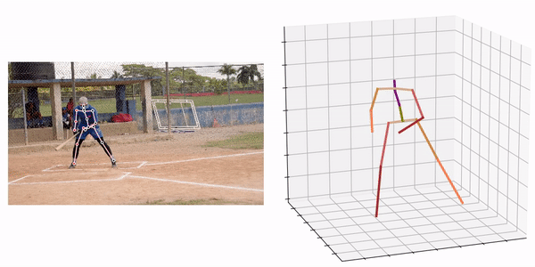
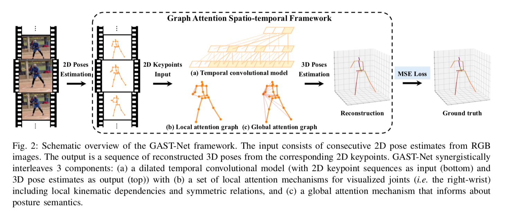
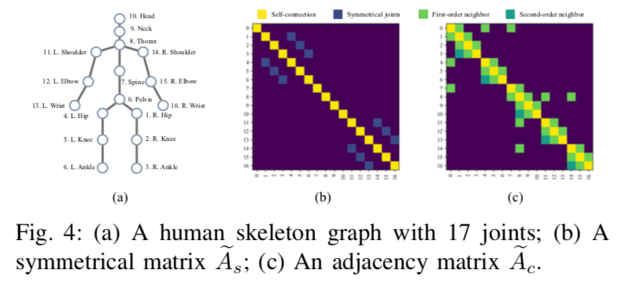
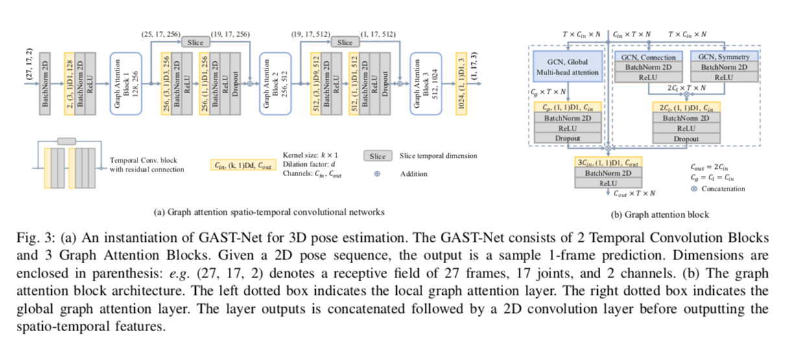
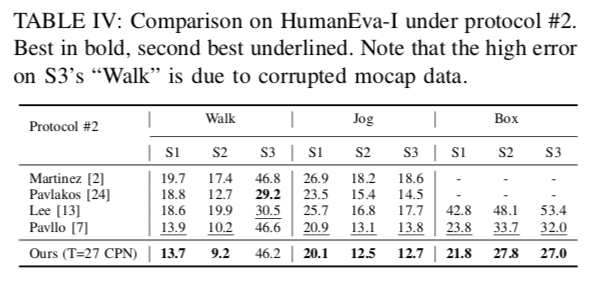

# GAST : 2Dの骨格から3Dの骨格を予測する機械学習モデル

# GAST : 2Dの骨格から3Dの骨格を予測する機械学習モデル

[](https://kyakuno.medium.com/?source=post_page---byline--6c70fc4b3b3a---------------------------------------)

[Kazuki Kyakuno](https://kyakuno.medium.com/?source=post_page---byline--6c70fc4b3b3a---------------------------------------)

May 6, 2021

--

Share

[ailia SDK](https://ailia.jp/)で使用できる機械学習モデルである「GAST」のご紹介です。エッジ向け推論フレームワークである[ailia SDK](https://ailia.jp/)と[ailia MODELS](https://github.com/axinc-ai/ailia-models)に公開されている機械学習モデルを使用することで、簡単にAIの機能をアプリケーションに実装することができます。

## GASTの概要

GAST（A Graph Attention Spatio-temporal Convolutional Network for 3D Human Pose Estimation in Video）は2020年10月に公開された2Dの骨格から3Dの骨格を予測するモデルです。



出典：<https://github.com/fabro66/GAST-Net-3DPoseEstimation>

[## A Graph Attention Spatio-temporal Convolutional Network for 3D Human Pose Estimation in Video

### Spatio-temporal information is key to resolve occlusion and depth ambiguity in 3D pose estimation. Previous methods…

arxiv.org](https://arxiv.org/abs/2003.14179?source=post_page-----6c70fc4b3b3a---------------------------------------)

## GASTのアーキテクチャ

GASTは時系列の2Dの骨格を入力として、3Dの骨格を出力します。2Dの骨格の検出にはYOLOv3とpose\_hrnet\_w48\_384x288を使用しています。人のトラッキングにはカルマンフィルタを使用したSORTアルゴリズムを使用しています。

入力のフレーム数は27で、pose\_hrnetのCOCO形式から、Human36M形式に変換した17のキーポイントの(x,y)で(27,17,2)を入力として、17のキーポイントの(x,y,z)である(1,17,3)を出力します。パディングは13フレームで、14フレーム目の3Dキーポイントを出力します。

Press enter or click to view image in full size



出典：<https://arxiv.org/pdf/2003.14179>

2D-3Dの骨格推定においては、下記の3つの課題があります。

1. 2Dという低次元から3Dという高次元への写像という観点で奥行き情報の曖昧さ
2. 自分の体でキーポイントが隠れてしまうself-occlusion
3. AIの推定精度

特に、self-occlusionによって、フレーム間でJitter（非連続性）が発生しやすいという問題があります。この問題に対して、GASTにおいては、骨格の時系列情報にGCN（Graph Convolution Networks）を適用することで改善を試みます。

Press enter or click to view image in full size



出典：<https://arxiv.org/pdf/2003.14179>

GCNは骨格を使用したアクション検出や、3Dモデルのメッシュのクラス分類などで使用されるモデルアーキテクチャで、2DのCNNを一般化してGraph構造に拡張したものです。あるノードに対して接続されている周辺のノードを参照して畳み込みを行います。2DのCNNは、格子状にノード（画素）を配置してGraph構造として表現することができます。骨格を扱う場合は、骨格の各キーポイントをノードとして扱います。

Press enter or click to view image in full size



出典：<https://arxiv.org/pdf/2003.14179>

加えて、接続されていないノードの情報を伝搬するため、Global Attentionを導入します。例えば、走るという動作では、wristとankleの関連性を使用した方が望ましいと考えられます。

## Get Kazuki Kyakuno’s stories in your inbox

Join Medium for free to get updates from this writer.

Subscribe

Subscribe

Remember me for faster sign in

学習にはHuman3.6Mデータセット（17キーポイント）とHumanEva-I（15キーポイント）を使用しています。GASTのモデルサイズは31.6MBです。

推論に使用するフレーム数については、T=27と243で評価しています。提案手法は特にHumanEva-Iで高い性能を発揮します。

Press enter or click to view image in full size


出典：<https://arxiv.org/pdf/2003.14179>



## GASTの使用方法

下記のコマンドで動画に対して3Dキーポイントを計算可能です。GASTは全フレームをパースしてから処理する仕組みのため、WEBカメラからの入力には対応していません。

```
$ python3 gast.py --input VIDEO_PATH --savepath SAVE_VIDEO_PATH
```

[## ailia-models/pose\_estimation\_3d/gast at master · axinc-ai/ailia-models

### (Video from https://github.com/fabro66/GAST-Net-3DPoseEstimation/blob/master/data/video/baseball.mp4) Automatically…

github.com](https://github.com/axinc-ai/ailia-models/tree/master/pose_estimation_3d/gast?source=post_page-----6c70fc4b3b3a---------------------------------------)

処理結果の例は下記となります。

デフォルトでは、入力された動画の前後に13フレームのパディングフレームを追加し、全フレームをバッチ処理します。

input\_shape=(frames,keypoint,xy)=(13+frames+13,17,2）

動画が長くなるとメモリ消費量が大きくなるため、 — lowmemoryオプションを指定することで1フレームずつ処理することも可能です。

input\_shape=(frames,keypoint,xy)=(13+1+13,17,2）

演算処理フレームの周辺13フレームを参照して処理結果を計算するため、まとめて計算した場合も、1フレームずつ処理した場合も処理結果は等価となります。

ax株式会社はAIを実用化する会社として、クロスプラットフォームでGPUを使用した高速な推論を行うことができるailia SDKを開発しています。ax株式会社ではコンサルティングからモデル作成、SDKの提供、AIを利用したアプリ・システム開発、サポートまで、 AIに関するトータルソリューションを提供していますのでお気軽に[お問い合わせ](https://axinc.jp/)ください。