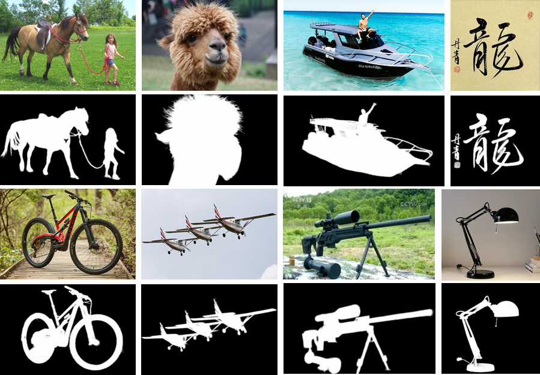
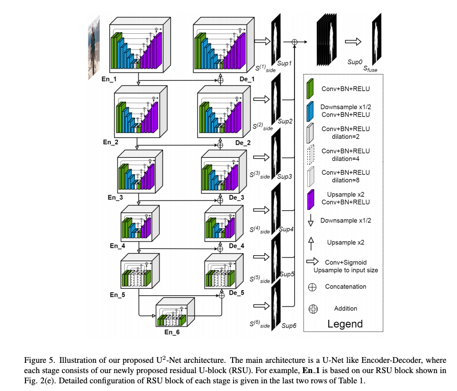
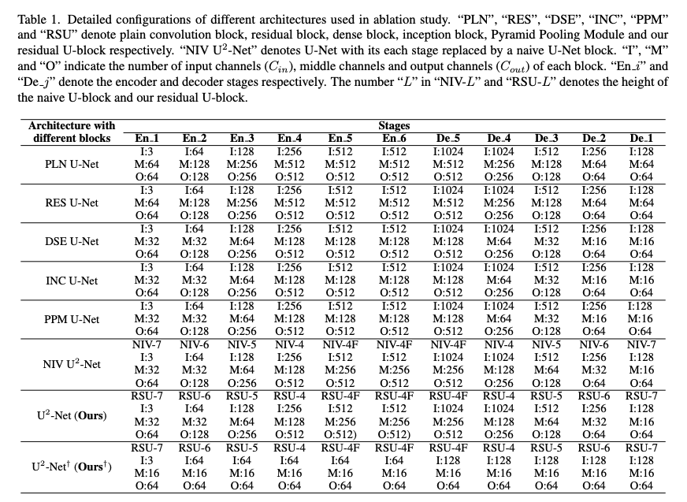

# U2Net : シングルショットで物体の切り抜きを行う機械学習モデル

# U2Net : シングルショットで物体の切り抜きを行う機械学習モデル

[Kazuki Kyakuno](https://kyakuno.medium.com/?source=post_page---byline--e346f2787cdb---------------------------------------)

5 min read

·

Jul 28, 2020

--

Share

[ailia SDK](https://ailia.jp/)で使用できる機械学習モデルである「U2Net」のご紹介です。エッジ向け推論フレームワークである[ailia SDK](https://ailia.jp/)と[ailia MODELS](https://github.com/axinc-ai/ailia-models)に公開されている機械学習モデルを使用することで、簡単にAIの機能をアプリケーションに実装することができます。

## U2Netの概要

U2Netはシングルショットで物体の切り抜きを行うことができる機械学習モデルです。人や猫などの画像を入力として、全景と背景を分離するためのアルファ値を計算することができます。U2Netにはモデルサイズが176.3MBのU2Netと、モデルサイズが4.7MBのU2NetPがあります。

[## U$^2$-Net: Going Deeper with Nested U-Structure for Salient Object Detection

### In this paper, we design a simple yet powerful deep network architecture, U$^2$-Net, for salient object detection…

arxiv.org](https://arxiv.org/abs/2005.09007?source=post_page-----e346f2787cdb---------------------------------------)

Press enter or click to view image in full size

（出典：<https://github.com/NathanUA/U-2-Net>）

## U2Netのアーキテクチャ

U2NetはUNetを階層化した上で、直列に2つ接続した構造となっています。従来のモデルは、BackboneにImageNetで事前学習したClassifierのモデルを使用することが多かったのですが、背景分離タスクに最適化したモデル構造を提案し、SOTAに匹敵するパフォーマンスを出しています。

Press enter or click to view image in full size

（出典：<https://arxiv.org/abs/2005.09007>）

U2Netは320x320の解像度で学習を行なっています。

[## NathanUA/U-2-Net

### The code for our newly accepted paper U^2-Net (U square net) in Pattern Recognition 2020: Contact…

github.com](https://github.com/NathanUA/U-2-Net?source=post_page-----e346f2787cdb---------------------------------------)

U2NetとU2NetPはネットワークアーキテクチャは同じで入力と出力のFeatureMapの枚数が異なります。U2NetではEn.5のFeatureMapが512まで広がりますが、U2NetPでは64で抑えられています。Convolutionの重みのサイズはFeatureMapの枚数に大きく依存するため、FeatureMapの枚数を抑制することでモデルサイズを1/37.5にすることができています。

## Get Kazuki Kyakuno’s stories in your inbox

Join Medium for free to get updates from this writer.

Subscribe

Subscribe

Remember me for faster sign in

ただし、パフォーマンスの改善については、論文で示されているように、GeforceGTX 1080TiでU2Netの30FPSが、U2NetPで40FPSと、1.33倍に留まっています。

Press enter or click to view image in full size

（出典：<https://arxiv.org/abs/2005.09007>）

学習はSOD（Salient Object Dataset）を使用しています。

[## Salient Objects Dataset (SOD) — Elder Laboratory

### For each image of the 300 images used in BSD, there is a .mat file which can be opened by Matlab. Loading each mat file…

www.elderlab.yorku.ca](https://www.elderlab.yorku.ca/resources/salient-objects-dataset-sod/?source=post_page-----e346f2787cdb---------------------------------------)

## U2Netの使用方法

ailia SDKでは下記のサンプルでU2Netを使用可能です。

[## ailia-models/background\_removal/u2net at master · axinc-ai/ailia-models

### (Image from https://github.com/NathanUA/U-2-Net/blob/master/test\_data/test\_images/girl.png) Ailia input shape: (1, 3…

github.com](https://github.com/axinc-ai/ailia-models/tree/master/background_removal/u2net?source=post_page-----e346f2787cdb---------------------------------------)

下記のコマンドで、U2Netを使用して、WEBカメラを入力とした人物切り抜きを行うことができます。

> python3 u2net.py -v 0

また、任意のビデオファイルに人物切り抜きを行いファイルに保存することもできます。

> python3 u2net.py -v input.mp4 -s output.mp4

実行例です。

-a smallを指定すると、モデルサイズの小さなU2NetPを使用することができます。

> python3 u2net.py -v 0 -a small

ailia SDKはPythonだけでなく、CやC#から使用することもできます、下記は、XcodeからU2Netを使用するサンプルとなっています。

[## axinc-ai/ailia-xcode

### Project sample of ailia SDK for xcode Xcode 11.3 Download u2net\_opset11.onnx in ./u2net folder. wget…

github.com](https://github.com/axinc-ai/ailia-xcode?source=post_page-----e346f2787cdb---------------------------------------)

ax株式会社はAIを実用化する会社として、クロスプラットフォームでGPUを使用した高速な推論を行うことができるailia SDKを開発しています。ax株式会社ではコンサルティングからモデル作成、SDKの提供、AIを利用したアプリ・システム開発、サポートまで、 AIに関するトータルソリューションを提供していますのでお気軽に[お問い合わせ](https://axinc.jp/)ください。