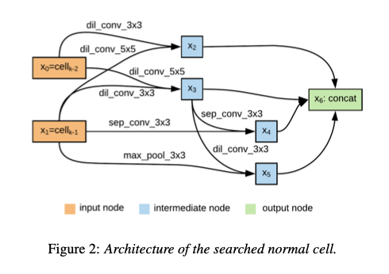
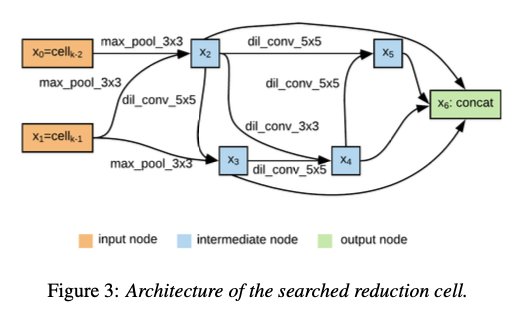

# AutoSpeech : 音声による個人識別モデル

# AutoSpeech : 音声による個人識別モデル

[](https://kyakuno.medium.com/?source=post_page---byline--267a00f26a4a---------------------------------------)

[Kazuki Kyakuno](https://kyakuno.medium.com/?source=post_page---byline--267a00f26a4a---------------------------------------)

Sep 27, 2021

--

Share

[ailia SDK](https://ailia.jp/)で使用できる機械学習モデルである「AutoSpeech」のご紹介です。エッジ向け推論フレームワークである[ailia SDK](https://ailia.jp/)と[ailia MODELS](https://github.com/axinc-ai/ailia-models)に公開されている機械学習モデルを使用することで、簡単にAIの機能をアプリケーションに実装することができます。

## AutoSpeechの概要

AutoSpeechは音声から個人識別を行える機械学習モデルです。2つの音声ファイルを入力して、各音声の特徴ベクトルを計算することで、2つの音声の類似度を出力することができます。識別対象の人の音声の特徴ベクトルをデータベースに保存しておくことで、個人識別が可能です。音声による生体認証や、音声からの文字起こしに発言者を記載するなどの用途に応用可能です。

[## AutoSpeech: Neural Architecture Search for Speaker Recognition

### Speaker recognition systems based on Convolutional Neural Networks (CNNs) are often built with off-the-shelf backbones…

arxiv.org](https://arxiv.org/abs/2005.03215?source=post_page-----267a00f26a4a---------------------------------------)

## AutoSpeechのアーキテクチャ

Sperker Recognitionには、Speaker Identification (SID)とSpeaker Verification (SV)の二つの応用があります。近年、End2EndによるSpeaker Recognitionが高い性能を発揮しています。

End2EndのSpeaker Recognitionにおいては、CNNやRNNを使って音声のフレームごとにFeatureExtractorによる特徴抽出を行った後、TemporalAggregationLayerによって、固定長のSpeaker Embedding（d-vector）に変換します。取得したEmbeddingにcosine similrityなどで類似度を計算します。

従来、FeatureExtractorにおいては、VGGやResNetのアーキテクチャが使用されていました。しかし、これらのアーキテクチャは画像識別向けのものであり、Speaker Recognitionに最適ではありません。

## Get Kazuki Kyakuno’s stories in your inbox

Join Medium for free to get updates from this writer.

Subscribe

Subscribe

Remember me for faster sign in

AutoSpeechでは、Neural Architecture Searchによって最適なネットワークアーキテクチャを探索します。探索空間は下記のレイヤーの集合となります。


出典：<https://arxiv.org/abs/2005.03215>

探索したアーキテクチャは下記となります。Normal Cellが解像度（次元数）を変えないセル、Reduction Cellが解像度（次元数）を縮退するセルです。例えば、VGGではConv -> ReluがNormal Cell、MaxPoolingがReduction Cellに相当します。これらのセルを、8回スタックしたものが最終的なモデルアーキテクチャとなります。



出典：<https://arxiv.org/abs/2005.03215>



出典：<https://arxiv.org/abs/2005.03215>

学習と評価にはVoxCeleb1データセットを使用しています。

[## VoxCeleb

### VoxCeleb1 contains over 100,000 utterances for 1,251 celebrities, extracted from videos uploaded to YouTube. 26/10/2017…

www.robots.ox.ac.uk](https://www.robots.ox.ac.uk/~vgg/data/voxceleb/vox1.html?source=post_page-----267a00f26a4a---------------------------------------)

評価結果は下記となります。提案手法は、VGGやResNetを使用しているものをOutPerformしています。

Press enter or click to view image in full size


出典：<https://arxiv.org/abs/2005.03215>

処理対象の音声ファイルのサンプリングレートは16kHzで、stftしたスペクトルに対して処理を行います。音声ファイルをフレーム分割し、各フレームの特徴ベクトルを計算し、全フレームのmeanを取った値を最終的な固定長の特徴ベクトルとします。類似度はcosine similarityであり、特徴ベクトルを正規化して内積することで計算します。

## AutoSpeechの使用方法

下記のコマンドで、2つの音声ファイルを入力して類似度を出力することができます。

```
$ python3 auto_speech.py --input1 wav/id10270/8jEAjG6SegY/00008.wav --input2 wav/id10270/x6uYqmx31kE/00001.wav
```

[## ailia-models/audio\_processing/auto\_speech at master · axinc-ai/ailia-models

### Audio file Wav file from The VoxCeleb1 Dataset https://www.robots.ox.ac.uk/~vgg/data/voxceleb/vox1.html Default input…

github.com](https://github.com/axinc-ai/ailia-models/tree/master/audio_processing/auto_speech?source=post_page-----267a00f26a4a---------------------------------------)

出力例です。類似度がしきい値よりも大きいと同一人物となりmatchと出力されます。

```
INFO auto_speech.py (229) : Start inference...  
INFO auto_speech.py (243) :  similar: 0.42532125  
INFO auto_speech.py (245) :  verification: match (threshold: 0.260)
```

学習は英語のデータセットで行われていますが、下記のサイトの元気な女の子の「おめでとうございます」と「すごいすごい」はsimlarity 0.41でmatch。落ち着いた女性の声の「おめでとうございます」と「合格です」はsimilality 0.80でmatch。元気な女の子の「おめでとうございます」と落ち着いた女性の声の「おめでとうございます」はsimilarity 0.228でunmatchと、日本語の音声に対しても適用可能です。

[## 効果音ラボ - フリー、商用無料、報告不用の効果音素材をダウンロード

### フリー素材ながら質を追求した、数百種の無料効果音をダウンロードできます。

soundeffect-lab.info](https://soundeffect-lab.info/sound/voice/info-lady1.html?source=post_page-----267a00f26a4a---------------------------------------)

ax株式会社はAIを実用化する会社として、クロスプラットフォームでGPUを使用した高速な推論を行うことができるailia SDKを開発しています。ax株式会社ではコンサルティングからモデル作成、SDKの提供、AIを利用したアプリ・システム開発、サポートまで、 AIに関するトータルソリューションを提供していますのでお気軽に[お問い合わせ](https://axinc.jp/)ください。