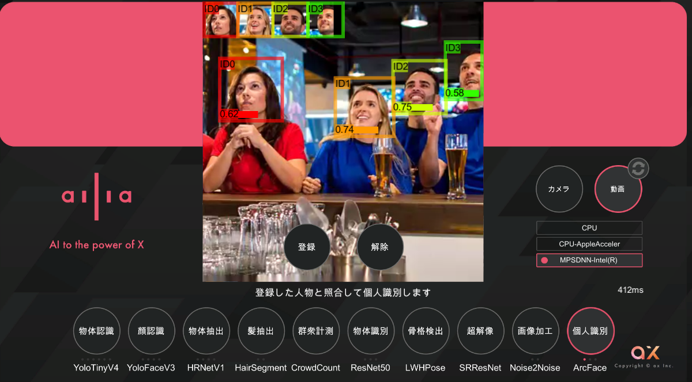

# ArcFace : 顔認証を行う機械学習モデル

# ArcFace : 顔認証を行う機械学習モデル

[Kazuki Kyakuno](https://kyakuno.medium.com/?source=post_page---byline--cbb0e127bd0a---------------------------------------)

8 min read

·

Aug 26, 2020

--

Share

[ailia SDK](https://ailia.jp/)で使用できる機械学習モデルである「ArcFace」のご紹介です。エッジ向け推論フレームワークである[ailia SDK](https://ailia.jp/)と[ailia MODELS](https://github.com/axinc-ai/ailia-models)に公開されている機械学習モデルを使用することで、簡単にAIの機能をアプリケーションに実装することができます。

## ArcFaceの概要

ArcFaceは二つの顔画像を入力として、どれくらい同一人物に近いかの距離を出力する機械学習モデルです。顔認証や顔検索に使用可能です。

[## ArcFace: Additive Angular Margin Loss for Deep Face Recognition

### One of the main challenges in feature learning using Deep Convolutional Neural Networks (DCNNs) for large-scale face…

arxiv.org](https://arxiv.org/abs/1801.07698?source=post_page-----cbb0e127bd0a---------------------------------------)

ArcFaceはメトリックスラーニングという仕組みを使用しており、通常のClassificationタスクにSoftmax Lossを置き換えるAngular Mergin Lossを導入することで、距離学習をClassificationタスクで解くことができるようになっています。

顔同士の距離はCos距離を用いています。Cos距離は検索エンジンでも使用される方法で、正規化された2つのベクトルの内積で計算できます。2つのベクトルが同じであればθが0になりcosθ=1、直行していればθがπ/2になりcosθ=0になります。そのため、類似度として使用できます。

Press enter or click to view image in full size

（出典：<https://arxiv.org/abs/1801.07698>）

通常のClassificationタスクでは、Featureを計算した後、FC層でFeatureとWeightの内積を取り、出力にSoftmaxを適用します。

ArcFaceではFeatureとFC層のWeightをそれぞれ正規化し、内積を取ることでCosθを計算します。Cosθに対してSoftmaxをかけることでLossを計算します。この時、内積をとったCosθの値に対して、arccosを適用し、正解ラベルに対してのみ+mの角度マージンを加えます。こうすることで、FC層のWeightが入力データセットに過度に依存することを防いでいます。

## ArcFaceの推論処理

推論時は2つの顔のFeatureを正規化した上で内積することで、Cos距離を計算し、同一人物判定ができるようになります。

入力された顔画像はグレースケールに変換後、バッチ1にそのまま、バッチ2に水平FLIPした画像を入力し、各512次元のFeatureをConcatして1024次元にして使用します。

## Get Kazuki Kyakuno’s stories in your inbox

Join Medium for free to get updates from this writer.

Subscribe

Subscribe

Remember me for faster sign in

水平FLIPした顔のFeatureをConcatして使用する手法はSphereFaceで提案されてものであり、CosFaceやArcFaceでも利用されています。

> We extract the deep features (SphereFace) from the output of the FC1 layer. For all experiments, the final representation of a testing face is obtained by concatenating its original face features and its horizontally flipped features. The score (metric) is computed by the cosine distance of two features. The nearest neighbor classifier and thresholding are used for face identification and verification, respectively.

[## CosFace: Large Margin Cosine Loss for Deep Face Recognition

### Face recognition has made extraordinary progress owing to the advancement of deep convolutional neural networks (CNNs)…

arxiv.org](https://arxiv.org/abs/1801.09414?source=post_page-----cbb0e127bd0a---------------------------------------)

## ArcFaceの精度

LFW DatasetにおいてSOTAを達成しています。

（出典：<https://arxiv.org/abs/1801.07698>）

[## LFW Face Database : Main

### New results page: We have recently updated and changed the format and content of our results page. Please refer to the…

vis-www.cs.umass.edu](http://vis-www.cs.umass.edu/lfw/?source=post_page-----cbb0e127bd0a---------------------------------------)

マージンを変化させた時の精度の比較です。マージンの取り方を変えることで精度が変化することがわかります。また、CosFaceにマージンを導入することで精度が改善することがわかります。

（出典：<https://arxiv.org/abs/1801.07698>）

## ailia SDKでArcFaceを使用する

ailia SDKでArcFaceを使用するには、下記のサンプルを使用します。

[## axinc-ai/ailia-models

### (Image from https://github.com/ronghuaiyang/arcface-pytorch/issues/63) Input the original image1 and its inversion, and…

github.com](https://github.com/axinc-ai/ailia-models/tree/master/face_identification/arcface?source=post_page-----cbb0e127bd0a---------------------------------------)

2つの顔画像を入力すると、同一人物かどうかを判定します。

> python3 arcface.py — inputs IMAGE\_PATH1 IMAGE\_PATH2

ビデオを入力すると、YOLOv3Faceを使用して顔を切り出すとともに、ArcFaceを使用して同一人物かどうかを判定し、顔にIDを割り当てます。

> python3 arcface.py -v 0

## ailia AI ShowcaseでArcFaceを使用する

iOSとAndroidで使用できるAIのデモアプリであるailia AI Showcaseを使用することで、ArcFaceによる顔認証を試すことができます。

Press enter or click to view image in full size

起動後、一番右のArcFaceが顔認証モデルになります。ArcFaceをもう一度クリックするとArcFaceMに切り替わります。ArcFaceはOSSの顔認証モデルであり、ArcFaceMは当社で学習したマスク対応の顔認証モデルとなります。

顔の登録では、入力画像から顔検出を行い、ArcFaceにより特徴を検出、1024次元の特徴ベクトルを取得します。これをデータベースに登録します。

顔の認証では、顔の登録と同様に顔検出と特徴抽出により1024次元の特徴ベクトルを取得し、データベースに入っているものから最も近い顔を検索します。

デモでは、画面の上部分に登録した顔画像の一覧が表示されます。リアルタイムに顔を認証し、対応する顔のIDと、類似度を表示します。類似度は1.0が最大で、数字が小さくなるほど確度が低下します。

登録ボタンで、新しい顔を登録することができます。解除ボタンで登録されている顔画像をクリアすることができます。

デフォルトでは動画に対して処理をしますが、カメラボタンでカメラ入力に切り替えることができます。カメラボタンは複数回押すことで、インカメラとアウトカメラが切り替わります。

[## ‎ailia AI showcase

### ‎ailia AI showcaseは様々なAI機能をお手軽にお試しいただけるアプリケーションです。ディープラーニング・フレームワーク「ailia SDK」によって、CPUやGPUを最大限活用した高速な推論を実現します。 ailia AI…

apps.apple.com](https://apps.apple.com/jp/app/ailia-ai-showcase/id1522828798?source=post_page-----cbb0e127bd0a---------------------------------------)

[## ailia AI showcase - Google Play のアプリ

### 全ユーザー対象 ailia AI showcaseは様々なAI機能をお手軽にお試しいただけるアプリケーションです。ディープラーニング・フレームワーク「ailia SDK」によって、CPUやGPUを最大限活用した高速な推論を実現します。…

play.google.com](https://play.google.com/store/apps/details?id=jp.axinc.ailia_ai_showcase&hl=ja&gl=US&source=post_page-----cbb0e127bd0a---------------------------------------)

ax株式会社はAIを実用化する会社として、クロスプラットフォームでGPUを使用した高速な推論を行うことができるailia SDKを開発しています。ax株式会社ではコンサルティングからモデル作成、SDKの提供、AIを利用したアプリ・システム開発、サポートまで、 AIに関するトータルソリューションを提供していますのでお気軽に[お問い合わせ](https://axinc.jp/)ください。