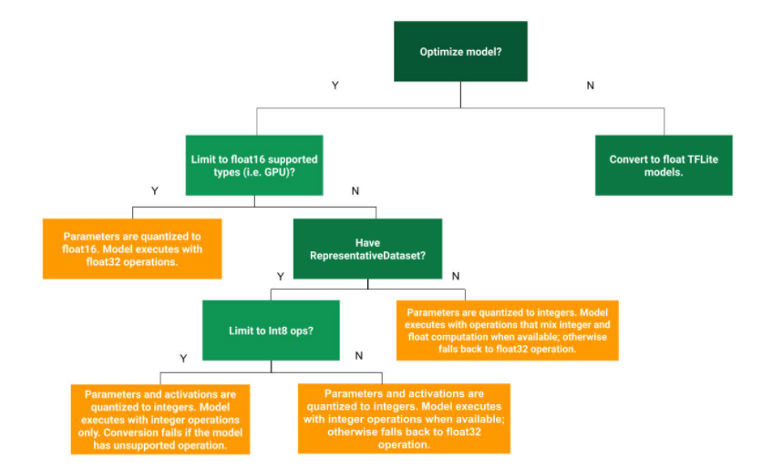
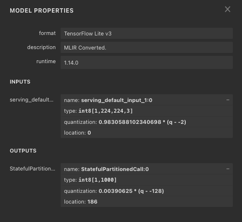
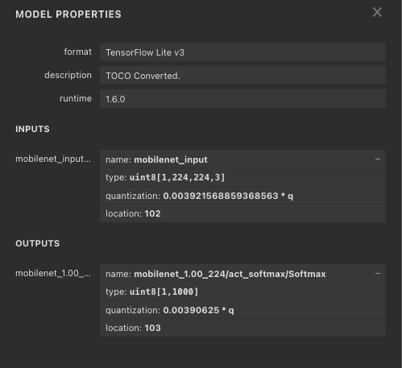

# Kerasのモデルをtfliteに変換する

# Kerasのモデルをtfliteに変換する

[Kazuki Kyakuno](https://kyakuno.medium.com/?source=post_page---byline--e8f5a1dd7ad5---------------------------------------)

Oct 27, 2020

--

Share

Kerasのモデルをtfliteに変換するチュートリアルです。FloatのモデルとInt8の量子化モデルの両方を作成します。

## 概要

Kerasのモデルをtfliteに変換するチュートリアルです。TensorFlowは1.15もしくは2.6を使用します。チュートリアルで使用するスクリプトは下記のリポジトリにあります。

[## axinc-ai/export-to-tflite

### You can't perform that action at this time. You signed in with another tab or window. You signed out in another tab or…

github.com](https://github.com/axinc-ai/export-to-tflite?source=post_page-----e8f5a1dd7ad5---------------------------------------)

Press enter or click to view image in full size

tfliteへの変換フロー（出典：<https://www.tensorflow.org/lite/performance/post_training_quantization?hl=ja>）

## TensorFlow Liteとtfliteについて

TensorFlow LiteはGoogleが開発したエッジ向けの推論フレームワークです。推論に特化しており、モバイルデバイスにAIモデルをデプロイすることが可能です。

tfliteはTensorFlow Liteのモデルファイルのフォーマットです。TensorFlowではProtocol Bufferという形式でモデルを保存しますが、TensorFlow Liteはより省メモリかつ高速に動作するFlat Bufferという形式でモデルを保存します。

TensorFlow LiteはFloatとInt8での推論に対応しており、FloatのモデルをInt8に量子化することで、より高速に推論を行うことが可能です。

## TensorFlow 2系

### Kerasで学習したモデルをsaved\_modelに変換する

Kerasで学習したモデルはhdf5形式で保存されます。tfliteに変換するには、まず、hdf5をsaved\_modelで保存します。今回のチュートリアルではResNet50を使用します。

### saved\_modelをtfliteに変換する

tf.lite.TFLiteConverter.from\_saved\_modelを使用することで、saved\_modelをtfliteに変換することができます。演算精度はFloatになります。なお、TensorFlow2系では、tf.lite.TFLiteConverter.from\_frozen\_graphは削除されています。

### saved\_modelをtflite (Int8)に量子化する

saved\_modelをInt8精度のtfliteファイルに変換します。

Int8精度のtfliteファイルに変換するには、Full Integer Quantizationを使用します。tf.lite.TFLiteConverter.from\_saved\_modelのオプションに、converter.target\_spec.supported\_ops = [tf.lite.OpsSet.TFLITE\_BUILTINS\_INT8]を与えます。

量子化には、キャリブレーション用の画像が必要です。TFLiteConverterでは、与えられたキャリブレーション用の画像でFloat精度の推論処理を行い、各Tensorのminとmaxを計算します。その値を元に、Int8の量子化パラメータを決定します。

今回はResNet50を使用するため、BGR順でImageNetのmeanを引いた値がキャリブレーション画像の入力形式となります。また、入力のレンジが負数も取り得るため、inference\_input\_typeをtf.int8に設定します。

### 精度を確認する

変換したモデルを使用して、FloatとInt8の精度を比較します。推論を行うには、Floatの入力画像をInt8に変換する必要があり、量子化パラメータが必要です。

## Get Kazuki Kyakuno’s stories in your inbox

Join Medium for free to get updates from this writer.

Subscribe

Subscribe

Remember me for faster sign in

量子化パラメータは、tfliteファイルをnetronで開くことで確認することができます。今回はキャリブレーション画像として-128〜127の画像を入力したため、入力画像の量子化パラメータとして0.9830 \* (q + 2)が設定されています。そのため、推論時は-128〜127の画像に対して量子化パラメータの逆数である1/0.9830を乗算して2を引くことで、0〜255のuint8に変換して入力することになります。同様に、出力は128を足した後、0.00390625を乗算して-128〜127のuint8を0〜1.0の確率に変換します。

なお、上記の推論サンプルでは正確な前処理と後処理を省略しています。

## TensorFlow 1系

### Kerasで学習したモデルをpbに変換する

Kerasで学習したモデルはhdf5形式で保存されます。tfliteに変換するには、まず、hdf5をpbに変換します。今回のチュートリアルではMobileNetV2を使用します。

Kerasのモデルをpbに変換するには、tf.graph\_util.convert\_variables\_to\_constantsを使用してグラフをFreezeする必要があります。また、入出力のノードの名前を取得する必要があります。ノードの名前は、gd.nodeをリストすることで推測することができます。

グラフをFreezeした後、write\_graphでpbを出力することができます。

## pbをtfliteに変換する

tf.lite.TFLiteConverter.from\_frozen\_graphを使用することで、pbをtfliteに変換することができます。演算制度はFloatになります。

## pbをtflite (Int8)に量子化する

pbをInt8精度のtfliteファイルに変換します。

Int8精度のtfliteファイルに変換するには、Full Integer Quantizationを使用します。tf.lite.TFLiteConverter.from\_frozen\_graphのオプションに、converter.target\_spec.supported\_ops = [tf.lite.OpsSet.TFLITE\_BUILTINS\_INT8]を与えます。

量子化には、キャリブレーション用の画像が必要です。TFLiteConverterでは、与えられたキャリブレーション用の画像でFloat精度の推論処理を行い、各Tensorのminとmaxを計算します。その値を元に、Int8の量子化パラメータを決定します。

今回はMobileNetV2を使用するため、BGR順で0〜1.0に正規化した値がキャリブレーション画像の入力形式となります。また、入力のレンジは正数であるため、inference\_input\_typeをtf.uint8に設定します。

### 精度を確認する

変換したモデルを使用して、FloatとInt8の精度を比較します。推論を行うには、Floatの入力画像をInt8に変換する必要があり、量子化パラメータが必要です。

量子化パラメータは、tfliteファイルをnetronで開くことで確認することができます。今回はキャリブレーション画像として0〜1.0の画像を入力したため、入力画像の量子化パラメータとして0.003921 = 1/255が設定されています。そのため、推論時は0〜1.0の画像に対して量子化パラメータの逆数である255を乗算して0〜255のuint8に変換して入力することになります。同様に、出力は0.0390625を乗算して0〜255のuint8を0〜1.0の確率に変換します。

量子化パラメータ

なお、上記の推論サンプルでは正確な前処理と後処理を省略しています。

## 参考情報

[## TensorFlow Lite 8ビット量子化仕様

### 次のドキュメントは、TensorFlow Liteの8ビット量子化スキームの仕様の概要を示しています。これは、ハードウェア開発者が量子化されたTensorFlow…

www.tensorflow.org](https://www.tensorflow.org/lite/performance/quantization_spec?hl=ja&source=post_page-----e8f5a1dd7ad5---------------------------------------)

ax株式会社はAIを実用化する会社として、クロスプラットフォームでGPUを使用した高速な推論を行うことができるailia SDKを開発しています。ax株式会社ではコンサルティングからモデル作成、SDKの提供、AIを利用したアプリ・システム開発、サポートまで、 AIに関するトータルソリューションを提供していますのでお気軽に[お問い合わせ](https://axinc.jp/)ください。