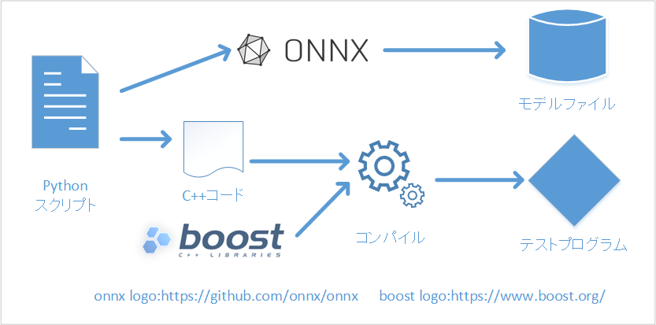

# 単体テストの自動生成

# 単体テストの自動生成

[Masashi MICHIGAMI](https://michigami.medium.com/?source=post_page---byline--7ab8a9590e93---------------------------------------)

Oct 5, 2021

--

Share

連載記事 ailia SDKの品質を支えるビルド＆テスト環境の第2回目です。

[ailia SDK](https://ailia.jp/)はWindows Mac iOS Android Linuxといった様々な環境に対応する クロスプラットフォーム対応高速CNN推論エンジンです。  
AVXやNEONといった各環境で利用可能なSIMD命令に対応したり、GPGPUの性能を最大限引き出すためcuDNNやMetalの他にVulkanなどにも対応することで各環境での高速推論を実現しております。

## はじめに

第1回では[ailia](https://ailia.jp/)のCI環境について概説しました。

今回は[ailia](https://ailia.jp/)のテストカバレッジを上げるために使用しているテストコードの自動生成についてのお話です。

Press enter or click to view image in full size

テストの自動生成イメージ

## Boost Test Libraryについて

Boost Test Libraryは[Boost C++ Library](https://www.boost.org/)に含まれるテストフレームワークです。

C++向けの単体テストフレームワークで以下のサンプルのようにテスト後、値が期待値と一致するかのチェック関数や条件に応じてFail関数を呼び出す形でテストを行います。

Boost 単体テストの例

例えば[ailia](https://ailia.jp/)の推論APIと併用すると以下のようなコードで推論結果が期待値と一致するかのテストを行うことができます。

Boost Test Libraryでailiaのテストを行う例

## モデルファイルからテストコードへ

### 愚直な実装

onnxライブラリでモデルを生成し、乱数入力とonnxに掲載されているリファレンスコードなどで期待値を生成して、上記のサンプルコードに埋め込めばモデルのテストを行うことができそうです。

[## onnx/Operators.md at master · onnx/onnx

### Open standard for machine learning interoperability - onnx/Operators.md at master · onnx/onnx

github.com](https://github.com/onnx/onnx/blob/master/docs/Operators.md?source=post_page-----7ab8a9590e93---------------------------------------#Relu)

ということで、onnxのリファレンス実装と比較するBoost Test Libraryを呼び出すC++のコードを自動生成するPythonスクリプトを作成しました。

テストコードを自動生成するスクリプト例(実際にはヘッダー出力処理などが別途必要)

このコードを実行するとtest.onnxが生成され、標準出力へ以下のようなC++コードが生成されます。

自動生成スクリプトで出力されたテストコードの例

200テストほど追加したところでCI上のビルドサーバーのメモリが不足してコンパイルエラーが頻発しました。…この方法では厳しそうです。

### ファイルから読み込む

自動生成されたC++コードの大半は入力データと期待値です。  
よってこの部分の出力をやめファイルから読み込むようにすれば、生成されるC++コードが小さくなり、コンパイル時に必要なメモリサイズが減ります。

## Get Masashi MICHIGAMI’s stories in your inbox

Join Medium for free to get updates from this writer.

Subscribe

Subscribe

Remember me for faster sign in

Pythonスクリプトで入出力データを出力している部分をC++側で定義されるファイル読み込み関数の呼び出しに変更し、Pythonスクリプト側でcsvなどのテキストファイルへ出力するように変更しました。

また、C++側もPythonスクリプトで出力された入出力データファイルを読み込むように変更しました。

しかし600テストほど追加したところでまたもやビルドサーバーでメモリ不足によるコンパイルエラーが頻発しました。

1ファイルに定義されている関数が多すぎるのが原因でした。

### ファイル分割

次に1ファイルあたりのテスト量を減らすためPythonスクリプトを修正してファイル分割を行えるようにしました。

テストコードをファイル分割する例(実際にはヘッダー出力処理などが別途必要)

レイヤー別にテストコードを分割したため、ビルドサーバーでのメモリ不足は発生しなくなりました。

しかし、テストコードのcppファイルが150ファイルを超え、テスト数が6000を超えたあたりで[ailia](https://ailia.jp/)本体のビルド時間以上にテストプログラムのビルドに時間がかかり、生成されたテストプログラムのバイナリが1GBを超えてしまい、最終的にAndroidホストサーバーのSSDが故障してしまいました。

### コマンドファイル化

自動生成されている関数が多いことに起因して問題が起きているため、関数を削減する方向で改良を行います。

Pythonスクリプト側はファイル読み込みや推論などC++上で呼び出す関数と引数に相当する情報をjsonとして保存します。

テストコードの代わりにJsonを出力するように変更したPythonスクリプト

Pythonスクリプトにより生成されたJson

C++側はjsonのパース処理、Pythonスクリプトで出力されるコマンドの解釈＆実行処理と、Boost Test Library側にテストケースを追加する処理(BOOST\_AUTO\_TEST\_CASEで行われている処理の代わり）を実装します。

コマンドファイルの読み込みに対応したテストコード

make\_test\_caseでテストケース作成し、テストケースをmaster\_test\_suiteへ追加することで、BOOST\_AUTO\_TEST\_CASEを使用して作成したテストプログラムと同様に扱うことができます。

また、この方法の場合、jsonファイルにテスト項目を追加するだけでテストプログラムの再コンパイルを行うことなくテスト項目を追加することができるため、テストプログラムのコンパイル時間を大幅に削減できます。

これによりテストプログラムのビルド時間を大幅に削減し、生成されたプログラムのバイナリサイズも6割ほど削減できました。

ax株式会社はAIを実用化する会社として、クロスプラットフォームでGPUを使用した高速な推論を行うことができる[ailia SDK](https://ailia.jp/)を開発しています。ax株式会社ではコンサルティングからモデル作成、SDKの提供、AIを利用したアプリ・システム開発、サポートまで、 AIに関するトータルソリューションを提供していますのでお気軽に[お問い合わせ](https://axinc.jp/)ください。

[ailia](https://ailia.jp/)は[株式会社アクセル](https://www.axell.co.jp/)の登録商標です。また、本文記載の社名・製品名などは、一般に各社の商標もしくは登録商標です。