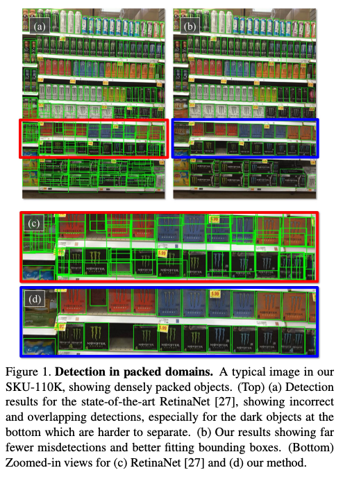

# SKU110K-DenseDet : 店舗内の商品を検出できる機械学習モデル

# SKU110K-DenseDet : 店舗内の商品を検出できる機械学習モデル

[](https://kyakuno.medium.com/?source=post_page---byline--b775184b5e46---------------------------------------)

[Kazuki Kyakuno](https://kyakuno.medium.com/?source=post_page---byline--b775184b5e46---------------------------------------)

5 min read

·

Dec 24, 2021

--

Share

[ailia SDK](https://ailia.jp/)で使用できる機械学習モデルである「SKU110K-DenseDet」のご紹介です。エッジ向け推論フレームワークである[ailia SDK](https://ailia.jp/)と[ailia MODELS](https://github.com/axinc-ai/ailia-models)に公開されている機械学習モデルを使用することで、簡単にAIの機能をアプリケーションに実装することができます。

## SKU110K-DenseDetの概要

SKU110K-DenseDetは店舗内の商品を検出できる機械学習モデルです。スーパーマーケットの棚から、商品のBounding Boxを検出することができます。カテゴリは存在せず、商品があるかないかだけを検出します。

Press enter or click to view image in full size


出典：<https://github.com/Media-Smart/SKU110K-DenseDet>

[## A Solution to Product detection in Densely Packed Scenes

### This work is a solution to densely packed scenes dataset SKU-110k. Our work is modified from Cascade R-CNN. To solve…

arxiv.org](https://arxiv.org/abs/2007.11946?source=post_page-----b775184b5e46---------------------------------------)

[## GitHub - Media-Smart/SKU110K-DenseDet: A state of art detector for densely packed scenes dataset…

### A state of art detector for densely packed scenes dataset SKU-110K. For more information, please read our technical…

github.com](https://github.com/Media-Smart/SKU110K-DenseDet?source=post_page-----b775184b5e46---------------------------------------)

## SKU110Kについて

SKU110Kは2019年4月に公開された商品検知のためのデータセットです。1000を超える世界中（United States、Europe、East Asia）のスーパーマーケットの携帯電話で撮影した画像を含んでいます。バウンディングボックスは手動でアノテーションされています。学習用には8233枚の画像で90968のBouding Box、検証用には2941枚の画像で432312のBounding Boxを含んでいます。



出典：<https://arxiv.org/pdf/1904.00853.pdf>

[## GitHub - eg4000/SKU110K\_CVPR19

### Dataset and Codebase for CVPR2019 "Precise Detection in Densely Packed Scenes" [Paper link] A typical image in our…

github.com](https://github.com/eg4000/SKU110K_CVPR19?source=post_page-----b775184b5e46---------------------------------------)

[## Precise Detection in Densely Packed Scenes

### Man-made scenes can be densely packed, containing numerous objects, often identical, positioned in close proximity. We…

arxiv.org](https://arxiv.org/abs/1904.00853?source=post_page-----b775184b5e46---------------------------------------)

## SKU110K-DenseDetのアーキテクチャ

SKU110K-DenseDetはMMDetectionを使用して学習されています。Cascade R-CNNを使用し、58.0%のmAPを達成しています。BackboneはResNXt-101を使用しています。

## Get Kazuki Kyakuno’s stories in your inbox

Join Medium for free to get updates from this writer.

Subscribe

Subscribe

Remember me for faster sign in

SKU110Kは小さい物体を多く含むため、通常の物体検出のアーキテクチャと認識解像度では精度が出ないという問題があります。そこで、データセットを2560x2560にリスケールして使用しています。

また、GPU memoryが少ない環境でCropして検知することを想定して、学習時にRandom Cropを使用しています。

SKU110Kは平均で1画像につき150のBounding Boxを含みます。これはMS COCOよりも大幅に多く、デフォルトHyper Parametersでは精度が出ません。そこで、RPNとR-CNNのMax Positive Sample Numberを調整しています。

## SKU110K-DenseDetの使用方法

ailia SDKでSKU110K-DenseDetを使用するには下記のコマンドを使用します。Backboneが巨大なため、GPUメモリが少ない環境では、-e 0を指定してCPUモードで実行してください。

```
$ python3 sku110k-densedet.py -i input.jpg -e 0
```

[## ailia-models/object\_detection/sku110k-densedet at master · axinc-ai/ailia-models

### (Image from https://github.com/eg4000/SKU110K\_CVPR19) Shape : (1, 3, 2560, 2560) det\_bboxes shape : (n, 5) det\_labels…

github.com](https://github.com/axinc-ai/ailia-models/tree/master/object_detection/sku110k-densedet?source=post_page-----b775184b5e46---------------------------------------)

ax株式会社はAIを実用化する会社として、クロスプラットフォームでGPUを使用した高速な推論を行うことができるailia SDKを開発しています。ax株式会社ではコンサルティングからモデル作成、SDKの提供、AIを利用したアプリ・システム開発、サポートまで、 AIに関するトータルソリューションを提供していますのでお気軽に[お問い合わせ](https://axinc.jp/)ください。