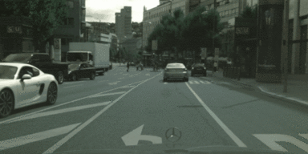
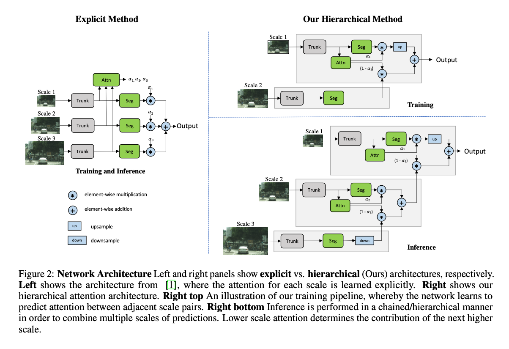
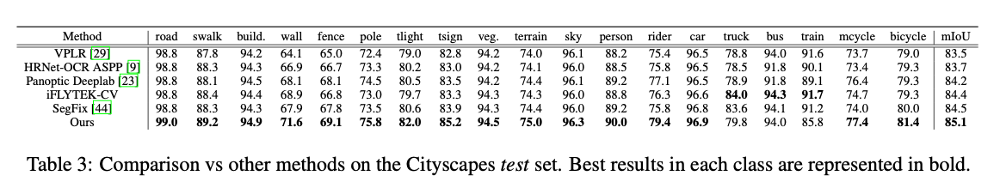

# PaddleSeg : 階層的なアテンションを使用した高精度なセグメンテーションモデル

# PaddleSeg : 階層的なアテンションを使用した高精度なセグメンテーションモデル

[](https://kyakuno.medium.com/?source=post_page---byline--acc89bf50423---------------------------------------)

[Kazuki Kyakuno](https://kyakuno.medium.com/?source=post_page---byline--acc89bf50423---------------------------------------)

Jan 25, 2022

--

Share

[ailia SDK](https://ailia.jp/)で使用できる機械学習モデルである「PaddleSeg」のご紹介です。エッジ向け推論フレームワークである[ailia SDK](https://ailia.jp/)と[ailia MODELS](https://github.com/axinc-ai/ailia-models)に公開されている機械学習モデルを使用することで、簡単にAIの機能をアプリケーションに実装することができます。

## PaddleSegの概要

PaddleSegは2020年5月に公開された、高精度なセグメンテーションモデルです。PaddlePaddle (Baidu) によって開発されました。Multi-Scale Attentionを使用しており、CityscapesデータセットでSoTAを達成しています。



出典：<https://github.com/PaddlePaddle/PaddleSeg/tree/release/2.3/contrib/CityscapesSOTA>

[## Hierarchical Multi-Scale Attention for Semantic Segmentation

### Multi-scale inference is commonly used to improve the results of semantic segmentation. Multiple images scales are…

arxiv.org](https://arxiv.org/abs/2005.10821?source=post_page-----acc89bf50423---------------------------------------)

[## PaddleSeg/contrib/CityscapesSOTA at release/2.3 · PaddlePaddle/PaddleSeg

### The implementation of Hierarchical Multi-Scale Attention based on PaddlePaddle. [Paper] Based on the above work, we…

github.com](https://github.com/PaddlePaddle/PaddleSeg/tree/release/2.3/contrib/CityscapesSOTA?source=post_page-----acc89bf50423---------------------------------------)

## PaddleSegのアーキテクチャ

セグメンテーションにおいて、画質を改善するために、マルチスケールでの推論が使用されています。マルチスケールでは、異なる解像度の画像をネットワークに入力し、処理結果を平均化もしくは最大値で結合します。

PaddleSegでは、Attentionを使用したマルチスケールの結合方法を提案します。これにより、ネットワークは、ケースごとにどのスケールの画像を使用するのが望ましいのかを学習し、より良いセグメンテーションを出力することが可能になります。

## Get Kazuki Kyakuno’s stories in your inbox

Join Medium for free to get updates from this writer.

Subscribe

Subscribe

Remember me for faster sign in

例えば、下記の例では、0.5xのスケールにおいて、細いポールが消失しています。2.0xのスケールでは、ポールは改善しますが、逆に、道のセグメンテーションの精度が低下します。Attentionを使用して結合することで、各スケールのセグメンテーション画像のより良い結合を行います。

Press enter or click to view image in full size


出典：<https://arxiv.org/abs/2005.10821>

また、Attentionは階層的に行います。明示的なAttentionでは、各セグメンテーションの出力の合成の係数を直接、求めます。これを階層的に行うことで、求める係数の数を削減し、より高速に学習することが可能となります。

Press enter or click to view image in full size



出典：<https://arxiv.org/abs/2005.10821>

BackboneはHRNet\_w48を使用しています。

PaddleSegは、Cityscapesデータセットにおいて、SoTAを達成しています。

Press enter or click to view image in full size



出典：<https://arxiv.org/abs/2005.10821>

## PaddleSegの使用方法

ailia SDKでPaddleSegを使用するには下記のコマンドを使用します。入力画像に対してセグメンテーションを行い、output.jpgに合成画像を、output\_mask.jpgにマスク画像を出力します。

```
$ python3 paddleseg.py --input input.jpg --savepath output.jpg
```

[## ailia-models/image\_segmentation/paddleseg at master · axinc-ai/ailia-models

### (Image from https://www.cityscapes-dataset.com/downloads/) Automatically downloads the onnx and prototxt files on the…

github.com](https://github.com/axinc-ai/ailia-models/tree/master/image_segmentation/paddleseg?source=post_page-----acc89bf50423---------------------------------------)

ax株式会社はAIを実用化する会社として、クロスプラットフォームでGPUを使用した高速な推論を行うことができるailia SDKを開発しています。ax株式会社ではコンサルティングからモデル作成、SDKの提供、AIを利用したアプリ・システム開発、サポートまで、 AIに関するトータルソリューションを提供していますのでお気軽に[お問い合わせ](https://axinc.jp/)ください。