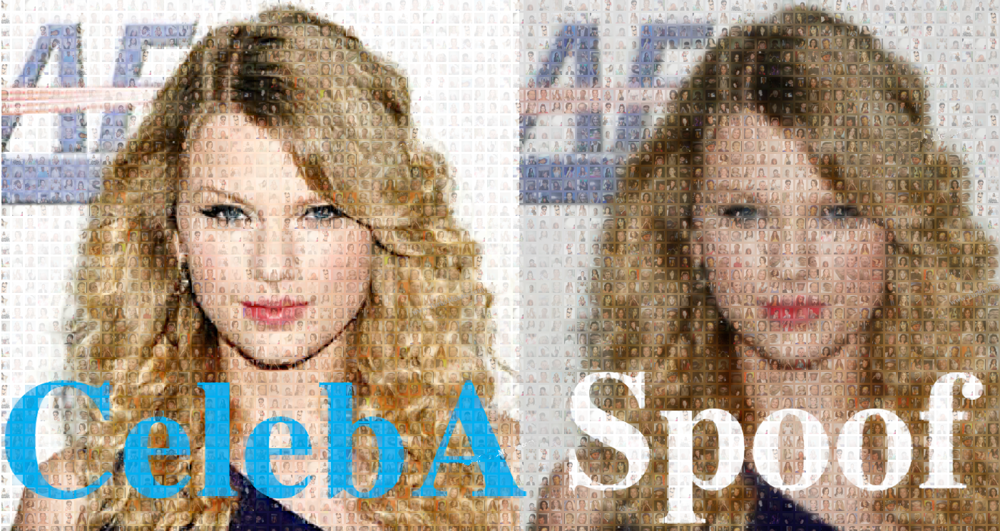
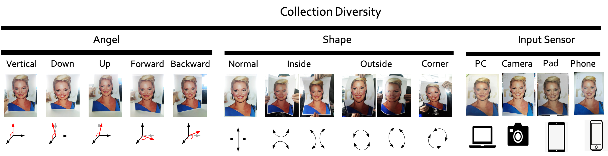

# FaceAntiSpoofing : 本物の顔かどうかを判定する機械学習モデル

# FaceAntiSpoofing : 本物の顔かどうかを判定する機械学習モデル

[](https://kyakuno.medium.com/?source=post_page---byline--c7092c1dde43---------------------------------------)

[Kazuki Kyakuno](https://kyakuno.medium.com/?source=post_page---byline--c7092c1dde43---------------------------------------)

Feb 2, 2022

--

Share

[ailia SDK](https://ailia.jp/)で使用できる機械学習モデルである「FaceAntiSpoofing」のご紹介です。エッジ向け推論フレームワークである[ailia SDK](https://ailia.jp/)と[ailia MODELS](https://github.com/axinc-ai/ailia-models)に公開されている機械学習モデルを使用することで、簡単にAIの機能をアプリケーションに実装することができます。

## FaceAntiSpoofingの概要

FaceAntiSpoofingは入力された顔が、本物か偽物かを判定する機械学習モデルです。実際の顔であればReal、印刷された顔など偽物の顔であればSpoofを返します。KYC（本人確認）などに利用することが可能です。

Press enter or click to view image in full size


出典：<https://github.com/kprokofi/light-weight-face-anti-spoofing>

[## GitHub - kprokofi/light-weight-face-anti-spoofing: towards the solving spoofing problem

### Towards the solving anti-spoofing problem on RGB only data. This repository contains a training and evaluation pipeline…

github.com](https://github.com/kprokofi/light-weight-face-anti-spoofing?source=post_page-----c7092c1dde43---------------------------------------)

## FaceAntiSpoofingのアーキテクチャ

FaceAntiSpoofingはMobileNetV3を使用して学習されています。データセットとして、CelebA Spoofを使用しています。

Press enter or click to view image in full size



出典：<https://github.com/Davidzhangyuanhan/CelebA-Spoof>

CelebA Spoofには、紙に印刷された顔や、PC・タブレット・携帯電話に表示した顔がデータとして含まれます。

## Get Kazuki Kyakuno’s stories in your inbox

Join Medium for free to get updates from this writer.

Subscribe

Subscribe

Remember me for faster sign in

Press enter or click to view image in full size


出典：<https://github.com/Davidzhangyuanhan/CelebA-Spoof>

CelebA Spoofには、紙に印刷された顔に関しては、PCやカメラ、携帯電話で撮影したデータが含まれます。また、AngleやShapeにも多様性があります。

Press enter or click to view image in full size



出典：<https://github.com/Davidzhangyuanhan/CelebA-Spoof>

MobileNet3 LargeにおけるCelbA-Spoofの精度は99.8%となっています。

Press enter or click to view image in full size


出典：<https://github.com/kprokofi/light-weight-face-anti-spoofing>

## FaceAntiSpoofingの使用方法

ailia SDKでFaceAntiSpoofingを使用するには下記のコマンドを使用します。detectionオプションを付与することで、入力された画像から顔を検出し、顔に対してRealかSpoofかを判定します。

```
$ python3 face-anti-spoofing.py --input input.jpg --detection
```

[## ailia-models/face\_recognition/face-anti-spoofing at master · axinc-ai/ailia-models

### (Image from https://search.creativecommons.org/photos/df3a19c2-47ca-4f58-8aed-0dc62e89e9e9) Shape: (1, 3, 128, 128) RGB…

github.com](https://github.com/axinc-ai/ailia-models/tree/master/face_recognition/face-anti-spoofing?source=post_page-----c7092c1dde43---------------------------------------)

ax株式会社はAIを実用化する会社として、クロスプラットフォームでGPUを使用した高速な推論を行うことができるailia SDKを開発しています。ax株式会社ではコンサルティングからモデル作成、SDKの提供、AIを利用したアプリ・システム開発、サポートまで、 AIに関するトータルソリューションを提供していますのでお気軽に[お問い合わせ](https://axinc.jp/)ください。