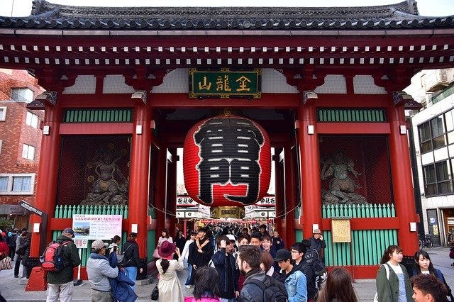

# LandmarksClassifierAsia : 日本の観光名所を識別できる機械学習モデル

# LandmarksClassifierAsia : 日本の観光名所を識別できる機械学習モデル

[](https://kyakuno.medium.com/?source=post_page---byline--dbe930b5653c---------------------------------------)

[Kazuki Kyakuno](https://kyakuno.medium.com/?source=post_page---byline--dbe930b5653c---------------------------------------)

7 min read

·

Feb 7, 2022

--

Share

[ailia SDK](https://ailia.jp/)で使用できる機械学習モデルである「LandmarksClassifierAsia」のご紹介です。エッジ向け推論フレームワークである[ailia SDK](https://ailia.jp/)と[ailia MODELS](https://github.com/axinc-ai/ailia-models)に公開されている機械学習モデルを使用することで、簡単にAIの機能をアプリケーションに実装することができます。

## LandmarksClassifierAsiaの概要

LandmarksClassifierAsiaは日本の観光名所を識別するための機械学習モデルです。Googleによって2020年4月に公開されました。画像から、観光名所の名前を出力することができます。検出できる観光名所は[17771種類](https://raw.githubusercontent.com/axinc-ai/ailia-models/master/image_classification/landmarks_classifier_asia/landmarks_classifier_asia_V1_label_map.csv)となります。

[## Google Landmarks Dataset v2 -- A Large-Scale Benchmark for Instance-Level Recognition and Retrieval

### While image retrieval and instance recognition techniques are progressing rapidly, there is a need for challenging…

arxiv.org](https://arxiv.org/abs/2004.01804?source=post_page-----dbe930b5653c---------------------------------------)

[## TensorFlow Hub

### Edit description

tfhub.dev](https://tfhub.dev/google/on_device_vision/classifier/landmarks_classifier_asia_V1/1?source=post_page-----dbe930b5653c---------------------------------------)

## LandmarksClassifierAsiaのアーキテクチャ

モデルの入力は0〜1のレンジにスケールされた321x321解像度のRGB画像になります。検知対象のランドマークはクロップされて入力されることを期待しています。出力は、98960カテゴリの類似度スコアとなります。観光名所の名前は英語で記載されています。ユニークなラベルは17771カテゴリであり、同じラベルが重複しています。そのため、後処理で適切にマージする必要があります。

例えば、出力ベクトルが [0.3, 0.5, 0.1]でラベルが[‘label\_1’, ‘label\_2’, ‘label\_1’]だった場合、出力は重複するラベルの中で最も高いスコアである{“label\_1": 0.3, “label\_2”: 0.5}である必要があります。

学習には、Google Landmarks Dataset V2を使用しています。GLDv2には500万枚の学習画像と、20万のラベル、11万枚のテスト画像が含まれます。画像は、Wikimedia Commonsから収集され、800時間をかけて人手でアノテーションされています。


出典：<https://arxiv.org/abs/2004.01804>

[## Announcing Google-Landmarks-v2: An Improved Dataset for Landmark Recognition & Retrieval

### Last year we released Google-Landmarks, the largest world-wide landmark recognition dataset available at that time. In…

ai.googleblog.com](https://ai.googleblog.com/2019/05/announcing-google-landmarks-v2-improved.html?source=post_page-----dbe930b5653c---------------------------------------)

このモデルはカテゴリ数が多いため、データセットの論文では距離学習が行われています。具体的に、論文ではResNet101とArcFaceで評価しています。[モデルをNetronで確認](https://netron.app/?url=https%3A%2F%2Fstorage.googleapis.com%2Failia-models%2Flandmarks_classifier_asia%2Flandmarks_classifier_asia_V1_1.onnx.prototxt)すると、公開されているモデルはResNet101ではなく、カーネルサイズ3x3と1x1を使用したもう少し軽量なbackboneを使用しているように見えています。

ResNet101とArcFaceを使用したモデルでのmAP@100（検知結果のtop-100を使用した認識率）は23.30%です。数値的に低く見えるのはラベル数が膨大にあるためです。


出典：<https://arxiv.org/abs/2004.01804>

## LandmarksClassifierAsiaのテスト

いくつかの画像でLandmarksClassifierAsiaをテストしてみます。

## Get Kazuki Kyakuno’s stories in your inbox

Join Medium for free to get updates from this writer.

Subscribe

Subscribe

Remember me for faster sign in

東京タワーや雷門は認識できます。


出典：<https://pixabay.com/photos/japan-tokyo-tower-landmark-343444/>

```
TopK predictions:  
  Tokyo Tower: 92.34%  
  Sapporo TV Tower: 84.53%  
  Yokohama Marine Tower: 81.77%
```



出典：<https://pixabay.com/photos/tokyo-asakusa-kaminarimon-gate-2443311/>

```
TopK predictions:  
  Kaminarimon Gate Senso-ji: 92.01%  
  Hōzōmon Gate: 89.89%  
  Osu Kannon: 85.13%
```

富士山や浜離宮など、山や庭園は特徴が少なく、少し検知が難しいようです。


出典：<https://pixabay.com/photos/mountain-volcano-peak-summit-477832/>

```
TopK predictions:  
  Asagirikogen Rest Area: 89.05%  
  Mt. Omuro: 81.65%  
  Mount Fuji: 81.06%
```


出典：<https://pixabay.com/photos/hamarikyu-japan-garden-lake-path-960271/>

```
TopK predictions:  
  Kannon-in: 85.25%  
  Keitakuen Garden: 83.54%  
  Kyoto Imperial Palace: 83.07%
```

## LandmarksClassifierAsiaの使用方法

ailia SDKでLandmarksClassifierAsiaを使用するには下記のコマンドを使用します。

```
$ python3 landmarks_classifier_asia.py --input input.jpg
```

[## ailia-models/landmark\_classification/landmarks\_classifier\_asia at master · axinc-ai/ailia-models

### (Image from https://pixabay.com/photos/japan-tokyo-tower-landmark-343444/) Shape : (1, 321, 321, 3) Shape : (1, 98960)…

github.com](https://github.com/axinc-ai/ailia-models/tree/master/landmark_classification/landmarks_classifier_asia?source=post_page-----dbe930b5653c---------------------------------------)

ax株式会社はAIを実用化する会社として、クロスプラットフォームでGPUを使用した高速な推論を行うことができるailia SDKを開発しています。ax株式会社ではコンサルティングからモデル作成、SDKの提供、AIを利用したアプリ・システム開発、サポートまで、 AIに関するトータルソリューションを提供していますのでお気軽に[お問い合わせ](https://axinc.jp/)ください。