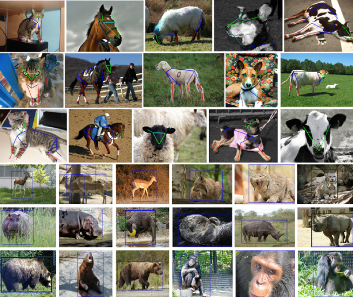

# AnimalPose : 動物の骨格検出モデル

# AnimalPose : 動物の骨格検出モデル

[](https://kyakuno.medium.com/?source=post_page---byline--f7f667c0e69d---------------------------------------)

[Kazuki Kyakuno](https://kyakuno.medium.com/?source=post_page---byline--f7f667c0e69d---------------------------------------)

Jun 30, 2021

--

Share

[ailia SDK](https://ailia.jp/)で使用できる機械学習モデルである「AnimalPose」のご紹介です。エッジ向け推論フレームワークである[ailia SDK](https://ailia.jp/)と[ailia MODELS](https://github.com/axinc-ai/ailia-models)に公開されている機械学習モデルを使用することで、簡単にAIの機能をアプリケーションに実装することができます。

## AnimalPoseの概要

AnimalPoseは動物の骨格検出モデルです。動物を入力として20のキーポイントを出力します。牛の骨格も検出可能なため、農業の分野に応用が可能です。

Press enter or click to view image in full size


出典：<https://pixabay.com/ja/photos/%e7%89%9b-%e5%ae%b6%e7%95%9c-%e4%b9%b3%e7%89%9b-%e4%b9%b3%e7%94%a8%e7%89%9b-%e5%8b%95%e7%89%a9-5717276/>

[## open-mmlab/mmpose

### English | 简体中文 MMPose is an open-source toolbox for pose estimation based on PyTorch. It is a part of the OpenMMLab…

github.com](https://github.com/open-mmlab/mmpose?source=post_page-----f7f667c0e69d---------------------------------------)

## AnimalPoseのアーキテクチャ

AnimalPoseは汎用的な骨格検出フレームワークであるmmposeの一部として公開されています。AnimalPoseの学習済みモデルはhrnetを使用するものと、pose\_resnetを使用するものが提供されています。

[## Animal - MMPose 0.15.0 documentation

### Edit description

mmpose.readthedocs.io](https://mmpose.readthedocs.io/en/latest/topics/animal.html?source=post_page-----f7f667c0e69d---------------------------------------)

いずれも、TopDownアプローチのモデルで、一体の動物のキーポイントを検出します。そのため、最初にYOLOなどで動物を検出し、各動物のキーポイントをAnimalPoseで検出します。

## AnimalPoseのデータセット

AnimalPoseの学習にはAnimalPoseDatasetが使用されています。AnimalPoseDatasetは、PASCAL2011データセットのアノテーションとして提供されています。

[## Home

### We fixed many previous false annotations (in total 260 images), we apologize for our bad annotation quality before. We…

sites.google.com](https://sites.google.com/view/animal-pose/?source=post_page-----f7f667c0e69d---------------------------------------)

3000枚以上の画像に、5つのカテゴリ（dog, cat, cow, horse, sheep）で、合計5517インスタンスのアノテーションを付与しています。各インスタンスには20のキーポイント（4 Paws, 2 Eyes, 2 Ears, 4 El- bows, Nose, Throat, Withers and Tailbase, and the 4 knees points）が定義されています。

Press enter or click to view image in full size



出典：<https://sites.google.com/view/animal-pose/>

[## Cross-Domain Adaptation for Animal Pose Estimation

### In this paper, we are interested in pose estimation of animals. Animals usually exhibit a wide range of variations on…

arxiv.org](https://arxiv.org/abs/1908.05806v2?source=post_page-----f7f667c0e69d---------------------------------------)

## AnimalPoseの使用方法

AnimalPoseを使用するには下記のコマンドを使用します。動画ファイルから骨格を検出します。

```
$ python3 animalpose.py -v input.mp4
```

[## axinc-ai/ailia-models

### (Image from…

github.com](https://github.com/axinc-ai/ailia-models/tree/master/pose_estimation/animalpose?source=post_page-----f7f667c0e69d---------------------------------------)

モデルはデフォルトではyolov3とhrnet32が使用されます。-d yolox\_mオプションを使用することでyolox\_mを、-m hrnet48オプションを付与することでhrnet48を使用することができます。より高精度な出力が必要な場合は、これらのオプションをご利用ください。

## Get Kazuki Kyakuno’s stories in your inbox

Join Medium for free to get updates from this writer.

Subscribe

Subscribe

Remember me for faster sign in

実行例です。

ax株式会社はAIを実用化する会社として、クロスプラットフォームでGPUを使用した高速な推論を行うことができるailia SDKを開発しています。ax株式会社ではコンサルティングからモデル作成、SDKの提供、AIを利用したアプリ・システム開発、サポートまで、 AIに関するトータルソリューションを提供していますのでお気軽に[お問い合わせ](https://axinc.jp/)ください。