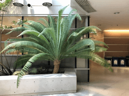
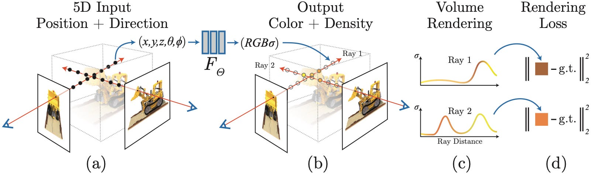
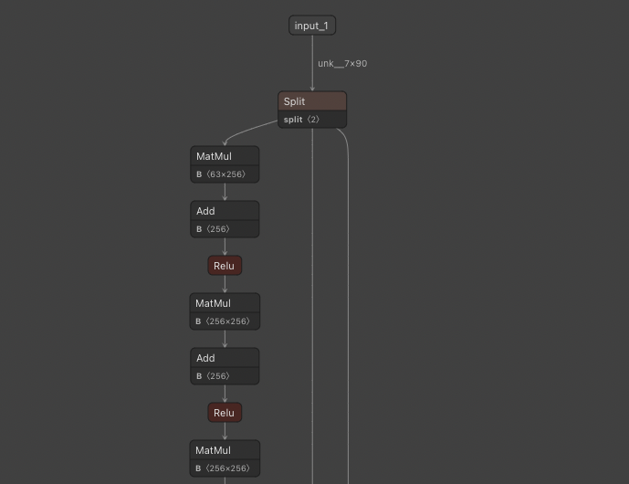
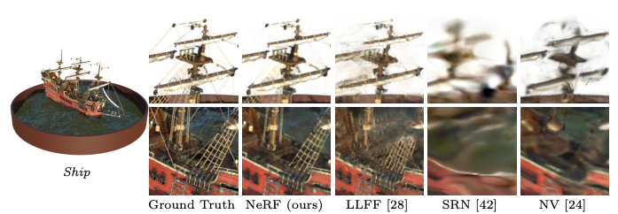

# NeRF : 複数の視点の画像から3Dモデルを生成してレンダリングする機械学習モデル

# NeRF : 複数の視点の画像から3Dモデルを生成してレンダリングする機械学習モデル

[](https://kyakuno.medium.com/?source=post_page---byline--2d6bee7ff22f---------------------------------------)

[Kazuki Kyakuno](https://kyakuno.medium.com/?source=post_page---byline--2d6bee7ff22f---------------------------------------)

7 min read

·

Apr 18, 2022

--

Share

[ailia SDK](https://ailia.jp/)で使用できる機械学習モデルである「NeRF」のご紹介です。エッジ向け推論フレームワークである[ailia SDK](https://ailia.jp/)と[ailia MODELS](https://github.com/axinc-ai/ailia-models)に公開されている機械学習モデルを使用することで、簡単にAIの機能をアプリケーションに実装することができます。

## NeRFの概要

NeRF（Neural Radiance Fields）は2020年3月に公開された技術です。NerFでは、複数の視点の画像から3Dモデルを生成して、任意の視点の映像をレンダリングすることが可能です。NeRFでは、ポリゴンを使用せずに、機械学習モデルとして3Dモデルを表現します。



出典：<https://github.com/bmild/nerf>

[## NeRF: Representing Scenes as Neural Radiance Fields for View Synthesis

### We present a method that achieves state-of-the-art results for synthesizing novel views of complex scenes by optimizing…

arxiv.org](https://arxiv.org/abs/2003.08934?source=post_page-----2d6bee7ff22f---------------------------------------)

[## GitHub - bmild/nerf: Code release for NeRF (Neural Radiance Fields)

### Tensorflow implementation of optimizing a neural representation for a single scene and rendering new views. NeRF…

github.com](https://github.com/bmild/nerf?source=post_page-----2d6bee7ff22f---------------------------------------)

## NeRFのアーキテクチャ

NeRFで生成された3Dモデルは機械学習モデルのパラメータとして表現されます。3Dモデル一つにつき、一つの機械学習モデルが生成されます。3Dモデルを関数表現するという考え方になります。

学習では、複数の視点の画像と、各画像のカメラパラメータを入力として、機械学習モデルを学習します。

Press enter or click to view image in full size



出典：<https://github.com/bmild/nerf>

推論では、生成したい空間上の座標（x,y,z）と、視線方向（θ,φ)を与えることで、(R,G,B,σ)を出力します。σは密度です。レイトレーシングのように、1画素1画素、RGB値を計算していきます。

モデルアーキテクチャは、(x,y,z)と（θ,φ)をPositionEmbeddingによって高次元空間に射影した90要素の1次元入力ベクトルに対して、Linear演算を重ねていく形となります。



[https://netron.app/?url=https://storage.googleapis.com/ailia-models/nerf/nerf.opt.onnx.prototxt](https://netron.app/?url=https%3A%2F%2Fstorage.googleapis.com%2Failia-models%2Fnerf%2Fnerf.opt.onnx.prototxt)

学習用のデータはLLFFフォーマットで入力します。LLFFフォーマットには、画像ファイルと、カメラ位置を示すnumpyファイルが含まれます。

[## GitHub - Fyusion/LLFF: Code release for Local Light Field Fusion at SIGGRAPH 2019

### Tensorflow implementation for novel view synthesis from sparse input images. Local Light Field Fusion: Practical View…

github.com](https://github.com/fyusion/llff?source=post_page-----2d6bee7ff22f---------------------------------------)

ビデオから3Dモデルを構築しようとした場合、ビデオにカメラ位置のアノテーションを追加する必要があります。自動的にカメラ位置を検出する方法としては、[SfM技術をベースとしたCOLMAP](https://colmap.github.io/)を使用可能です。COLMAPはドローンの映像からカメラ位置を推定する用途などで使用されています。対象物体が静止していて、その周りを回るような映像に対するカメラ位置推定を得意としています。

## Get Kazuki Kyakuno’s stories in your inbox

Join Medium for free to get updates from this writer.

Subscribe

Subscribe

Remember me for faster sign in

NERFは従来方式よりもディテールの細かい映像を出力することが可能です。

Press enter or click to view image in full size



出典：<https://arxiv.org/pdf/2003.08934.pdf>

## NERFの使用方法

ailia SDKでは変換済みの3DモデルをONNXとして入力し、実際に推論して画像を生成することが可能です。

下記のコマンドで1フレームのレンダリングを行います。

```
python3 nerf.py -s output.png
```

angleオプションでレンダリングする視点を変更することができます。

```
python3 nerf.py --angle 100
```

render\_factorオプションでレンダリング解像度を上げることができます。デフォルトでは1/4解像度でレンダリングします。下記の設定では1/2解像度でレンダリングします。

```
python3 nerf.py --render_factor 2
```

[## ailia-models/neural\_rendering/nerf at master · axinc-ai/ailia-models

### Multiple images for construct 3D model (from…

github.com](https://github.com/axinc-ai/ailia-models/tree/master/neural_rendering/nerf?source=post_page-----2d6bee7ff22f---------------------------------------)

## 関連情報

### COLMAPとNeRFを使った3次元復元

[## GitHub - ALBERT-Inc/NeRF-tutorial: NeRFチュートリアル

### 学習済みモデルによるレンダリング COLMAPはSfM用のソフトウェアです。カメラパラメータの推定に加え、ソフトウェア単体でも3次元復元ができます。インストールは githubのリリースページ…

github.com](https://github.com/ALBERT-Inc/NeRF-tutorial?source=post_page-----2d6bee7ff22f---------------------------------------)

### NeRFをボリュームテクスチャに変換してUnityでレンダリングする

> Back to your idea of caching the 4d volume. I have a [unity project](https://github.com/kwea123/nerf_Unity) and [video](https://www.youtube.com/watch?v=8AJIIVImPWo&list=PLDV2CyUo4q-K02pNEyDr7DYpTQuka3mbV&index=8&t=80s&ab_channel=AI%E8%91%B5) that realize this. It is very fast (>100FPS) in the video, but the image quality is definitely lower than if you do the “correct” inference. I didn’t write python code to evaluate it, but in my opinion it might result in 5~6 points difference in PSNR.

[## GitHub - kwea123/nerf\_Unity: Unity project for nerf\_pl (Neural Radiance Fields)

### Unity projects for my implementation of nerf\_pl (Neural Radiance Fields) Update : Now you can view the volume from…

github.com](https://github.com/kwea123/nerf_Unity?source=post_page-----2d6bee7ff22f---------------------------------------)

[## About the inference speed of NeRF · Issue #91 · bmild/nerf

### On the paper , it is mentioned that inference speed of NeRF is very slow. It seems to me that, to get an image, there…

github.com](https://github.com/bmild/nerf/issues/91?source=post_page-----2d6bee7ff22f---------------------------------------)

ax株式会社はAIを実用化する会社として、クロスプラットフォームでGPUを使用した高速な推論を行うことができるailia SDKを開発しています。ax株式会社ではコンサルティングからモデル作成、SDKの提供、AIを利用したアプリ・システム開発、サポートまで、 AIに関するトータルソリューションを提供していますのでお気軽に[お問い合わせ](https://axinc.jp/)ください。