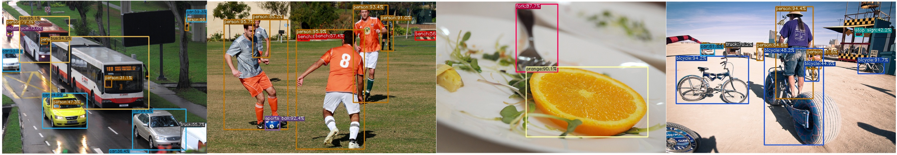
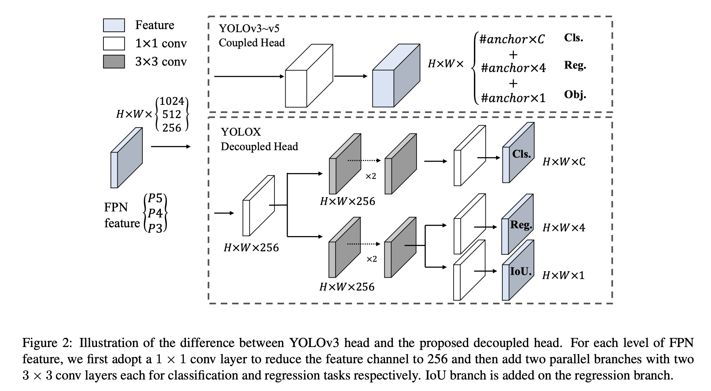
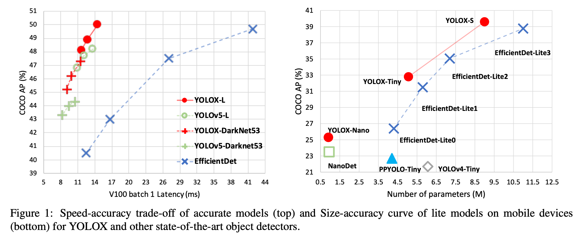
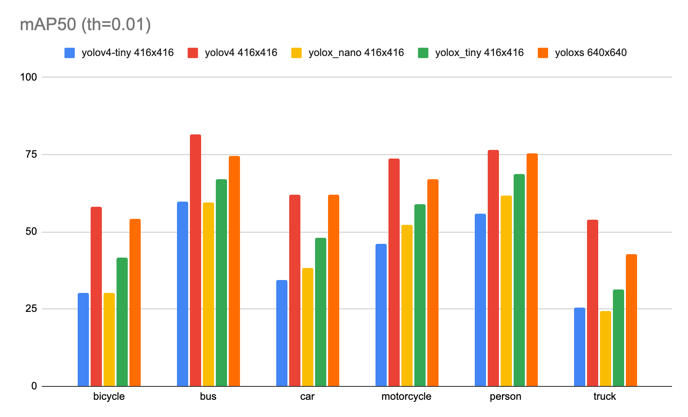
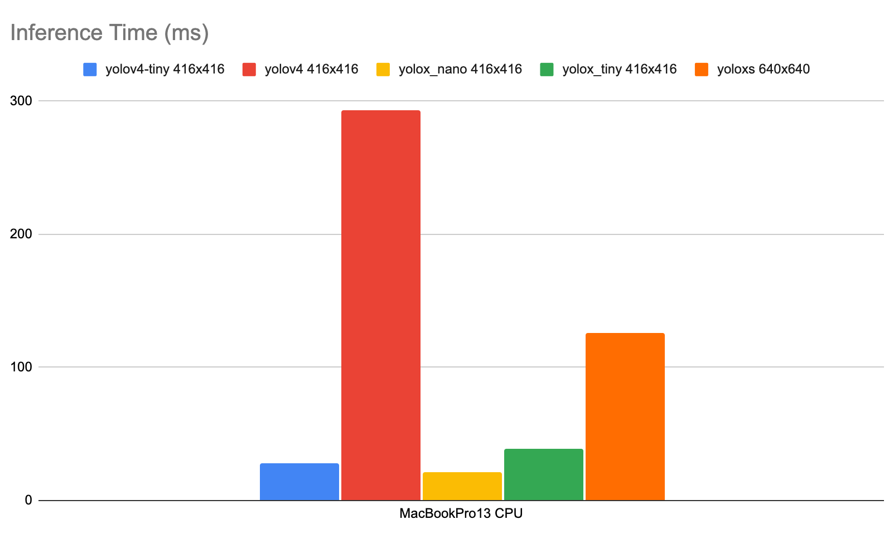

# YOLOX : YOLOv5を超える物体検出モデル

# YOLOX : YOLOv5を超える物体検出モデル

[](https://kyakuno.medium.com/?source=post_page---byline--e9706e15fef2---------------------------------------)

[Kazuki Kyakuno](https://kyakuno.medium.com/?source=post_page---byline--e9706e15fef2---------------------------------------)

8 min read

·

Oct 20, 2021

--

Share

[ailia SDK](https://ailia.jp/)で使用できる機械学習モデルである「YOLOX」のご紹介です。エッジ向け推論フレームワークである[ailia SDK](https://ailia.jp/)と[ailia MODELS](https://github.com/axinc-ai/ailia-models)に公開されている機械学習モデルを使用することで、簡単にAIの機能をアプリケーションに実装することができます。

## YOLOXの概要

YOLOXは2021年8月に公開された最新の物体検出モデルです。YOLOv5を超える性能と、使いやすいライセンス（Apache License）を両立しています。


出典：<https://github.com/Megvii-BaseDetection/YOLOX/blob/main/assets/logo.png>

Press enter or click to view image in full size



出典：<https://github.com/Megvii-BaseDetection/YOLOX/blob/main/assets/demo.png>

[## YOLOX: Exceeding YOLO Series in 2021

### In this report, we present some experienced improvements to YOLO series, forming a new high-performance detector …

arxiv.org](https://arxiv.org/abs/2107.08430?source=post_page-----e9706e15fef2---------------------------------------)

[## GitHub - Megvii-BaseDetection/YOLOX: YOLOX is a high-performance anchor-free YOLO, exceeding…

### YOLOX is a high-performance anchor-free YOLO, exceeding yolov3~v5 with MegEngine, ONNX, TensorRT, ncnn, and OpenVINO…

github.com](https://github.com/Megvii-BaseDetection/YOLOX?source=post_page-----e9706e15fef2---------------------------------------)

## YOLOXのアーキテクチャ

YOLOXは従来のYOLOをアンカーフリーに変更し、Decoupled HeadとSimOTAを導入した物体検出モデルです。CVPR2021のAutomous Driving WorkshopのStreaming Perception Challengeで1位を獲得しています。

従来のYOLOv4およびYOLOv5はアンカーを使用することを前提として過度に最適化されたパイプラインとなっているため、YOLOXはYOLOv3-SPPをベースラインとして改良しています。YOLOv3-SPPに対して、YOLOv5で導入された、CSPNetのバックボーンと、PAN headを導入しています。

物体検出においては、classification（クラス分類）とregression（バウンディングボックスの位置の計算）を同時に行うため、競合が発生して精度が低下することが知られています。この問題に対して、Decoupled headを使用する方法が提案されていますが、従来のYOLOシリーズのbackboneとfeature pyramidsにはCoupled headが使用されてました。YOLOXでは、YOLOシリーズのCoupled headをDecoupled headに置き換えることで高精度化を行っています。

Press enter or click to view image in full size



出典：<https://arxiv.org/pdf/2107.08430.pdf>

学習においては、MosaicやMixupを使用した、強いData Augmentationを適用しています。また、Lossの最適化にOTAを改良したSimOTAを使用しています。

## Get Kazuki Kyakuno’s stories in your inbox

Join Medium for free to get updates from this writer.

Subscribe

Subscribe

Remember me for faster sign in

新規に導入された各ツールの貢献は下記となります。

Press enter or click to view image in full size


出典：<https://arxiv.org/pdf/2107.08430.pdf>

YOLOXのベンチマーク結果は下記となっています。

Press enter or click to view image in full size



出典：<https://arxiv.org/pdf/2107.08430.pdf>

## YOLOXの種類

YOLOXにはバリエーションが存在します。高精度向けのStandard Modelsと、エッジ端末向けのLight Modelsの二種類が存在します。

Press enter or click to view image in full size


出典：<https://github.com/Megvii-BaseDetection/YOLOX>

## YOLOXの性能

COCO2017のValidation Setを使用してmAP50と推論時間を計測しました。YOLOX-sはYOLOv4と同等の精度をYOLOv4の半分の推論時間で達成することができています。

Press enter or click to view image in full size



yoloxのmAP50

Press enter or click to view image in full size



yoloxの推論時間

なお、mAPの計測には下記のリポジトリを、推論時間の計測にはailia SDK 1.2.8を使用しています。

[## GitHub - rafaelpadilla/Object-Detection-Metrics: Most popular metrics used to evaluate object…

### If you use this code for your research, please consider citing: @Article{electronics10030279, AUTHOR = {Padilla, Rafael…

github.com](https://github.com/rafaelpadilla/Object-Detection-Metrics/?source=post_page-----e9706e15fef2---------------------------------------)

## CVPR2021 Automous Driving Workshop Streaming Perception Challenge

YOLOXが一位を獲得したCVPR2021におけるAutomous Driving WorkshopのStreaming Perception ChallengeのLeaderboardは下記になります。一位のBaseDetがYOLOXとなります。

[## EvalAI: Evaluating state of the art in AI

### EvalAI is an open-source web platform for organizing and participating in challenges to push the state of the art on AI…

eval.ai](https://eval.ai/web/challenges/challenge-page/800/overview?source=post_page-----e9706e15fef2---------------------------------------)

このチャレンジでは、自動運転向けの[Argoverse HD](https://www.argoverse.org/data.html)データセットに、COCOデータセットと同様の2D Bounding Boxのアノテーションを行ったArgoverse 1.1データセットを評価に使用しています。[Argoverse 1.1](https://www.cs.cmu.edu/~mengtial/proj/streaming/)データセットには、フロントカメラの映像を使用してアノテーションした1,250,000のBounding Boxが含まれています。

Press enter or click to view image in full size


出展：<https://www.cs.cmu.edu/~mengtial/proj/streaming/>

[## Streaming Perception

### Based upon the autonomous driving dataset Argoverse 1.1, we build our dataset with high-frame-rate annotations for…

www.cs.cmu.edu](https://www.cs.cmu.edu/~mengtial/proj/streaming/?source=post_page-----e9706e15fef2---------------------------------------)

## YOLOXの使用方法

ailia SDKでYOLOXを使用するには下記のコマンドを使用します。WEBカメラに対して認識が可能です。

```
$ python3 yolox.py -v 0
```

デフォルトではYOLOX-sが使用されます。-mオプションを使用することで、tinyモデルを含むその他のモデルも使用可能です。

[## ailia-models/object\_detection/yolox at master · axinc-ai/ailia-models

### (Image from https://github.com/RangiLyu/nanodet/blob/main/demo\_mnn/imgs/000252.jpg) Ailia input shape: (1, 3, 416…

github.com](https://github.com/axinc-ai/ailia-models/tree/master/object_detection/yolox?source=post_page-----e9706e15fef2---------------------------------------)

また、ailia SDK 1.2.9から、ailia Detector API経由でのYOLOXの推論に対応しています。ailia Detector APIを使用することで、C++による高速な前処理と後処理を実現します。

ax株式会社はAIを実用化する会社として、クロスプラットフォームでGPUを使用した高速な推論を行うことができるailia SDKを開発しています。ax株式会社ではコンサルティングからモデル作成、SDKの提供、AIを利用したアプリ・システム開発、サポートまで、 AIに関するトータルソリューションを提供していますのでお気軽に[お問い合わせ](https://axinc.jp/)ください。