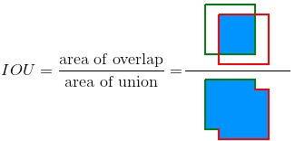
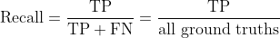
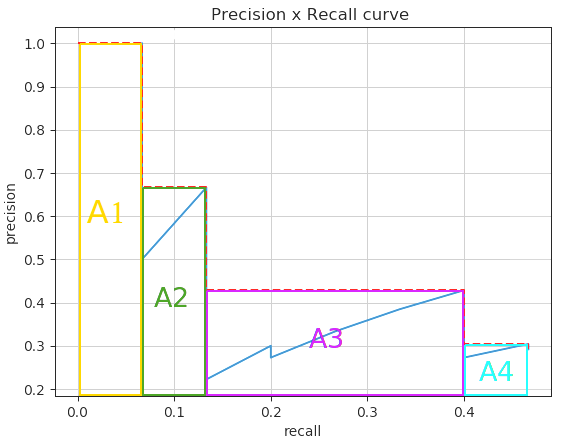
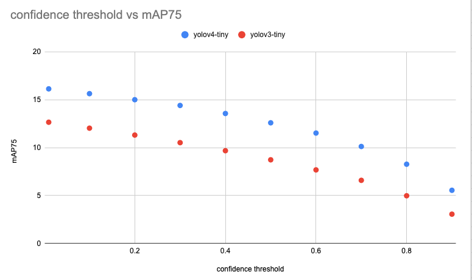

# mAP : 物体検出モデルの評価指標

# mAP : 物体検出モデルの評価指標

[](https://kyakuno.medium.com/?source=post_page---byline--956a786e8c3d---------------------------------------)

[Kazuki Kyakuno](https://kyakuno.medium.com/?source=post_page---byline--956a786e8c3d---------------------------------------)

11 min read

·

Jun 23, 2021

--

Share

物体検出モデルの評価指標であるmAPを解説します。

## mAPの概要

mAP（mean Average Precision）はYOLOなどの物体検出モデルで使用される評価指標です。mAPの計算には、IOU、Precision、Recall、Precision Recall Curve、APが必要です。

[## rafaelpadilla/Object-Detection-Metrics

### If you use this code for your research, please consider citing: @Article{electronics10030279, AUTHOR = {Padilla, Rafael…

github.com](https://github.com/rafaelpadilla/Object-Detection-Metrics?source=post_page-----956a786e8c3d---------------------------------------)

## IOUについて

物体検出ではオブジェクトのバウンディングボックスとカテゴリを予測します。バウンディングボックスが正しく予測できたかどうかの判定には、IOU（Intersection Over Union）を使用します。

IOUは、バウンディングボックスがどのくらい重なっているかを示します。IOUは、二つのバウンディングボックスの領域のうち、重なっている領域の比率を示し、1.0で完全一致、0.0で重なり無しを示します。



出典：<https://github.com/rafaelpadilla/Object-Detection-Metrics>

物体検出の評価においては、正解データに対して、どれくらいバウンディングボックスが重なっていれば認識成功とみなすかを定義する必要があります。そのためにIOUが使用されており、mAP50はIOU=50、つまり50%以上の重なりがあれば正解とみなすとした時の精度になります。IOUが大きくなるほど、より正確にバウンディングボックスを検出する必要があり、難易度が高くなります。そのため、mAP50よりもmAP75の方が数値上は低くなります。

## PrecisionとRecallについて

Precisionは検出したバウンディングボックスが正しい比率を示します。間違ったバウンディングボックスを過剰に検出してしまう過検出がなければ1.0になります。ただし、検出すべきバウンディングボックスを検出できていない、未検出があっても1.0になります。


出典：<https://github.com/rafaelpadilla/Object-Detection-Metrics>

Recallは検出すべきバウンディングボックスを検出できている比率を示します。検出すべきバウンディングボックスを検出できていない未検出がなければ1.0になります。ただし、間違ったバウンディングボックスを過剰に検出してしまう過検出があっても1.0になります。



出典：<https://github.com/rafaelpadilla/Object-Detection-Metrics>

## Precision Recall Curveについて

縦軸にPrecision、横軸にRecallをプロットしたのがPrecision Recall Curveです。


出典：<https://github.com/rafaelpadilla/Object-Detection-Metrics>

物体検出にはthresholdが存在します。thresholdを大きくすると、過検出は減りますが、未検出が増加します。例えば、threshold=1.0とすると、物体は検出されず、Precisionは1.0、Recallは0.0になります。逆に、threshold=0.0とすると、無限に物体が検出され、Precisionは0.0、Recallは1.0になります。

優秀な機械学習モデルの場合、thresholdを小さくしても（Recallを大きくしても）、過検出は起きず、Precisionは高いままで維持されます。そのため、カーブが右上に行くほど優秀な機械学習モデルであると言えます。

## APについて

機械学習モデル同士の性能を比較する場合、Precision Recall Curveを比較して、右上にあるほど優秀であるのですが、実際に人が見て判断する必要であり手間がかかります。また、実際のPrecision Recall Curveはジグザグしているため、優秀かどうかの判断に主観が入ってしまいます。

## Get Kazuki Kyakuno’s stories in your inbox

Join Medium for free to get updates from this writer.

Subscribe

Subscribe

Remember me for faster sign in

より直感的に判断できるようにしたのがAPで、Precision Recall Curveの面積を示します。カーブが右上に行くほど面積は大きくなるので、数値が大きいほど優秀な機械学習モデルであるということが言えます。



出典：<https://github.com/rafaelpadilla/Object-Detection-Metrics>

## mAPについて

mAPはAP値を平均化したものです。APを全てのクラスについてさらに平均したものになります。

## mAPの最大化について

mAPはconf-thresholdを固定して計算します。そこで、COCO2017のTestSetを使用して、conf-thresholdを変更させながらmAPを計測することで、thresholodの影響を確認しました。

その結果、conf-thresholdを小さくするほどmAPが高くなることが確認できました。

Press enter or click to view image in full size


yolov4-tinyとyolov3-tinyのthresholdによるmAP50

Press enter or click to view image in full size



yolov4-tinyとyolov3-tinyのthresholdによるmAP75

これは、過検出な方がmAPが高くなることを示唆しています。Precisionを高くするよりも、Recallを高くした方が、ロングテールで面積が大きくなるためで、COCO2017のTest Setが40,670枚と少ないのが影響していると考えています。

実際、yolov5のtest.pyにおいても、mAP計算用のconf-thresは0.001と極めて小さくなっています。

[## ultralytics/yolov5

### You can't perform that action at this time. You signed in with another tab or window. You signed out in another tab or…

github.com](https://github.com/ultralytics/yolov5/blob/master/test.py?source=post_page-----956a786e8c3d---------------------------------------)

## mAPの計測スクリプトの実装

ailia-modelsの各モデルのmAPを計測するスクリプトの実装例です。

[## ailia-models-measurement/object\_detection at main · axinc-ai/ailia-models-measurement

### Calculate mAP of object detection API The script will download coco2017 val dataset to data/coco2017. Predict bounding…

github.com](https://github.com/axinc-ai/ailia-models-measurement/tree/main/object_detection?source=post_page-----956a786e8c3d---------------------------------------)

prediction.pyでは指定したモデルを使用して推論を行い、推論結果を保存します。

```
python3 prediction.py -m yolox
```

map.pyでは推論結果を読み込み、mAPを計測します。-thに0.5を指定するとAP50、0.75を指定するとAP75となります。

```
python3 map.py -m yolox -d coco2017 -th 0.5
```

計測結果の出力は下記となります。

```
DATASETS: coco2017__dw_640_dh_640_th_0_01_m_yolox_s  
MODEL: yoloxAP: 89.18% (airplane)  
AP: 23.15% (apple)  
AP: 22.48% (backpack)  
AP: 40.01% (banana)  
AP: 52.16% (baseball_bat)  
AP: 61.46% (baseball_glove)  
AP: 81.96% (bear)  
AP: 54.59% (bed)  
AP: 32.66% (bench)  
AP: 53.88% (bicycle)  
AP: 46.07% (bird)  
AP: 47.76% (boat)  
AP: 23.03% (book)  
AP: 52.45% (bottle)  
AP: 55.16% (bowl)  
AP: 40.80% (broccoli)  
AP: 74.23% (bus)  
AP: 48.88% (cake)  
AP: 61.40% (car)  
AP: 31.64% (carrot)  
AP: 85.80% (cat)  
AP: 50.09% (cell_phone)  
AP: 44.40% (chair)  
AP: 69.70% (clock)  
AP: 53.34% (couch)  
AP: 66.56% (cow)  
AP: 52.42% (cup)  
AP: 41.51% (dining_table)  
AP: 72.09% (dog)  
AP: 55.42% (donut)  
AP: 83.54% (elephant)  
AP: 83.86% (fire_hydrant)  
AP: 43.46% (fork)  
AP: 79.99% (frisbee)  
AP: 85.47% (giraffe)  
AP: 12.73% (hair_drier)  
AP: 23.45% (handbag)  
AP: 74.51% (horse)  
AP: 40.46% (hot_dog)  
AP: 67.46% (keyboard)  
AP: 56.36% (kite)  
AP: 27.00% (knife)  
AP: 69.68% (laptop)  
AP: 72.75% (microwave)  
AP: 66.63% (motorcycle)  
AP: 76.40% (mouse)  
AP: 36.73% (orange)  
AP: 51.09% (oven)  
AP: 62.47% (parking_meter)  
AP: 75.03% (person)  
AP: 70.50% (pizza)  
AP: 43.83% (potted_plant)  
AP: 68.85% (refrigerator)  
AP: 40.66% (remote)  
AP: 45.16% (sandwich)  
AP: 33.58% (scissors)  
AP: 68.45% (sheep)  
AP: 59.49% (sink)  
AP: 72.54% (skateboard)  
AP: 44.07% (skis)  
AP: 42.34% (snowboard)  
AP: 23.83% (spoon)  
AP: 54.08% (sports_ball)  
AP: 75.74% (stop_sign)  
AP: 54.67% (suitcase)  
AP: 58.73% (surfboard)  
AP: 61.45% (teddy_bear)  
AP: 75.20% (tennis_racket)  
AP: 51.47% (tie)  
AP: 42.70% (toaster)  
AP: 78.84% (toilet)  
AP: 35.21% (toothbrush)  
AP: 49.51% (traffic_light)  
AP: 83.08% (train)  
AP: 42.44% (truck)  
AP: 76.55% (tv)  
AP: 62.14% (umbrella)  
AP: 51.26% (vase)  
AP: 48.97% (wine_glass)  
AP: 88.01% (zebra)  
mAP: 55.96%
```

ax株式会社はAIを実用化する会社として、クロスプラットフォームでGPUを使用した高速な推論を行うことができるailia SDKを開発しています。ax株式会社ではコンサルティングからモデル作成、SDKの提供、AIを利用したアプリ・システム開発、サポートまで、 AIに関するトータルソリューションを提供していますのでお気軽に[お問い合わせ](https://axinc.jp/)ください。